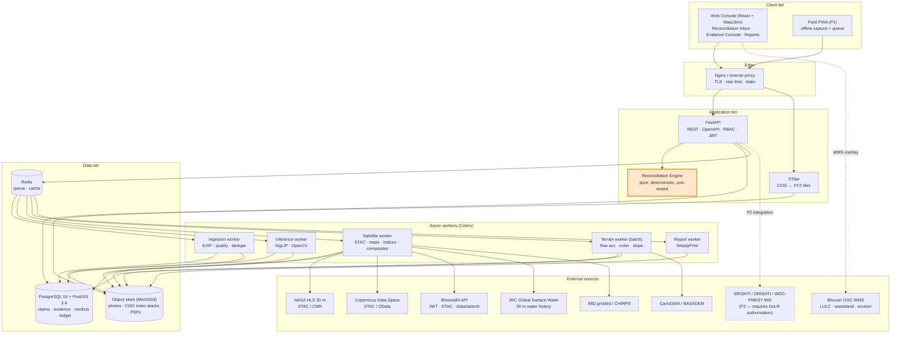
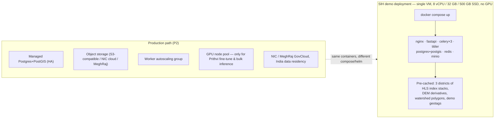
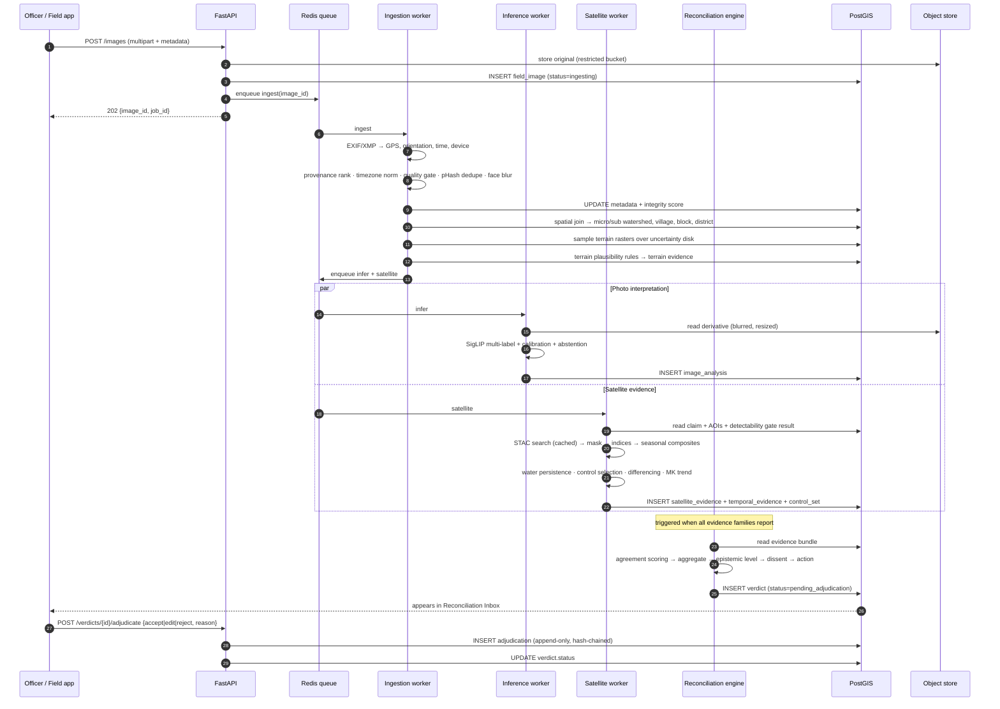
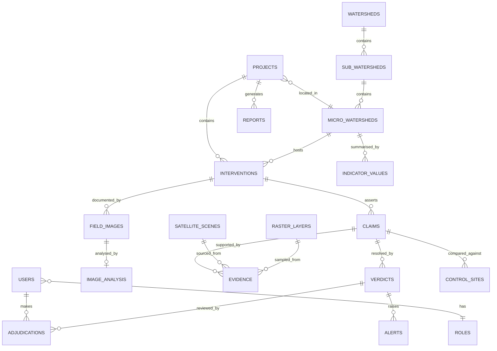
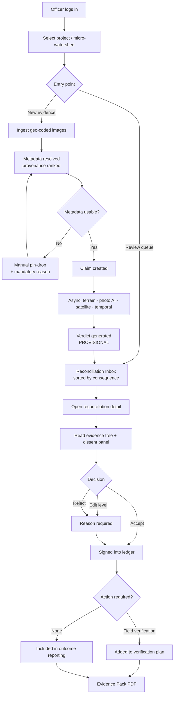
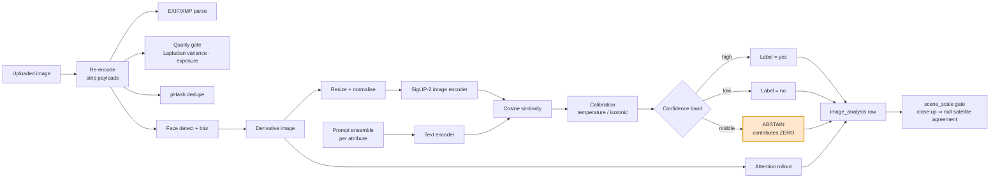
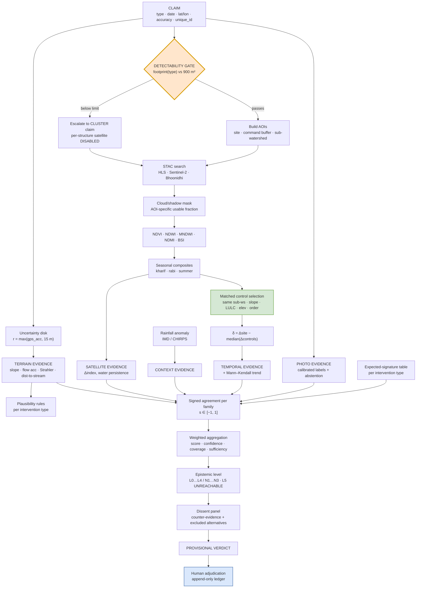
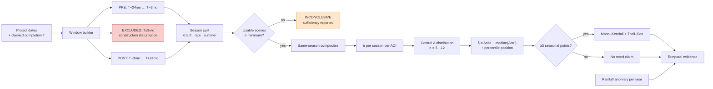

# PRAMAAN
### Photo-Referenced Analytics for Monitoring of Assets And Natural-resources

**Smart India Hackathon 2026 — Problem Statement 26015**
*Application of Geospatial Techniques for Visualization and Analysis to Interpret Geo-Coded Images to Enhance Watershed Development Outcomes*

**Organisation:** Ministry of Rural Development · **Department:** Department of Land Resources (DoLR) · **Category:** Software · **Theme:** Agriculture, FoodTech & Rural Development

**Document type:** Master research, product design, architecture and implementation specification
**Version:** 1.0 · **Date:** 27 August 2026

---

## EVIDENCE LABELLING CONVENTION USED THROUGHOUT

Every material claim in this document carries one of four labels. Do not remove them when reusing this material — they are what make the design defensible in front of a DoLR/NRSC judge.

| Label | Meaning |
|---|---|
| **[VERIFIED]** | Confirmed against a primary source (government portal, official manual, peer-reviewed paper, official API spec) which is cited. |
| **[LIKELY]** | Strongly supported by indirect evidence or by multiple secondary sources, but not confirmed on a primary source during this research. |
| **[ASSUMPTION]** | A design assumption we are making deliberately. Stated so it can be challenged and tested. |
| **[PROTOTYPE SUBSTITUTE]** | We cannot access the real government asset for a hackathon; we name the specific stand-in we will use and the exact swap path to production. |

**Hard rule observed:** no API endpoint, dataset, statistic or platform capability appears in this document unless it was actually found on a source, or is explicitly labelled as an assumption/substitute.

---

# 1. EXECUTIVE SUMMARY

## 1.1 What the problem really is

Read literally, PS 26015 asks for "visualization and analysis of geo-coded images." Read against the actual state of the DoLR watershed ecosystem, it asks for something much more specific and much more valuable.

The Department of Land Resources **already has** the pieces the problem statement talks about:

- **DRISHTI 2.0** — an Android field app that captures a geo-tagged photograph of every watershed work, with latitude, longitude, GPS accuracy, orientation and timestamp embedded, plus activity type, village, survey number, beneficiary and status. **[VERIFIED — NRSC DRISHTI v2.3 manual]**
- **SRISHTI 2.0** — a Bhuvan web portal where SLNA/WCDC officers moderate those geotags (accept / reject) and view them on satellite backdrops. **[VERIFIED — NRSC SRISHTI-DRISHTI manual; DoLR–NRSC MoU, 18 Oct 2023]**
- **Bhuvan WDC 2.0** — the current-generation watershed application on Bhuvan. **[VERIFIED — bhuvan-app1.nrsc.gov.in/wdc2.0]**
- **A national mandate to do exactly this analysis**: the WDC-PMKSY 2.0 Guidelines state that "change detection technique should be used to understand changes in vegetation cover by NDVI and changes in water availability through NDWI" and that "cross verification of satellite-based images with ground-based interventions can facilitate multiple levels of authentication, monitoring." **[VERIFIED — WDC-PMKSY 2.0 Guidelines]**

So the gap is **not** a missing dashboard. The gap is this:

> **The geo-tagged photograph is currently treated as a document, not as a testable claim. Nobody systematically asks the satellite record whether the photograph is telling the truth, and nobody systematically asks whether the structure in the photograph actually changed anything on the ground.**

The moderation workflow in SRISHTI is *accept / reject based on a human looking at a picture*. That is verification of **existence**, at best. It is not verification of **outcome**. And with 1.24 lakh water harvesting structures created or rejuvenated under WDC-PMKSY **[VERIFIED — DoLR WDC-PMKSY dashboard]**, human eyeballing does not scale to outcome assessment.

## 1.2 What we build

**PRAMAAN turns every geo-tagged watershed photograph into a machine-testable claim, reconciles that claim against the satellite and terrain record, and returns a verdict with confidence, evidence and an audit trail — for a human officer to adjudicate.**

The unit of work is not a map layer. It is an **Evidence Reconciliation**:

```
CLAIM        "Check dam, completed, 15-Mar-2024, at 20.4712°N 78.9312°E,
              WS-code 4D3C2A1a, beneficiary group X"    ← from DRISHTI-style geotag

EVIDENCE     Photo AI     : water body present (0.91), masonry structure present (0.84),
                            vegetation sparse (0.77)
             Terrain      : point is on a 3rd-order stream, flow accumulation 4,180 cells,
                            slope 2.1°, upstream area 1.9 km²   ← physically plausible site
             Satellite    : NDWI at site +0.31 post-monsoon 2024 vs −0.08 pre-2023,
                            change absent in 6 matched control sites in same sub-watershed
             Temporal     : water persistence 4 mo/yr → 7 mo/yr; NDVI in 300 m command
                            area +0.09 in rabi, controls +0.01

VERDICT      CORROBORATED — multi-indicator supported (not causal)
             Confidence 0.78 · 4 of 5 indicators agree · rainfall-normalised
             Dissent: cloud gap Jul–Aug 2024, single post-year only

ACTION       No field visit required. Include in district outcome report.

HUMAN        WCDC Project Manager: ACCEPT ✓  (signed, timestamped, immutable)
```

And the far more operationally valuable inverse case:

```
VERDICT      CONTRADICTED — field claim of a completed farm pond, but no NDWI/water
             signature in any post-monsoon scene across 2 years, no terrain
             plausibility (site on a ridge, flow accumulation 12 cells)
ACTION       FLAG FOR PHYSICAL VERIFICATION — priority 1, district Nanded
```

That second box is the product. It is the thing a District Collector cannot get today, it is cheap to produce at national scale, and it directly serves the audit and outcome-evaluation duty that the WDC-PMKSY 2.0 guidelines place on SLNAs.

## 1.3 The one-line positioning

> **PRAMAAN is an intelligence layer over DoLR's existing SRISHTI/DRISHTI geotag pipeline. It does not replace Bhuvan. It answers the question Bhuvan does not: "does the satellite record agree with the photograph, and did the structure change anything?"**

## 1.4 Five defensible innovations (nothing here is "first ever")

1. **Evidence Reconciliation Engine** — a formal claim→evidence→verdict framework with an explicit, published epistemic ladder (Observed → Correlated → Multi-indicator supported → Causal-with-control). Most govt geospatial dashboards stop at "displayed."
2. **Paired-control differencing inside the same sub-watershed** — every intervention is scored against automatically-selected matched control locations (same sub-watershed, similar slope/aspect/LULC/soil, no intervention), which is what makes a 30 m signal interpretable despite rainfall and seasonality. Directly borrowed from published quasi-experimental watershed impact literature.
3. **Terrain-plausibility screening of geotags** — cheap, deterministic, explainable: a check dam claimed on a ridge with flow accumulation of 12 cells is a data-quality flag before any AI runs. Uses DEM-derived flow accumulation and Strahler order. No ML, high precision, zero training data.
4. **Resolution-honest reporting** — the system *refuses* to make per-structure claims below the physical detection limit of the sensor and instead escalates to a neighbourhood/cluster claim. This is the single most credible thing you can say to a remote-sensing scientist judge.
5. **Adjudication ledger** — every AI verdict is provisional until a named officer accepts, edits or rejects it; the ledger is append-only and becomes the labelled training/validation set. AI never becomes government evidence on its own.

## 1.5 What we deliberately do NOT build

- Not a replacement for SRISHTI, DRISHTI, Bhuvan or the WDC-PMKSY MIS.
- Not an automatic "Watershed Health Score" out of 100 (see §19 — we build an indicator panel, not a fake index).
- Not per-farm-pond area measurement from 30 m pixels (physically indefensible; see §25).
- Not a groundwater model, not a hydrological simulation model, not a rainfall forecast.
- Not a general-purpose GIS editor.

## 1.6 SIH readiness in one line

The full P0 workflow runs on **free, verified, programmatically accessible data** (Bhoonidhi STAC API, Copernicus Data Space, HLS 30 m, SRTM/CartoDEM, Bhuvan OGC thematic services), on a single 8-core VM with no GPU required for the demo path, over a pre-cached 3-district area — so nothing in the live demo depends on a government login we do not have or a network we cannot control.

---

# 2. OFFICIAL ECOSYSTEM FINDINGS

This section exists because the single fastest way to lose PS 26015 is to stand in front of a DoLR officer and describe a platform they already own.

## 2.1 SRISHTI and DRISHTI — what they actually are

**[VERIFIED]** SRISHTI and DRISHTI are a complementary pair built by **NRSC (ISRO)** for **DoLR**, hosted on Bhuvan.

*Source: NRSC SRISHTI–DRISHTI User Manual, `bhuvan-app1.nrsc.gov.in/iwmp/downloads/Srishti-Drishti-Eng-USer_Manual.pdf`; DRISHTI v2.3 Manual, `.../DRISHTI_V2.3_MANUAL.pdf`*

| | SRISHTI | DRISHTI |
|---|---|---|
| Type | Web GIS portal on Bhuvan | Android field app |
| Purpose | "Entirety of Natural Resource Management envisaged through Watershed Management Concept" — visualise, moderate, report | "Ability to view everything on the field situation and reporting it" — capture |
| Users | DoLR admin (national), State admin, SLNA (state), WCDC (district), Citizen (view-only, no login) | WDT / field personnel |
| Key function | Moderate geotags: **blue = unmoderated, green = accepted, red = rejected**; upload DPR/action plan (≤20 MB); digitise action plans in Bhuvan Mapper; view thematic layers with swipe compare | Capture GPS (target ≤10 m accuracy), 2 mandatory photos, activity attributes, offline queue |
| Scale referenced in manual | ~42,000 micro-watersheds / 4,660 projects across 10 states (regular IWMP) + ~10,500 micro-watersheds across 50 districts (Special IWMP) | Activity taxonomy: **85 activities in 9 categories** (v1) / **18 activity categories** (v2.3) |

**DRISHTI's captured photo metadata — the exact fields [VERIFIED]:** latitude, longitude, **accuracy**, **orientation**, timestamp, plus optional text description. Plus form fields: activity type, village, survey number, beneficiary name, activity completion date, and **activity status transitioning Not Initiated → Initiated → In Progress → Completed**, with a **"revisit"** mode for re-photographing an existing asset.

> **This is enormously important for our design.** The government's own field app *already* captures orientation and accuracy and *already* supports revisits with status transitions. That means (a) we do not need to invent a capture app for production — we consume this schema; (b) before/after pairs at the same asset already exist structurally; (c) orientation lets us do view-direction-aware reasoning, which almost nobody uses.

**DRISHTI v2.0 / SRISHTI 2.0 exist and are current.** **[VERIFIED]** The DoLR–NRSC MoU of **18 October 2023** explicitly commits NRSC to deliver "**SRISHTI 2.0**: customized web portal for WDC-PMKSY 2.0" and "**DRISHTI 2.0**: customized mobile application for field data collection and transfer to Bhuvan," plus "land cover change analysis and impact assessment for watersheds" and a "project status reporting dashboard." *Source: MoRD press release, reported 18 Oct 2023.*

## 2.2 On the "SRISHTI-DRISHTI platform provides 30 m data" claim in the PS

**Finding: we could not verify a public, documented 30 m data product or API served by SRISHTI-DRISHTI itself.** What we did verify:

- The SRISHTI/DRISHTI manuals reference **IRS LISS-III/LISS-IV, panchromatic, 2.5 m natural-colour composites, and Cartosat-1 stereo-derived DTM** — not 30 m. **[VERIFIED — manual]**
- Bhuvan exposes **OGC WMS** services (`https://bhuvan-vec2.nrsc.gov.in/bhuvan/wms`, WMS 1.1.1, e.g. layer `lulc:BR_LULC50K_1112`) for thematic layers including LULC, Wasteland, Geomorphology, Erosion, Water Bodies, Salt-affected/Waterlogged. **[VERIFIED — Bhuvan Wiki "How to use WMS services"]** *(caveat: that wiki page was last edited ~4 years ago; endpoints must be re-tested at build time — see §27 risk R-07.)*
- **Bhoonidhi** (NRSC's EO data hub) is the actual programmatic front door for ISRO EO data, and it does have a real API. See §12.
- Independently, **30 m is exactly the native resolution of Landsat 8/9 OLI and of NASA's Harmonized Landsat–Sentinel-2 (HLS) product** **[VERIFIED — NASA HLS L30/S30 v2.0, LP DAAC]**, and it is the resolution IBM/NASA's Prithvi-EO-2.0 foundation model was pre-trained on (4.2 M HLS time-series samples at 30 m) **[VERIFIED — arXiv:2412.02732]**.

**Our stance, stated openly to judges:**

> "We treat '30 m' as the *analysis resolution tier* the Department has specified, not as a claim about a specific downloadable API. We build the entire analytical stack to be correct at 30 m, we source 30 m data from verified open channels (HLS / Landsat via NASA, Resourcesat via Bhoonidhi's STAC API, Sentinel-2 via Copernicus resampled to the 30 m grid), and we abstract the imagery source behind a driver interface so that the day DoLR gives us a SRISHTI-DRISHTI credential or a WMS/WCS endpoint, it is a one-file change." **[PROTOTYPE SUBSTITUTE — explicit swap path in §12.4]**

This is the correct, honest, and *strategically strongest* answer. Fabricating a SRISHTI API would be fatal.

## 2.3 WDC-PMKSY 2.0 — the programme we are serving

**[VERIFIED — wdcpmksy.dolr.gov.in and WDC-PMKSY 2.0 Guidelines]**

| Attribute | Value |
|---|---|
| Physical target | **49.50 lakh hectares** (2021–2026) |
| Central outlay | **₹8,134 crore** |
| Unit cost | ₹22,000/ha plains; ₹28,000/ha hilly/difficult/desert and LWE/IAP districts |
| Project duration | **3–5 years** (reduced from 4–7 in IWMP) |
| Phases | Preparatory → Works → Consolidation & Withdrawal |
| Institutions | DoLR (NLND) → SLNA (state, CEO + 4–7 professionals) → WCDC (district, chaired by Collector, 3–6 staff) → PIA → WDT (min 4, ≥1 woman) → Watershed Committee (11 members) |

**Live national dashboard figures [VERIFIED — wdcpmksy.dolr.gov.in/dolrDashBoard, retrieved Aug 2026]:**

- Soil & moisture conservation: **326,965 ha**
- Plantation (horticulture + afforestation): **145,549 ha**
- **Water harvesting structures created/rejuvenated: 124,830**
- Employment: **2.85 crore person-days**
- Farmers benefitted: **24.45 lakh**
- Degraded land covered: **11.14 lakh ha**
- Protective irrigation: **308,505 ha**

**These seven numbers are the entire business case.** 124,830 structures is far past the point where an officer can visually adjudicate outcomes. It is exactly the right size for automated reconciliation with human adjudication of exceptions.

## 2.4 What the guidelines actually mandate — our legal/policy hook

Direct provisions from the **WDC-PMKSY 2.0 Guidelines [VERIFIED]**:

| Provision (quoted) | What PRAMAAN does with it |
|---|---|
| "parcel-wise GIS-based resource inventory should be generated by **geo-tagging all water harvesting structures, wells and bore wells**" | Our ingestion schema is this inventory |
| "**Unique ID for each work/structure should be created**, which will be used for integrating various temporal and attribute data" | `intervention.unique_id` is our primary join key — we adopt the government's own key, we do not invent one |
| "Mobile application for geo-tagging of existing structures... and **capturing geotagged photos of work at different stages**" | Stage-wise photos = our before/during/after evidence chain |
| "**Change detection technique should be used** to understand changes in vegetation cover by **NDVI** and changes in water availability through **NDWI**" | This is literally our §17 temporal engine. We are implementing a written mandate. |
| "**Cross verification of satellite-based images with ground-based interventions** can facilitate multiple levels of authentication, monitoring" | This is literally our §16 evidence-fusion core. |
| DPR mapping at **1:5,000–1:10,000**, DEM "not coarser than 2.5 m" | Constrains what we can claim at 30 m — we are explicit that PRAMAAN is a *monitoring/assurance* tier, not a *DPR planning* tier |
| SLNA constitutes "State level Panel of Independent Evaluating Agencies" for mid-term and end-term evaluation | PRAMAAN outputs are the evidence pack those evaluators currently have to assemble by hand |

**The strategic read:** the Department has already written down that it wants NDVI/NDWI change detection and satellite–ground cross-verification. Nobody has built the system that operationalises those two sentences at national scale. That is our entire product, and it is *requested in writing by the client*.

## 2.5 National Technical Guidelines (NRAA, August 2025)

**[VERIFIED — NTG for Improved Watershed Management, NRAA, DA&FW, Aug 2025]** A very recent and very relevant document. Five technical domains: Remote Sensing & GIS; Land Resource Inventory; Hydrology; Community Engagement; **Monitoring & Evaluation including satellite-based impact assessment**. It prescribes sub-metre imagery for base maps and **"1 to 10 metres" spatial resolution for thematic layers and M&E**, DEMs ~1 m from stereo, and baseline–midline–endline surveys with 10-year cost-benefit analysis.

**Honest tension we must address head-on, and do (§34):** NTG asks for 1–10 m for M&E; the PS asks for 30 m. Our resolution: **30 m is the tier at which you can afford to monitor 124,830 structures every 16 days, nationally, for free, forever. 1 m is the tier at which you confirm the exceptions.** PRAMAAN is explicitly designed as a *triage* system that spends cheap 30 m analysis on everything and directs expensive high-resolution/field attention only where reconciliation fails. That is the argument that satisfies both documents simultaneously — and it is a genuinely good systems-engineering argument.

## 2.6 The wider Bhuvan/ISRO ecosystem (mapped, so we do not duplicate it)

**[VERIFIED — Bhuvan sitemap, bhuvan-app1.nrsc.gov.in/sitemap/]**

| Application | URL | Relevance |
|---|---|---|
| IWMP (SRISHTI) | `bhuvan-app1.nrsc.gov.in/iwmp` | Predecessor watershed M&E portal |
| **WDC 2.0** | `bhuvan-app1.nrsc.gov.in/wdc2.0` | **Current watershed application — our integration target** |
| IWMP-Planner | `bhuvan-mapper1.nrsc.gov.in/iwmpnew/` | Action-plan digitisation |
| Sujala | `bhuvan-app1.nrsc.gov.in/sujala3/` | Karnataka watershed M&E |
| MGNREGA | `bhuvan-app2.nrsc.gov.in/mgnrega/mgnrega_phase2.php` | Asset geotag monitoring |
| MGNREGA-TPV | `bhuvan-app2.nrsc.gov.in/mgnregatpv/mapview` | **Third-party verification — closest analogue to us** |
| Yuktdhara / VGPP planner | `bhuvan-app2.nrsc.gov.in/planner_v3/plannerhome.php` | Geospatial *planning* for MGNREGA assets |
| Bhuvan Panchayat 3.0 | `bhuvan-panchayat3.nrsc.gov.in/` | Village-level decentralised planning |
| Thematic Services (OGC) | `bhuvan-app1.nrsc.gov.in/thematic/thematic/index.php` | **Our thematic layer source** |
| Bhoonidhi | `bhoonidhi.nrsc.gov.in` | **Our ISRO EO data source (has an API)** |

**GeoMGNREGA** crossed **1 crore geotagged assets** as of 2018 **[VERIFIED — PIB PRID 1488368]**. This proves at national scale that (a) India can collect geotags in volume, and (b) collection has massively outrun interpretation. That gap, eight years on, is still open.

## 2.7 The current DoLR workflow, end to end

Reconstructed from the guidelines and the SRISHTI/DRISHTI manuals **[VERIFIED where cited, LIKELY for the sequencing]**:

```
PLAN        DPR prepared by PIA/WDT at 1:5,000–1:10,000 using GIS/RS, DEM ≤2.5 m,
            net-planning, ridge-to-valley; uploaded to SRISHTI (≤20 MB) as PDF/maps
            └─► Approved by WCDC/SLNA

IMPLEMENT   Works executed under Watershed Committee; unique work ID assigned in MIS

GEO-TAG     WDT captures DRISHTI geotag: GPS ≤10 m, 2 photos, orientation, timestamp,
            activity type, survey no., beneficiary, status
            └─► pushed to Bhuvan (immediate or queued offline)

MODERATE    SLNA/WCDC opens SRISHTI, views photo on imagery, marks ACCEPT (green)
            or REJECT (red)              ◄── ***the interpretation stops here***

MONITOR     Web MIS progress reports; periodic review meetings; field visits
            NRSC does programme-level land-cover change analysis per MoU

EVALUATE    Mid-term and end-term evaluation by SLNA's panel of independent agencies
            ── largely survey-based, sample-based, manual, retrospective

REPORT      Physical/financial progress to DoLR; national dashboard aggregates
```

**Where PRAMAAN inserts:** exactly one arrow — between **GEO-TAG** and **MODERATE**. We enrich the moderation queue so that the officer is no longer deciding from a photograph alone, and we produce the evidence that **EVALUATE** currently has to assemble manually and retrospectively.

We touch nothing else. That is a feature, not a limitation, and it is how you get a government judge to nod.

---

# 3. PROBLEM DECOMPOSITION

Breaking PS 26015 into solvable engineering problems.

| # | Sub-problem | Nature | Hardest part | Our approach | Tier |
|---|---|---|---|---|---|
| P1 | Ingest heterogeneous geo-coded images and extract reliable metadata | Data engineering | EXIF stripped by messaging apps; manual coords; timezone chaos | Multi-source metadata resolver with provenance ranking (§6) | P0 |
| P2 | Decide whether a geotag's location is even physically plausible | Geospatial, deterministic | Needs hydrologically-conditioned DEM | Terrain plausibility screen using flow accumulation + Strahler order + slope | P0 |
| P3 | Extract semantic content from a ground photograph | Computer vision | Tiny/no labelled Indian watershed photo dataset | Staged: classical CV → CLIP/SigLIP zero-shot with calibrated thresholds → small fine-tuned classifier on our own annotations (§14) | P0/P1 |
| P4 | Place the image in watershed/administrative/terrain context | GIS | Watershed boundary provenance & CRS hygiene | PostGIS point-in-polygon over watershed hierarchy + spatial joins | P0 |
| P5 | Retrieve the right satellite observations for that place and time | RS + data engineering | Cloud, revisit gaps, harmonisation across sensors | STAC-based scene selection with cloud/QA masking and per-index compositing | P0 |
| P6 | Derive indicators the field claim can be tested against | Remote sensing | Choosing indices that are actually informative at 30 m | NDVI, NDWI/MNDWI, NDMI, BSI + water persistence; documented formulas (§15) | P0 |
| P7 | Separate intervention signal from seasonality and rainfall | Statistics | Confounding | **Paired matched controls in same sub-watershed** + rainfall normalisation (§17) | P0 — this is the scientific core |
| P8 | Reconcile field claim vs satellite evidence into a verdict | Product logic + calibration | Not over-claiming | Explicit evidence ladder + confidence with documented aggregation (§16) | P0 |
| P9 | Refuse to answer when physically impossible | Product integrity | Discipline | Detectability gate: object footprint vs GSD; escalate to cluster claim (§25) | P0 — the credibility feature |
| P10 | Prioritise where scarce human attention should go | Decision support | Avoiding arbitrary scores | Rank by (contradiction severity × investment value × recency), not by a health score | P0 |
| P11 | Human adjudication that is auditable | Product + governance | Non-repudiation | Append-only adjudication ledger, per-officer signing (§15/§25) | P0 |
| P12 | Generate a report an officer can actually send upward | Product | Format fidelity | Templated PDF with embedded evidence, provenance and dissent section | P0 |
| P13 | Work in low-connectivity field conditions | Mobile/systems | Sync integrity | Offline queue, resumable upload, deferred inference (§16 in prompt / our §Field usability) | P1 |
| P14 | Scale to lakhs of structures | Systems | Raster IO cost | Pre-computed indicator cubes per sub-watershed; async workers | P1/P2 |

**Critical insight from the decomposition:** the highest-value items (P2, P7, P9, P11) contain **almost no deep learning**. They are geospatial statistics, hydrology and product discipline. The AI (P3) is genuinely useful but is one input among five — which is exactly what a good judge wants to hear, and exactly what makes the system robust when the AI is wrong.

---

# 4. CURRENT WORKFLOW & PAIN POINTS

## 4.1 Pain points, traced to a source

| # | Pain point | Evidence / basis | Cost of the pain |
|---|---|---|---|
| PP1 | Geotag moderation is accept/reject on a photograph alone | SRISHTI colour-coding is exactly blue/green/red **[VERIFIED — DRISHTI v2.3 manual]** | A photograph proves a photograph was taken. It does not prove the structure works. |
| PP2 | No systematic outcome verification per structure | Guidelines *ask* for NDVI/NDWI change detection but no per-asset system is documented **[VERIFIED for the ask; LIKELY for the absence]** | 124,830 structures with unknown individual efficacy |
| PP3 | Evaluation is retrospective, sample-based, survey-driven | Mid-term/end-term by independent panels **[VERIFIED — guidelines]** | Problems surface years late, after money is spent |
| PP4 | Field officer time is spent on travel, not on judgement | Structural to any field-verification regime **[LIKELY]** | Verification visits are untargeted |
| PP5 | Photos, DPRs, MIS rows and satellite layers live in separate systems | SRISHTI DPR upload is a ≤20 MB blob store **[VERIFIED — manual]** | No join between plan, evidence and outcome |
| PP6 | GPS quality is captured but not exploited | Accuracy field exists, target ≤10 m **[VERIFIED — manual]** | Bad-GPS points silently pollute analysis |
| PP7 | Orientation is captured and almost certainly unused | Orientation field exists **[VERIFIED — manual]**; no documented use **[LIKELY]** | A free signal about *what direction the evidence looks at* is discarded |
| PP8 | Seasonality is routinely confused with impact | Universal failure mode in RS-based programme evaluation **[VERIFIED in literature — quasi-experimental designs exist precisely for this]** | Both false success and false failure claims |
| PP9 | No provenance chain from a claim to the evidence that supports it | **[ASSUMPTION, high confidence]** | Cannot defend numbers under audit/CAG scrutiny |

## 4.2 The single sentence that frames the pitch

> "India has already solved *collection*. One crore MGNREGA assets are geotagged. 1.24 lakh WDC-PMKSY water structures are built and photographed. What India has not solved is *interpretation at that scale* — and the guidelines already say what interpretation is supposed to look like."

---

# 5. EXISTING SOLUTIONS & GAP ANALYSIS

## 5.1 Comparative matrix

| System | Organisation | Purpose | Data | GIS | AI/ML | Temporal | Strength | Weakness | Gap PRAMAAN fills |
|---|---|---|---|---|---|---|---|---|---|
| **SRISHTI 2.0** [VERIFIED] | NRSC/DoLR | Watershed M&E portal, geotag moderation | IRS LISS-III/IV, PAN, Cartosat DTM, Bhuvan thematics | Yes — strong | Not documented | Layer swipe compare | Authoritative; national; integrated with the programme | Moderation is human accept/reject; no automated outcome test per structure | Automated per-structure reconciliation + verdict + confidence |
| **DRISHTI 2.0** [VERIFIED] | NRSC/DoLR | Field geotag capture | Photos + GPS + orientation | Map view | None documented | Revisit/status transitions | Excellent metadata schema; offline queue; national rollout | Capture only; no interpretation | Interpretation layer consuming exactly this schema |
| **Bhuvan WDC 2.0** [VERIFIED] | NRSC | Current watershed app | Bhuvan stack | Yes | Not documented | Yes (visual) | Official | Visualisation-centric | Analytics/inference, not display |
| **MGNREGA-TPV** [VERIFIED] | NRSC/MoRD | Third-party verification of assets | Geotags + imagery | Yes | Not documented | Limited | Closest institutional analogue — proves govt appetite for verification | Verification of existence, other scheme | Outcome verification, watershed-specific hydrological reasoning |
| **Yuktdhara / VGPP** [VERIFIED] | NRSC | Geospatial *planning* of MGNREGA assets | Multi-temporal RS + thematic | Yes | Not documented | Yes | Strong planning tool | Planning, not post-hoc outcome assurance | Post-implementation evidence loop |
| **Bhuvan Panchayat 3.0** [VERIFIED] | NRSC | Village-level planning | High-res + thematic | Yes | Not documented | Limited | Grassroots reach | Planning-centric | — |
| **India-WRIS** [VERIFIED] | CWC/MoJS | Water resources information | Basin/water body layers, hydro-met | Yes | No | Yes | Authoritative hydrology layers | Not asset/photo-linked | We *consume* it as context |
| **WDC-PMKSY MIS** [VERIFIED] | DoLR | Physical/financial progress | Tabular | Minimal | No | Progress over time | Authoritative programme record | No spatial evidence linkage | Ties MIS unique_id to spatial evidence |
| **SatSure** [VERIFIED — company products] | Private | Ag/credit satellite analytics (soil moisture, cropland) | Multi-sensor + AI | Yes | Yes | Yes | Mature ML | Commercial, ag-finance focus, not watershed-asset reconciliation | Government-workflow-native, auditable, free-data-based |
| **Vassar Labs** [VERIFIED — company products] | Private | Water/irrigation decision support for state govts | IoT + RS + models | Yes | Yes | Yes | Deep govt deployment experience in water | Model-heavy, licensed, not photo-evidence-centric | Photo-claim reconciliation |
| Generic "GIS dashboards" | Various | Display | Various | Yes | Sometimes | Sometimes | Fast to build | Visualisation ≠ intelligence | The entire thesis |

## 5.2 The gap, stated precisely

Every system above does one of three things: **collects** (DRISHTI), **displays** (SRISHTI, WDC 2.0, Bhuvan Panchayat), or **models a separate domain** (WRIS, Vassar). 

**No system in the surveyed set takes an individual geo-tagged field photograph, treats it as a falsifiable claim, and returns a satellite-corroborated verdict with a calibrated confidence, an explicit epistemic level, a matched-control comparison, and a human adjudication trail.**

That is a narrow, specific, checkable, buildable gap. It is not "AI for watersheds."

## 5.3 Why nobody has built it (and why that is not a red flag)

Three real reasons, all of which we address:

1. **It requires being willing to say "I don't know."** Contradicted/inconclusive verdicts are institutionally uncomfortable. We solve this by framing output as *triage for human verification*, never as an accusation.
2. **It requires matched-control statistics, which is unglamorous.** Most geospatial products stop at "here is the NDVI difference."
3. **The detectability problem is real** — many watershed structures are smaller than a 30 m pixel. Most teams either ignore this (and are wrong) or give up. We solve it with the escalation ladder in §25.

---

# 6. RESEARCH / PAPER FINDINGS

## 6.1 Method table

| # | Method | Input | Output | Reported performance | Data need | Compute | SIH suitability |
|---|---|---|---|---|---|---|---|
| M1 | **NDVI/NDWI change detection** (mandated by WDC-PMKSY 2.0 guidelines) | Multispectral 10–30 m time series | Per-pixel index deltas | N/A (indices, not classifiers) | Free (HLS/S2/Landsat) | Very low | ★★★★★ P0 |
| M2 | **Quasi-experimental treated-vs-untreated watershed comparison** — Aba Gerima, Ethiopia; LULC classification 2002/2013/2019, overall accuracy **83.3–88.7%**, treated watershed showed restored vegetation while untreated neighbours continued degrading **[VERIFIED — Springer, doi 10.1007/s13762-021-03192-7]** | Multi-date imagery + ground data | Impact attribution with control | 83–89% classification OA | Free | Low | ★★★★★ — **this is our §17 design pattern** |
| M3 | **Satellite-based assessment of soil & water conservation, Tana-Beles** **[VERIFIED — Ecological Economics, S0921800919305257]** | Multi-date RS + econometrics | Causal-ish impact estimates | — | Free | Low | ★★★★ — cite as methodological precedent |
| M4 | **RS-based impact assessment of Indian watershed programmes** — established practice in JISRS/IJRS literature **[VERIFIED — e.g. J. Indian Soc. Remote Sens. 10.1007/s12524-008-0037-8; "Impact assessment of watershed management programmes on LULC dynamics using RS and GIS"]** | LULC time series | Programme-level change | — | Free | Low | ★★★★ — proves Indian precedent |
| M5 | **ICRISAT meta-analysis of 636 Indian micro-watersheds** — mean **B:C ≈ 2**, mean **IRR 27.4%**, **151 person-days/ha** employment, **cropping intensity +35.5%**, runoff **−45%**, soil loss **−1.1 t/ha/yr** **[VERIFIED — OAR@ICRISAT 2351]** | Meta-analysis | Programme economics | — | — | — | ★★★★★ — our impact slide's evidence base |
| M6 | **Small-water-body mapping from Sentinel-2 MSI** — improved accuracy for small bodies; and transfer-learning S2→PlanetScope for small water bodies **[VERIFIED — IJRS 10.1080/01431161.2020.1766150; Remote Sens. 10.3390/rs17152738]** | 10 m S2 | Water masks | Higher-than-baseline for small bodies | Free | Low–med | ★★★★ — **and it defines our detectability floor** |
| M7 | **Multi-index water detection benchmarking on S2** **[VERIFIED — S2352938524002313]** | S2 bands | Best-index selection | Comparative | Free | Low | ★★★★ — justifies MNDWI over naive NDWI |
| M8 | **JRC Global Surface Water (Pekel et al.)** — 30 m Landsat-derived monthly/yearly water history & recurrence, 1984–present **[VERIFIED — JRC GSW v1.4 in GEE catalog; global-surface-water.appspot.com]** | Landsat archive | Water occurrence/recurrence/seasonality | Published, widely validated | Free | None (pre-computed) | ★★★★★ P0 — **instant multi-decadal water baseline** |
| M9 | **Prithvi-EO-2.0 geospatial foundation model** — pretrained on **4.2 M HLS 30 m time-series samples**, +8% over Prithvi-EO-1.0, beats 6 competing models on GEO-Bench, CC-BY-4.0 on HuggingFace/TerraTorch **[VERIFIED — arXiv:2412.02732; ibm-nasa-geospatial/Prithvi-EO-2.0-300M]** | HLS 30 m cubes | Embeddings → task heads | GEO-Bench SOTA-class | Fine-tune needs labels | GPU for fine-tune | ★★★ P1/P2 — **exactly 30 m; perfect "future model" story** |
| M10 | **CLIP / SigLIP-2 zero-shot classification** **[VERIFIED — arXiv:2502.14786 SigLIP 2]** | Ground photo + text prompts | Label + similarity score | Task-dependent; needs calibration | **Zero training data** | CPU-feasible for small batches | ★★★★★ P0 — **solves our no-labelled-data problem** |
| M11 | **Zero-shot geospatial classification with VLMs (GeoVision Labeler)** **[VERIFIED — arXiv:2505.24340]** | Imagery + LLM/VLM | Labels without task training | — | None | Moderate | ★★★★ — precedent for the zero-shot route |
| M12 | **RS-CLIP: zero-shot RS scene classification** **[VERIFIED — JAG S1569843223003217]** | RS scenes | Scene labels | — | None | Moderate | ★★★ — for satellite chips, P1 |
| M13 | **Deep learning on ground-level photographs to support satellite land-use mapping** (grassland management intensity) **[VERIFIED — S2352938522000490]** | Ground photos | Land management class | — | Labelled photos | GPU | ★★★★ — **direct precedent for "ground photo as a satellite-map input"** |
| M14 | **Smartphone crowdsourcing + deep learning for crop-type mapping in SE India** **[VERIFIED — Remote Sens. 12(18):2957]** | Crowdsourced geotagged photos | Crop-type maps | Published | Crowdsourced | GPU | ★★★★★ — **the closest existing thing to our thesis, in India** |
| M15 | **UAV–Sentinel-2 fusion for environmental monitoring** **[VERIFIED — Sci Rep s41598-025-13049-5]** | UAV + S2 | Fused product | — | UAV needed | Med | ★★ P2 — drone path (guidelines do mention drones) |
| M16 | Flow-accumulation / Strahler-order drainage extraction from DEM (standard hydrology, D8/D-infinity) | DEM | Streams, flow acc., order | Deterministic | Free DEM | Low | ★★★★★ P0 — our terrain plausibility screen |

## 6.2 What the literature settles for us

1. **Treated-vs-control comparison is the accepted way to assess watershed interventions from satellite** (M2, M3). We adopt it. This is the difference between a science-grade product and a demo.
2. **Ground photographs as an ML input, geospatially linked to satellite mapping, is published and works** (M13, M14) — including in India. We are not inventing a fantasy modality.
3. **Zero-shot VLMs remove the "we have no labelled dataset" objection** (M10, M11, M12) — provided we calibrate thresholds on our own small annotated set and report per-class precision/recall honestly.
4. **A 30 m foundation model already exists and is openly licensed** (M9). It is our credible P2 research path and it aligns exactly with the PS's 30 m framing.
5. **Small water bodies are hard but not impossible at 10 m and marginal at 30 m** (M6, M7). This mathematically defines the detectability gate in §25 rather than us guessing.
6. **The economics of watershed programmes are well established** (M5) — B:C ≈ 2, IRR 27.4%. Our impact argument is: even a 1% improvement in the effectiveness of ₹8,134 crore of central outlay, achieved by targeting verification, is a very large number. We will state it as arithmetic on a verified figure, not as a fabricated statistic.

## 6.3 Deliberately rejected methods

| Rejected | Why |
|---|---|
| End-to-end "watershed health" deep regression | No ground truth to train on; unexplainable; would be attacked immediately |
| Automatic causal inference from single before/after pair | Confounded by rainfall and season; scientifically indefensible |
| Per-structure area/volume estimation from 30 m | Below detection limit; see §25 |
| Super-resolution of 30 m to "see" small ponds | Hallucination risk on a government evidence system. Explicitly refused. |
| Training a custom detector from scratch on watershed photos | No dataset of sufficient size exists; contradicts SIH timeline |
| Groundwater level prediction from imagery | Not defensible; GW is not directly observable optically |

---

# 7. WINNING PRODUCT CONCEPT

## 7.1 Name and one-liner

**PRAMAAN** — *Photo-Referenced Analytics for Monitoring of Assets And Natural-resources*
(*pramāṇ*, प्रमाण — Sanskrit/Hindi for **proof, valid means of knowledge**. In Indian epistemology, *pramāṇa* is literally the theory of how a claim becomes justified knowledge. That is exactly what this product does, and it is a name a DoLR judge will remember.)

> **PRAMAAN turns every geo-tagged watershed photograph from a document into evidence — by asking the satellite, the terrain and the time series whether the photograph is telling the truth, and telling an officer exactly where it isn't.**

## 7.2 The conceptual model — three objects, one verb

| Object | Definition | Source of truth |
|---|---|---|
| **CLAIM** | A structured, falsifiable assertion derived from a geo-coded image + its metadata + its MIS record. *"A completed check dam exists at (x,y) as of date d, unique_id U."* | DRISHTI-style geotag + WDC-PMKSY MIS |
| **EVIDENCE** | An independently-sourced, dated, quantified observation bearing on the claim. Five families: photo-derived, terrain-derived, satellite-index-derived, temporal-trend-derived, contextual (rainfall, LULC, control sites). | PRAMAAN pipelines |
| **VERDICT** | An adjudicable conclusion: level on the epistemic ladder + confidence + supporting/dissenting evidence + recommended action. | PRAMAAN reconciliation engine, then a **named human officer** |

The verb is **RECONCILE**.

## 7.3 The epistemic ladder (published in the UI, printed in every report)

This is the single most important table in the product. It is what stops PRAMAAN from being another AI-that-overclaims.

| Level | Name | What it means | What must be true | Example |
|---|---|---|---|---|
| **L0** | **Recorded** | A claim exists | Geotag ingested, metadata parsed | "Farm pond geotagged on 12-Jun-2024" |
| **L1** | **Observed** | Something is directly visible in one evidence source | Photo AI or single satellite scene supports it | "Photo shows standing water (conf 0.88)" |
| **L2** | **Corroborated** | Two independent evidence families agree | ≥2 families, ≥1 non-photo | "Photo shows water AND MNDWI > threshold at site" |
| **L3** | **Multi-indicator supported** | ≥3 independent families agree across time | Includes a temporal trend, rainfall-normalised | "…AND water persistence rose 4→7 months/yr" |
| **L4** | **Control-differenced** | The change is present at the site and **absent at matched controls** | Paired control design passes significance screen | "…AND 6 matched controls in same sub-watershed show no such change" |
| **L5** | **Causal** | Attribution to the intervention | Requires designed evaluation, ground measurement, ideally randomisation | **PRAMAAN never issues L5 automatically.** It can only be reached by a human evaluator adding field measurement. |

**PRAMAAN's ceiling is L4.** We say this out loud, on a slide. L4 is genuinely strong — it is the standard used in the published Ethiopian watershed impact literature (M2/M3) — and refusing L5 is what makes L4 believable.

Inverse ladder for negative findings:

| Level | Name | Meaning | Action |
|---|---|---|---|
| **N1** | **Inconclusive** | Evidence insufficient (cloud, below detection limit, no baseline) | Report as unknown. Never as failure. |
| **N2** | **Unsupported** | Expected signature absent but explanations exist | Low-priority queue |
| **N3** | **Contradicted** | Expected signature absent, alternatives excluded, terrain implausible or metadata inconsistent | **Flag for physical verification, priority-ranked** |

## 7.4 What makes it a *product*, not a pipeline

Three product surfaces, each for a different person:

1. **The Reconciliation Inbox** (WCDC Project Manager) — a work queue of claims needing adjudication, sorted by consequence, not by date. This is the daily-use surface.
2. **The Watershed Evidence Console** (SLNA GIS analyst / M&E) — map + time series + control comparison for a whole project; the place you go to answer "how is IWMP-Nanded-07 actually doing?"
3. **The Evidence Pack** (DoLR / independent evaluator / audit) — a generated, provenance-complete PDF/HTML for one project or one structure, with dissenting evidence included.

## 7.5 Why this beats the obvious alternative interpretations

| Alternative reading of the PS | Why we rejected it |
|---|---|
| "Photo gallery on a map" | Already exists (SRISHTI). Zero novelty. |
| "AI that classifies watershed photos" | Useful component, but a classifier is not a decision-support system, and accuracy claims without ground truth die under questioning. |
| "Thematic map generator" | NRSC does this better than we ever will, at national scale, authoritatively. |
| "Watershed Health Score dashboard" | Arbitrary weights = instant attack surface. See §19. |
| "Digital twin of a watershed" | Buzzword; undeliverable in a hackathon; unverifiable. |
| **"Evidence reconciliation engine"** | **Narrow, novel, mandated by the guidelines, demonstrable end-to-end, and directly reduces a real cost (untargeted field verification).** |

---

# 8. THE KILLER WORKFLOW

**One workflow. Everything else in the product exists to serve it.**

## 8.1 The workflow: CLAIM → EVIDENCE → VERDICT → ACT → RECORD

```
┌─ 1. SELECT ──────────────────────────────────────────────────────────────┐
│ Officer opens project IWMP-XX-07 (a real micro-watershed, pre-loaded).    │
│ Sees: boundary, drainage (DEM-derived), LULC, 142 geotagged works,        │
│        23 flagged for adjudication.                                       │
└──────────────────────────────────────────────────────────────────────────┘
                                   ▼
┌─ 2. BASELINE ────────────────────────────────────────────────────────────┐
│ Pre-project (T0) composite: NDVI, MNDWI, water persistence, bare-soil.    │
│ Shown as maps + sub-watershed summary strip.                              │
└──────────────────────────────────────────────────────────────────────────┘
                                   ▼
┌─ 3. INGEST ──────────────────────────────────────────────────────────────┐
│ Drop in a geo-coded photo (or pick one from the queue).                   │
│ Metadata resolver: EXIF GPS → sidecar JSON → manual entry, with           │
│ provenance rank + confidence. Timezone normalised to IST → UTC.           │
└──────────────────────────────────────────────────────────────────────────┘
                                   ▼
┌─ 4. VALIDATE ────────────────────────────────────────────────────────────┐
│ • GPS accuracy ≤ threshold?  • Inside project boundary?                   │
│ • Timestamp within project window?  • Duplicate/near-duplicate?           │
│ • TERRAIN PLAUSIBILITY: is a check dam claim on a drainage line?          │
│   (flow accumulation, Strahler order, slope, upstream area)               │
└──────────────────────────────────────────────────────────────────────────┘
                                   ▼
┌─ 5. INTERPRET (photo AI) ────────────────────────────────────────────────┐
│ Multi-label: water present, masonry/structure, vegetation density,        │
│ exposed soil, erosion indicators, construction stage.                     │
│ Each with calibrated confidence + a visual explanation.                   │
└──────────────────────────────────────────────────────────────────────────┘
                                   ▼
┌─ 6. LOCATE ──────────────────────────────────────────────────────────────┐
│ Point-in-polygon → micro-watershed → sub-watershed → watershed;           │
│ village/block/district; distance to nearest stream; upstream/downstream   │
│ position; command-area buffer derived from structure type.                │
└──────────────────────────────────────────────────────────────────────────┘
                                   ▼
┌─ 7. RETRIEVE ────────────────────────────────────────────────────────────┐
│ STAC query for the site AOI: pre-window scenes, post-window scenes,       │
│ cloud/QA masked, harmonised to the 30 m analysis grid.                    │
└──────────────────────────────────────────────────────────────────────────┘
                                   ▼
┌─ 8. COMPARE ─────────────────────────────────────────────────────────────┐
│ Field claim vs satellite indicators — same season, same year.            │
│ "Photo says water. MNDWI says water. AGREE."                             │
└──────────────────────────────────────────────────────────────────────────┘
                                   ▼
┌─ 9. TREND ───────────────────────────────────────────────────────────────┐
│ Before/During/After per-index trajectory, rainfall-normalised,            │
│ WITH the matched-control band overlaid. This chart is the demo's peak.    │
└──────────────────────────────────────────────────────────────────────────┘
                                   ▼
┌─ 10. ASSESS ─────────────────────────────────────────────────────────────┐
│ Intervention Outcome Evidence: expected signature for THIS structure type │
│ vs observed. Level on the epistemic ladder. Confidence. Dissent listed.   │
└──────────────────────────────────────────────────────────────────────────┘
                                   ▼
┌─ 11. PRIORITISE ─────────────────────────────────────────────────────────┐
│ Contradicted + high investment + recent → top of the district's           │
│ physical-verification list, with a route-efficient cluster suggestion.    │
└──────────────────────────────────────────────────────────────────────────┘
                                   ▼
┌─ 12. ADJUDICATE ─────────────────────────────────────────────────────────┐
│ Officer: ACCEPT / EDIT / REJECT + reason. Signed. Append-only ledger.     │
│ Correction becomes a labelled sample for the next model release.          │
└──────────────────────────────────────────────────────────────────────────┘
                                   ▼
┌─ 13. REPORT ─────────────────────────────────────────────────────────────┐
│ Evidence Pack PDF: claim, all evidence, verdict, dissent, provenance,     │
│ officer signature, data lineage (scene IDs, dates, cloud %, model         │
│ versions). Ready to attach to an evaluation submission.                   │
└──────────────────────────────────────────────────────────────────────────┘
```

## 8.2 Why this specific workflow wins

- It is **complete** — a full loop from raw input to signed government artefact. Judges see closure, not a feature tour.
- Its **peak moment is step 9–10**: the control-band chart plus a CONTRADICTED verdict is visually dramatic and intellectually serious at the same time.
- Every step **degrades gracefully**: cloud → inconclusive, no photo AI → terrain + satellite still work, no controls → drop to L3.
- It is **demonstrable in 5 minutes** with pre-cached data and no live external dependency.

---

# 9. USER PERSONAS & USER JOURNEYS

## 9.1 Personas

### P1 — Sunita Rathod, WDT Field Member (Project Implementing Agency)
*Age 29, agriculture diploma, covers 4 villages, ~35 works.*
- **Responsibility:** capture geotags at each work stage; report status.
- **Today:** opens DRISHTI, walks to structure centre, waits for GPS ≤10 m, takes 2 photos, fills 8 fields, queues for sync. **[VERIFIED workflow — DRISHTI manual]**
- **Pain:** no feedback loop. She never learns whether her photo was useful, and she re-travels to sites that were fine.
- **What PRAMAAN changes:** instant on-device pre-flight checks (GPS quality, is this the right stream line, is this a duplicate) and, later, a "your 3 works this month were all corroborated" acknowledgement. Her rework drops.
- **Decision she makes:** *is this capture good enough to submit?*

### P2 — Ravi Kumar, WCDC Project Manager (District)
*Age 41, civil engineering, reports to the District Collector, ~1,200 works across 8 projects.*
- **Responsibility:** moderate geotags, approve progress, schedule field verification, answer to the Collector.
- **Today:** opens SRISHTI, clicks blue markers, looks at a photo, marks green or red. **[VERIFIED — DRISHTI v2.3 manual]** Physical verification is scheduled by intuition and complaint.
- **Pain:** cannot tell a photograph of a working check dam from a photograph of a check dam that silted up in one season. Verification budget is tiny relative to work count.
- **What PRAMAAN changes:** his inbox is **sorted by consequence**. 1,200 works become 40 that need his judgement this month. He gets a defensible reason for every field visit he orders.
- **Decision he makes:** *where do I send a person this week, and what do I tell the Collector?*
- **This is our primary persona. The product is designed for Ravi.**

### P3 — Dr. Meera Nair, SLNA M&E / GIS Specialist (State)
*Age 36, MSc Geoinformatics, one of the "4–7 professionals" the guidelines require.* **[VERIFIED — WDC-PMKSY 2.0 structure]**
- **Responsibility:** state-level monitoring, evidence for mid-term/end-term evaluation, DoLR reporting.
- **Today:** manually assembles NDVI comparisons in QGIS per project when asked; no standing pipeline.
- **Pain:** every evaluation is a from-scratch GIS project; methodology varies by analyst; not reproducible.
- **What PRAMAAN changes:** a standing, versioned, reproducible indicator pipeline with documented methodology; she spends her time on interpretation, not on downloading scenes.
- **Decision she makes:** *which projects go into the state's success story, and which need remedial action?*

### P4 — Shri A. Deshmukh, District Collector / DoLR Director
*Reviews, does not operate.*
- **Needs:** one screen, three numbers, and the ability to click into any number down to a photograph and a satellite chart. Cares about audit-defensibility above all.
- **What PRAMAAN changes:** every aggregate number has a provenance chain to a signed adjudication.
- **Decision:** *do I sign this progress report?*

### P5 — Independent Evaluating Agency (SLNA panel) **[VERIFIED — required by guidelines]**
- **Needs:** an evidence base they did not generate themselves, with dissent visible.
- **What PRAMAAN changes:** the Evidence Pack is their starting point, not their output.

### P6 — Citizen / Gram Sabha
- SRISHTI already provides citizen view without login. **[VERIFIED]**
- **P2-tier**: a read-only public view of *adjudicated* verdicts only (never raw AI output) — transparency without exposing provisional machine judgements.

## 9.2 The primary user journey (Ravi, Monday morning, 18 minutes)

| Time | Action | System response |
|---|---|---|
| 0:00 | Logs in, lands on **Reconciliation Inbox** | 1,214 works · 38 need adjudication · 6 CONTRADICTED · 12 INCONCLUSIVE · 20 CORROBORATED-for-confirmation |
| 0:30 | Opens the top CONTRADICTED item | Split view: photo (left) with AI labels; map+chart (right) |
| 1:00 | Reads verdict card | "Farm pond, claimed completed 12-Jun-2024. **CONTRADICTED (N3), conf 0.81.** No MNDWI water signature in 7 cloud-free post-monsoon scenes across 2 seasons. Terrain: flow accumulation 12 cells, slope 6.4° — site is not on a drainage line. Photo AI: water present 0.31 (low). 6 matched controls: no change either." |
| 2:00 | Clicks **"Why?"** | Evidence tree expands: each of the 5 families, each with its raw number, date, scene ID, and a link to the exact chip |
| 3:00 | Checks the **dissent panel** | "Dissenting: photo does show an excavated depression (0.74). Possible: pond built but not yet filled; pond below 30 m detection limit (est. footprint 18×22 m < 1 pixel)." → system has **auto-downgraded** the verdict severity because of the detection-limit note |
| 4:00 | Decides: **EDIT → "Needs field check, low priority"** + comment | Ledger entry written; item moves to verification list with his reason attached |
| 5:00–15:00 | Processes 12 more | 9 accepted in <20 s each (evidence agrees, he confirms), 3 escalated |
| 15:00 | Clicks **Generate Verification Plan** | 6 flagged sites clustered into 2 field trips by proximity; printable with maps and the specific question to answer at each site |
| 17:00 | Clicks **Evidence Pack** for the project | PDF generated with provenance; attached to his monthly report |

**Journey outcome:** what used to be an untargeted, intuition-driven verification programme becomes a targeted, documented one. That is the whole value proposition in one journey.

---

# 10. FEATURE SET

Grouped by the workflow stage they serve. Priority in §11.

### A. Ingestion & Metadata
- A1 Multi-path image ingest: single upload, bulk ZIP, folder, CSV+images, (P2) DRISHTI-format API
- A2 EXIF/XMP extraction: GPS lat/lon/alt, GPSImgDirection (orientation), DateTimeOriginal, Make/Model, GPSHPositioningError
- A3 Fallback metadata resolution: sidecar JSON → CSV row → manual pin-drop, each with a **provenance rank**
- A4 Timezone normalisation and clock-skew detection
- A5 Perceptual-hash duplicate & near-duplicate detection (same photo submitted for two works)
- A6 Image quality gate: blur (variance of Laplacian), exposure, resolution floor
- A7 Coordinate sanity: valid range, on land, inside India, inside project
- A8 **Metadata integrity score** (0–1) surfaced everywhere downstream

### B. Terrain & Geospatial Context
- B1 Watershed hierarchy assignment (micro → sub → watershed) by point-in-polygon
- B2 Administrative assignment (village/block/district) by point-in-polygon
- B3 DEM-derived: slope, aspect, flow direction, flow accumulation, Strahler order, drainage network
- B4 Distance-to-stream and upstream contributing area at the claim point
- B5 **Terrain plausibility screen** per structure type (rule table in §18)
- B6 Command/influence-area buffer generation, structure-type-specific
- B7 Upstream/downstream neighbour identification for ridge-to-valley coherence

### C. Photo Intelligence
- C1 Multi-label scene attributes: water present, structure present, vegetation density class, exposed soil, gully/erosion indicator, construction stage
- C2 Calibrated confidence per label with abstention
- C3 Visual explanation (attention/CAM or crop evidence)
- C4 Orientation-aware note: "camera facing 214° — the visible scene lies south-west of the point"
- C5 (P1) Structure-type consistency check: does the photo look like the claimed activity type?
- C6 (P2) Progress-stage estimation across a revisit series

### D. Satellite Evidence
- D1 STAC scene discovery for AOI + time window across sources
- D2 Cloud/shadow/QA masking, per-scene usable-fraction accounting
- D3 Index computation: NDVI, NDWI, MNDWI, NDMI, BSI, (P1) SAVI/MSAVI for sparse cover
- D4 Seasonal compositing (kharif / rabi / summer) with explicit season definitions
- D5 Water persistence (months-with-water per year) from index stack + JRC GSW baseline
- D6 30 m analysis grid harmonisation across sensors
- D7 **Detectability gate**: object footprint vs GSD → per-structure vs cluster claim
- D8 Chip extraction and rendering for the UI (before/after swipe)

### E. Temporal & Control
- E1 Before/During/After window construction from project dates
- E2 Same-season year-over-year comparison (never cross-season)
- E3 Rainfall normalisation using gridded rainfall context
- E4 **Matched-control site selection** (same sub-watershed, similar slope/aspect/LULC/soil, ≥X m from any intervention)
- E5 Difference-in-differences style delta with dispersion band
- E6 Trend significance screen (non-parametric; Mann–Kendall / bootstrap)
- E7 Cloud-gap and data-sufficiency reporting per window

### F. Reconciliation & Decision
- F1 Expected-signature table per intervention type (§18)
- F2 Evidence aggregation to a verdict + epistemic level
- F3 Calibrated confidence with documented aggregation formula
- F4 **Dissent panel** — evidence against the verdict, always shown
- F5 Priority ranking for physical verification
- F6 Verification-plan clustering by proximity
- F7 (P1) Sub-watershed anomaly detection (spatial outliers in indicator change)

### G. Human-in-the-Loop & Governance
- G1 Accept / Edit / Reject with mandatory reason on non-accept
- G2 Append-only adjudication ledger with user, role, timestamp, hash chain
- G3 Model version + data lineage stamped on every verdict
- G4 Correction capture → labelled dataset export
- G5 Role-based access (DoLR / SLNA / WCDC / PIA / read-only), scoped by jurisdiction — mirroring SRISHTI's own role model **[VERIFIED role names]**
- G6 Full audit log of every view and action

### H. Visualisation & Reporting
- H1 Map console: basemap, watershed layers, drainage, geotag points coloured by verdict
- H2 Before/after raster swipe with date labels
- H3 Indicator time-series chart with control band and rainfall bars
- H4 Thematic map generation: LULC, drainage, vegetation, water, intervention density, change
- H5 Indicator panel (NOT a single score — see §19)
- H6 Evidence Pack PDF export
- H7 Project/district roll-up dashboard
- H8 (P1) Map/report export as GeoTIFF/GeoPackage for use in QGIS

### I. Field / Offline (P1)
- I1 PWA capture with offline queue and resumable upload
- I2 On-device pre-flight checks (GPS accuracy, duplicate, blur)
- I3 Low-bandwidth vector tiles + cached basemap for the assigned project
- I4 Deferred inference with notification on completion

---

# 11. P0 / P1 / P2 MVP PRIORITISATION

Scoring: each dimension 1–5. **Score = Impact × Feasibility × Demo-Value × Novelty**, max 625. Feasibility is weighted implicitly by being multiplicative — anything infeasible drops out automatically.

## 11.1 P0 — MUST WORK DURING JUDGING

| Feature | Imp | Feas | Demo | Nov | Score | Note |
|---|---|---|---|---|---|---|
| F2/F3 Reconciliation engine + verdict + confidence | 5 | 4 | 5 | 5 | **500** | The product |
| E4/E5 Matched-control differencing | 5 | 4 | 5 | 5 | **500** | The science |
| B5 Terrain plausibility screen | 5 | 5 | 5 | 4 | **500** | Cheap, deterministic, unique |
| D7 Detectability gate | 5 | 5 | 4 | 5 | **500** | The credibility feature |
| F4 Dissent panel | 4 | 5 | 5 | 5 | **500** | Judges have never seen this |
| A1–A8 Ingestion + metadata resolver | 5 | 5 | 3 | 3 | 225 | Foundation |
| D1–D6 Satellite indicator pipeline | 5 | 4 | 4 | 2 | 160 | Foundation |
| B1–B4 Watershed/terrain context | 5 | 5 | 3 | 2 | 150 | Foundation |
| C1–C3 Photo AI (zero-shot + calibration) | 4 | 4 | 5 | 3 | 240 | Must be honest about accuracy |
| E1–E3 Temporal windows + rainfall normalisation | 5 | 4 | 4 | 3 | 240 | |
| G1–G3 Adjudication + ledger | 5 | 5 | 4 | 4 | **400** | Governance story |
| H1–H3 Map console + swipe + control chart | 5 | 4 | 5 | 2 | 200 | The visual |
| H6 Evidence Pack PDF | 4 | 5 | 5 | 3 | 300 | Closes the loop on stage |
| F5 Priority ranking | 5 | 5 | 4 | 3 | 300 | The "so what" |

**P0 critical path:** `Data cache → PostGIS schema → indicator pipeline → terrain derivatives → ingestion → reconciliation engine → console → PDF`. Everything else forks off this spine.

## 11.2 P1 — SHOULD HAVE

| Feature | Score | Why not P0 |
|---|---|---|
| C5 Structure-type consistency check | 240 | Needs more labels |
| F6 Verification-plan clustering | 200 | Nice, not load-bearing |
| F7 Sub-watershed anomaly detection | 180 | Adds a second story; risk of dilution |
| I1–I4 Offline PWA capture | 180 | Production essential, demo optional (DRISHTI already exists) |
| H4 Full thematic map suite | 150 | PS asks for it; we generate 4 core ones in P0, the rest here |
| H8 GeoTIFF/GPKG export | 120 | Analyst value, not demo value |
| G4 Correction → training set export | 200 | Great slide, small code |
| D3 extra indices (SAVI/MSAVI) | 100 | Marginal at 30 m |

## 11.3 P2 — FUTURE / PRODUCTION / RESEARCH

- Prithvi-EO-2.0 fine-tuned change-detection head on HLS 30 m (perfect fit; needs GPU + labels)
- Direct SRISHTI/DRISHTI/WDC-PMKSY MIS API integration (needs DoLR authorisation)
- Sentinel-1 SAR for cloud-free monsoon water detection (very high value in India; adds sensor complexity)
- Drone/UAV fusion (guidelines explicitly mention drones **[VERIFIED]**)
- Multi-year outcome cohort analytics across districts
- Citizen transparency portal for adjudicated verdicts
- Automated DPR-vs-implementation spatial conformance checking
- Groundwater/well-inventory temporal integration (guidelines mention temporal well inventory tagged to unique ID **[VERIFIED]**)

## 11.4 WHAT WE MUST NOT BUILD FOR SIH — explicit list

1. ❌ **A custom mobile app for capture.** DRISHTI exists and is deployed nationally. Building a competitor signals we did not do the research. (A P1 PWA is fine *if framed as a reference client for the ingestion API*, never as a DRISHTI replacement.)
2. ❌ **A single "Watershed Health Score /100."** Attack surface with no defence. See §19.
3. ❌ **Object detection of check dams from 30 m satellite imagery.** Physically impossible; we would be laughed at.
4. ❌ **Super-resolution / generative enhancement of satellite chips.** Hallucination in a government evidence system.
5. ❌ **A hydrological simulation model (SWAT/HEC-HMS integration).** Enormous, unverifiable in a hackathon, not asked for.
6. ❌ **Live dependency on any government login during the demo.** Everything demoed must run from a local cache.
7. ❌ **Real-time streaming / WebSockets.** No workflow needs sub-second updates. Async jobs + polling is correct.
8. ❌ **A general-purpose GIS editing suite.** QGIS exists.
9. ❌ **Blockchain for the audit ledger.** An append-only hash-chained Postgres table gives the same integrity property with none of the credibility cost.
10. ❌ **Training any model from scratch.**

---

# 12. VERIFIED DATA SOURCES

## 12.1 Satellite imagery

| Dataset | Source | Res. | Revisit | Format | Access | License | Use | Status |
|---|---|---|---|---|---|---|---|---|
| **HLS L30 / S30 v2.0** (Harmonized Landsat–Sentinel-2) | NASA LP DAAC | **30 m** | ~2–3 d combined | COG | **STAC / CMR, free, Earthdata login** | Open, US Gov | **Primary 30 m analysis stack** — matches PS's 30 m framing exactly | **[VERIFIED]** `earthdata.nasa.gov/data/catalog/lpcloud-hlss30-2.0`, `hls.gsfc.nasa.gov/data-access-and-tools/` |
| **Sentinel-2 L2A** | ESA / Copernicus Data Space Ecosystem | 10/20 m | 5 d | SAFE/COG | **STAC catalogue + OData APIs, free registration** | Copernicus open licence | Higher-res corroboration; resampled to 30 m grid | **[VERIFIED]** `documentation.dataspace.copernicus.eu/APIs/STAC.html`, new STAC catalogue released Feb 2025 |
| **Landsat 8/9 OLI L2** | USGS | 30 m | 16 d (8 d paired) | COG | STAC (USGS/AWS), free | Public domain | Long baseline back to 2013 | **[VERIFIED]** |
| **Resourcesat-2/2A LISS-III (23.5 m) / AWiFS (56 m)** | **Bhoonidhi, NRSC** | 23.5 / 56 m | 5–24 d | GeoTIFF | **Bhoonidhi API, STAC catalogue, JWT bearer auth** | Open for >5 m per Indian Space Policy 2023 | **Indian-sovereign imagery — the politically correct source** | **[VERIFIED]** `bhoonidhi-api.nrsc.gov.in`, endpoints `/auth/token`, `/data/collections`, `/data/search`, `/download`; rate limits 20 auth/hr, 3 search/s, 3 concurrent downloads |
| **JRC Global Surface Water v1.4** | EC JRC (Pekel et al.) | 30 m | Monthly, 1984– | GeoTIFF / GEE | Free download + GEE | Open | **Pre-computed multi-decadal water occurrence, recurrence, seasonality — instant baseline** | **[VERIFIED]** `global-surface-water.appspot.com/download`; GEE `JRC/GSW1_4/MonthlyHistory` |
| Sentinel-1 GRD (SAR) | Copernicus | 10 m | 6–12 d | SAFE | CDSE STAC | Open | **P2** — cloud-free monsoon water | **[VERIFIED]** |

**Bhoonidhi open-data rule [VERIFIED — Bhoonidhi Brochure 2025]:** data **coarser than 5 m is open to all users**; finer than 5 m is free only to Indian Government Entities on declaration, and priced for non-government entities via NSIL. **This is a crucial licensing fact for our team: LISS-III at 23.5 m is legitimately open to us; Cartosat 2.5 m is not.** We will state this on the data slide — it demonstrates we read the policy.

## 12.2 Terrain

| Dataset | Source | Res. | Access | Use | Status |
|---|---|---|---|---|---|
| **CartoDEM v3 R1** | Bhuvan / NRSC | 30 m | Bhuvan NOEDA download, free registration | **Indian national DEM — preferred** | **[VERIFIED — Bhuvan open EO data archive `bhuvan-app3.nrsc.gov.in/data/download/`]** |
| **NASADEM / SRTM** | NASA | 30 m | Open, STAC/direct | Fallback + cross-check | **[VERIFIED]** |
| Copernicus DEM GLO-30 | ESA | 30 m | Open | Fallback | **[VERIFIED]** |
| Cartosat 2.5 m DEM | Bhoonidhi | 2.5 m | **Priced for non-govt** | Production DPR-tier only | **[VERIFIED — priced]** |

**Design note:** the WDC-PMKSY 2.0 DPR standard is a DEM "not coarser than 2.5 m" **[VERIFIED]**. We use 30 m for *monitoring-tier plausibility screening only* and say so explicitly. A 30 m DEM is adequate for flow accumulation and stream-order screening at micro-watershed scale; it is not adequate for net planning, and we do not claim it is.

## 12.3 Vector / thematic

| Dataset | Source | Access | Use | Status |
|---|---|---|---|---|
| **Bhuvan thematic OGC WMS** — LULC 50K, Wasteland, Geomorphology, Erosion, Water Bodies, Salt-affected/Waterlogged | NRSC Bhuvan | `https://bhuvan-vec2.nrsc.gov.in/bhuvan/wms` (WMS 1.1.1), e.g. `lulc:BR_LULC50K_1112` | Authoritative Indian thematic context | **[VERIFIED — Bhuvan Wiki; must re-test endpoints at build time, see R-07]** |
| **Watershed boundaries** — SLUSI Watershed Atlas of India (macro/meso/micro hierarchy + codes like `4D3C2A1a`) | SLUSI, DA&FW | `slusi.dacnet.nic.in/dwainew.html`; watershed boundary shapes on data.gov.in | **Our watershed hierarchy** | **[VERIFIED — SLUSI Digital Watershed Atlas; data.gov.in "Shape of Watershed Boundaries of India"]** |
| WRIS watersheds / basins / water bodies | India-WRIS, CWC | Portal + published layers | Hydrological context | **[VERIFIED]** |
| Administrative boundaries (state/district/block/village) | Survey of India / data.gov.in / LGD codes | Open | Joins to MIS | **[VERIFIED]** |
| ESA WorldCover 10 m / Dynamic World | ESA / Google | Open | LULC cross-check | **[VERIFIED — widely available open products]** |
| SoilGrids 250 m | ISRIC | Open API | Control matching covariate | **[VERIFIED]** |
| NBSS&LUP soil / LRI | ICAR-NBSS&LUP | Restricted/licensed | Production soil layer | **[LIKELY restricted — treat as P2]** |

## 12.4 Rainfall / climate

| Dataset | Source | Res. | Access | Use | Status |
|---|---|---|---|---|---|
| **IMD gridded rainfall (0.25°)** | India Meteorological Department | ~25 km, daily | IMD Pune data portal, free for research | **Authoritative Indian rainfall normalisation** | **[VERIFIED — IMD gridded products are the standard Indian source; access is via IMD's data supply portal]** |
| **CHIRPS v2** | UCSB/USGS | 0.05°, daily/pentad | Open, direct + GEE | Fallback / gap-fill | **[VERIFIED]** |
| ERA5-Land | ECMWF/C3S | ~9 km, hourly | Open (CDS API) | Reference ET, soil moisture context | **[VERIFIED]** |

## 12.5 Field / programme data

| Dataset | Source | Access | Status |
|---|---|---|---|
| DRISHTI geotag records (photo + lat/lon/accuracy/orientation/timestamp + activity attributes) | DoLR/NRSC via Bhuvan | **No public API found.** Production integration requires DoLR authorisation. | **[VERIFIED that no public API is documented]** → **[PROTOTYPE SUBSTITUTE]** see below |
| WDC-PMKSY MIS work records with unique_id | DoLR | Portal; no public API found | **[PROTOTYPE SUBSTITUTE]** |
| Project boundaries / DPR spatial plans | SRISHTI uploads | Login-gated | **[PROTOTYPE SUBSTITUTE]** |

### The substitution plan — stated openly

| Production source | SIH substitute | Swap effort |
|---|---|---|
| DRISHTI geotag feed | **A DRISHTI-schema-faithful synthetic + real-photo corpus.** We replicate the exact field names from the published NRSC manual (lat, lon, accuracy, orientation, timestamp, activity type, village, survey no., beneficiary, status, revisit link) so the ingestion contract is *already correct*. Photos: our own field/CC-licensed/annotated images (§13). | Replace one `GeotagSource` driver class |
| WDC-PMKSY MIS | CSV import matching MIS columns incl. `unique_id` | Config only |
| SRISHTI project boundaries | SLUSI micro-watershed polygons for the chosen demo districts | Already the same geometry family |
| "SRISHTI-DRISHTI 30 m imagery" | HLS 30 m + Landsat 30 m + Resourcesat via Bhoonidhi | Replace one `ImagerySource` driver class |

**We will show this table on a slide.** Judges from DoLR/NRSC will recognise every field name, and the message lands: *these students read our manual and built to our schema.*

---

# 13. GROUND-TRUTH STRATEGY

The most common way an SIH AI project dies: "what did you validate on?"

## 13.1 The four ground-truth assets we build

### GT-1 — Field Photo Annotation Set (for photo AI)
- **Target: 1,200–1,800 images**, achievable by a 5-person team in ~3 person-days using a fast annotation UI.
- **Sources, in priority order:**
  1. **Team-collected photographs** — every member photographs local water bodies, bunds, ponds, plantations, gullies, bare fields with GPS on. Cost: zero. Realism: high. Rights: ours. *Target 400–600.*
  2. **Openly-licensed imagery** — Wikimedia Commons / Openverse CC-BY/CC0 images of check dams, farm ponds, contour bunds, gully plugs, plantations in India. Only images with an explicit reusable licence, recorded per-image in a manifest. *Target 400–600.*
  3. **Public government photo galleries** used **only for qualitative testing, not redistribution**, with source recorded. *Target 200.*
  4. **Augmentation** of the above (not new information, but robustness): brightness/contrast/JPEG-quality/rotation/rain-haze simulation, and deliberate corruption (EXIF stripped, GPS zeroed) for the metadata-resolver tests. *3× multiplier.*
- **Explicitly NOT used:** scraped images of unclear provenance; anything with identifiable people's faces retained (we blur faces at ingest — see §25).

**Annotation schema (multi-label, deliberately coarse — coarse labels are labels you can actually agree on):**

```yaml
image_id: str
license: {own | cc0 | cc-by | cc-by-sa | gov-test-only}
source_url: str|null
labels:
  water_present:        {yes | no | uncertain}
  water_extent:         {none | puddle | small(<0.1ha) | medium | large}   # only if yes
  structure_present:    {none | earthen_bund | masonry_check_dam | pond_excavation |
                         percolation_tank | gully_plug | trench | well | canal | other}
  construction_stage:   {not_started | excavation | under_construction | completed | dilapidated | na}
  vegetation_density:   {bare | sparse | moderate | dense}
  exposed_soil:         {yes | no}
  erosion_indicator:    {none | rill | gully | sheet | streambank}
  scene_scale:          {close_up | mid | landscape}   # critical: close-ups cannot be satellite-corroborated
  usable_for_rs_check:  {yes | no}                     # derived gate
annotator_id: str
annotated_at: iso8601
```

- **Two annotators per image on a 20% overlap subset**, and we **report Cohen's κ**. Reporting inter-annotator agreement is a five-line calculation that instantly signals methodological seriousness. If κ < 0.6 on a label, we drop or merge that label rather than pretending.

### GT-2 — Intervention Reference Set (for satellite/reconciliation validation)
- **150–300 manually-verified locations** in the demo districts, each labelled *has visible water-harvesting structure* / *does not*, digitised by our team from **high-resolution basemap imagery** (visual interpretation), with a confidence flag and the interpretation date.
- Purpose: gives us a reference against which to measure the **terrain plausibility screen** and the **detectability gate**, and to build the matched-control pool.
- **Honest limitation stated in the report:** this is photo-interpreted reference data, not field-surveyed ground truth. We call it a *reference set*, never *ground truth*.

### GT-3 — Reconciliation Test Cases (for the engine)
- **60–100 hand-built cases** spanning every path through the verdict logic: clean corroboration; cloud-blocked; below detection limit; terrain-implausible; contradicted; conflicting evidence families; missing baseline; bad GPS; duplicate image; wrong season.
- These are **unit tests with expected epistemic level and expected verdict**, run in CI. This is how we guarantee the demo cannot produce an embarrassing verdict.

### GT-4 — Adjudication Ledger (the compounding asset)
- Every officer accept/edit/reject becomes a labelled sample. Export path: `ledger → labelled dataset → model retrain`.
- **This is a genuinely strong slide:** *the system's training data is produced by its own use, by domain experts, for free, forever.*

## 13.2 Splits and evaluation protocol

| Asset | Train | Val | Test | Split rule |
|---|---|---|---|---|
| GT-1 photos | 60% | 20% | 20% | **Split by source/location, not randomly** — prevents near-duplicate leakage between splits |
| GT-2 reference locations | — | 30% | 70% | Screening rules are not trained; used almost entirely for testing |
| GT-3 cases | — | — | 100% | CI regression suite |

**Zero-shot first:** for C1 we run CLIP/SigLIP **zero-shot** and use GT-1 *only* to (a) choose prompt phrasings, (b) fit per-label decision thresholds and a calibration curve, (c) report performance. This means the val set does threshold selection and the **test set is touched exactly once**, at the end, and that number is what goes on the slide. We will say that on the slide.

## 13.3 What we will report, and what we refuse to report

**Will report:** per-label precision, recall, F1, support, abstention rate, and a reliability diagram (predicted confidence vs observed accuracy) with Expected Calibration Error. Per-label, not averaged — averages hide the failing class.

**Will refuse to report:** a single headline "accuracy" number for the whole system; any accuracy figure for a class with fewer than 30 test examples (we will print "insufficient test support" instead); any accuracy claim for satellite-based structure detection at 30 m.

> Saying "we do not have enough test data to claim a number for gully-plug detection" in front of judges is worth more than a fabricated 94%.

---

# 14. AI/ML STRATEGY

## 14.1 Governing principle

> **Use the simplest technique that is adequate. Every model must earn its place by being better than a rule, and every model must be able to say "I don't know."**

We will state on a slide that **three of the five evidence families in PRAMAAN contain no machine learning at all** (terrain, satellite indices, temporal statistics). This is a strength: the system's core reasoning is deterministic and inspectable, and the ML is a bounded contributor.

## 14.2 Task-by-task selection

| # | Task | Chosen approach | Why this, not something fancier | Input | Output | Training | Compute | Target | Risk |
|---|---|---|---|---|---|---|---|---|---|
| T1 | Image quality gate (blur/exposure) | **Classical CV** — variance of Laplacian, histogram stats | Deterministic, instant, zero training. A CNN here would be pure decoration. | JPEG | pass/fail + score | none | CPU, <10 ms | Recall ≥0.95 on blurred | Threshold tuning only |
| T2 | Duplicate / near-duplicate detection | **Perceptual hash (pHash) + Hamming distance** | Standard, exact, explainable | JPEG | duplicate group id | none | CPU | ~1.0 precision on exact dupes | Crops evade pHash → add ORB fallback (P1) |
| T3 | Scene attribute multi-label (water, structure, vegetation, soil, erosion, stage) | **CLIP/SigLIP-2 zero-shot with per-label calibrated thresholds**, → **P1: linear probe / small fine-tuned head on GT-1** | **No labelled Indian watershed photo corpus exists.** Zero-shot VLM is the published answer to exactly this (M10–M12), needs no training data, and the linear probe upgrade is 40 lines once GT-1 exists. | 224–384 px image | per-label score + abstain | none (zero-shot); ~1 GPU-hour (probe) | CPU-feasible for demo batches; GPU for bulk | Per-label P/R reported honestly; abstention allowed | VLM bias to prompt wording → mitigated by prompt ensembles fixed on val set |
| T4 | Visual explanation | **Attention rollout / crop-evidence tiles** | Users need to see *what in the photo* drove the label | image + model | heatmap or evidence crop | none | CPU | Qualitative | Explanations can mislead — labelled "indicative" |
| T5 | Water extent from satellite | **MNDWI + Otsu thresholding, per-scene** (not a CNN) | Benchmarking literature (M7) shows index choice matters more than model choice for water at this scale; deterministic, no training, fully explainable, works on any sensor | 30 m multispectral | water mask + area | none | CPU seconds | Validated against JRC GSW where overlap | Turbid/vegetated water misses → reported as limitation |
| T6 | Vegetation status | **NDVI (+ SAVI in sparse cover)** seasonal composites | Mandated by the guidelines by name **[VERIFIED]**; universally understood; no training | 30 m multispectral | index rasters/stats | none | CPU | N/A | Saturation in dense canopy — noted |
| T7 | Drainage network extraction | **D8 flow direction + flow accumulation + Strahler order** (WhiteboxTools / RichDEM) | Physics, not learning. Deterministic and reproducible. | 30 m DEM | streams, order, flow acc. | none | CPU minutes/district | Compared to WRIS drainage | DEM artefacts → pit-filling documented |
| T8 | Terrain plausibility of a claim | **Rule table over T7 outputs** (§18) | A rule you can print is worth more to an auditor than a model you can't | claim + terrain rasters | plausible / implausible + reason | none | CPU ms | Precision-focused (few false alarms) | Rules must be per-structure-type, validated on GT-2 |
| T9 | Change detection | **Index differencing + same-season YoY + matched controls + Mann–Kendall trend** | Statistics with an interpretable estimator beats a black-box change model for evidence purposes | index time series | delta, trend, significance | none | CPU | Sanity-checked on GT-2 | Confounding — the whole point of controls |
| T10 | LULC classification (thematic maps) | **Consume Bhuvan LULC 50K via WMS + ESA WorldCover**; only classify ourselves if a gap exists | Do not re-derive what NRSC already publishes authoritatively | — | LULC layer | none | none | — | Endpoint availability (R-07) |
| T11 | Spatial anomaly detection (P1) | **Local Moran's I / robust z-score on indicator change per micro-watershed** | Classical spatial statistics; interpretable; standard in the literature | indicator surface | outlier polygons | none | CPU | Qualitative | Multiple-comparison inflation → FDR control |
| T12 | Satellite change-detection head (P2 research) | **Prithvi-EO-2.0 300M fine-tune via TerraTorch** | Pretrained on 4.2 M HLS **30 m** samples — the exact tier the PS names; CC-BY-4.0 **[VERIFIED]** | HLS 30 m cube | change map | GPU fine-tune + labels | A100-class hours | Research | Labels are the bottleneck — honest about it |

## 14.3 MVP model vs future research model

| | MVP (P0, demo) | Future (P2, production/research) |
|---|---|---|
| Photo | CLIP/SigLIP-2 zero-shot, calibrated | Fine-tuned SigLIP head on ≥20k adjudicated images from the ledger |
| Satellite | Index + threshold + statistics | Prithvi-EO-2.0 fine-tuned multi-temporal change head |
| Water | MNDWI/Otsu + JRC GSW | Sentinel-1 SAR fusion for monsoon; sub-pixel unmixing with reported uncertainty |
| Terrain | 30 m DEM rules | 2.5 m Cartosat DEM (available to govt entities) — DPR-tier planning |
| Reconciliation | Documented weighted evidence aggregation | Learned aggregation trained on the adjudication ledger, with monotonicity constraints so it stays explainable |

## 14.4 Confidence and calibration — the part most teams skip

Every label carries a probability. Raw VLM/model scores are **not** probabilities. We:

1. Fit **temperature scaling / isotonic regression** on the GT-1 validation split per label.
2. Report **Expected Calibration Error** and show a **reliability diagram** in the docs and in one appendix slide.
3. Enforce **abstention**: if calibrated confidence ∈ [t_low, t_high], the label is `uncertain` and contributes **zero** to the verdict rather than contributing weakly. An uncertain photo does not get to nudge a government decision.

### The frozen family set — ADR-001

**Decision (frozen; changing it requires a version bump of the engine and a re-run of the full golden-case suite):** there are **exactly six** evidence families, and `metadata` is **not** one of them.

| Family | Weight `w_e` | Independent of the claim? | Why this rank |
|---|---|---|---|
| `terrain` | 0.25 | ✓ fully | The only family unaffected by cloud, sensor resolution or season |
| `satellite` | 0.20 | ✓ fully | Fully independent, but bounded by the 30 m detection limit |
| `temporal` | 0.20 | ✓ fully | Fully independent, but needs usable scenes in *both* windows |
| `control` | 0.15 | ✓ fully | The strongest design element we have; ranked below satellite/temporal only because a thin matched pool makes it unavailable more often |
| `photo` | 0.12 | ✗ — it *is* the claim's source | Must never outvote independent evidence |
| `context` | 0.08 | ✓ fully | A confounder check (rainfall), not primary evidence |
| **Σ** | **1.00** | | Asserted at import time in `weights.py` |

**The ratio is the design claim:** independent families total **0.88** against the photo family's **0.12** — independent evidence outweighs self-report roughly **7 : 1**.

> **Note on how this table was corrected.** An earlier draft of this ADR published weights of `{.25, .20, .20, .15, .10, .05}` and asserted `Σ = 1.00`. They sum to **0.95**. The error was caught not by review but by `_validate_weights()`, which refuses to import a weight set that does not sum to 1.0 — the engine would not start. That is the intended behaviour of a load-bearing assertion, and it is the reason the weights live in code with a validator rather than in a document with a claim.

**Why `control` is a separate family from `temporal`.** They fail independently. `temporal` answers *"did the surface state at this site change?"*; `control` answers *"did comparable un-intervened sites change the same way?"* A cloud gap kills `temporal`; an insufficient matched-control pool (N < 5) kills `control` while leaving `temporal` intact. Collapsing them into one family would let a missing control pool silently discount a perfectly good temporal observation — and would make the L4 rule (which requires *both*) unstateable.

**Why `metadata` is not a family.** Metadata is not evidence *about the structure* — §16.1 says so explicitly. It is evidence about *how much the other evidence can be trusted*. It therefore enters as the `metadata_integrity` term of `quality`, and **only** there. Counting it as both a family and a multiplier would penalise a bad geotag twice and make the score non-linear in a way we could not defend to an auditor.

### Evidence aggregation formula (published in the UI's "Method" panel)

```
Families E = {terrain, satellite, temporal, photo, control, context}     (|E| = 6, frozen)

  support(C)   = Σ_{e ∈ E}  w_e · s_e · a_e        # s_e ∈ [-1,1] signed agreement
  weight_total = Σ_{e ∈ E}  w_e · a_e              # a_e ∈ {0,1} availability
  score(C)     = support(C) / max(weight_total, ε)          ∈ [-1, 1]

  coverage(C)  = weight_total / Σ_{e ∈ E} w_e      # = weight_total, since Σ w_e = 1
  quality(C)   = metadata_integrity × data_sufficiency      # both ∈ [0,1]
  confidence(C) = |score(C)| · coverage(C) · quality(C)     ∈ [0, 1]

  epistemic level = f(number of independent agreeing families,
                      presence of the temporal family,
                      presence of a passing control comparison,
                      coverage, data sufficiency, detectability gate)
```

**Structural invariants (property-tested in CI, `tests/unit/test_engine_properties.py`):**

| # | Invariant | Why it matters |
|---|---|---|
| I1 | `confidence ≤ |score|` | `coverage, quality ∈ [0,1]`. Any published example violating this is arithmetically impossible. |
| I2a | Adding an available family with `s_e < 0` never increases **`support`** (unnormalised) | Each added term is `w_e · s_e` with `s_e < 0` |
| I2b | `score` is non-decreasing in **any single family's** `s_e`, availability fixed — `∂score/∂s_e = w_e / weight_total > 0` | The operative guarantee: nobody can improve a claim's score by making one family's evidence look worse |
| I3 | Marking an available family unavailable never increases `coverage` | Missing data must cost, never pay |
| I4 | An abstained photo label yields a verdict identical to `photo.available = False` | Abstention contributes exactly zero, not weakly |
| I5 | `dissent` is non-empty for every verdict | A verdict without stated counter-evidence is not shippable |

**The weights are a documented assumption [ASSUMPTION]**, defined in exactly one place — `backend/app/services/reconcile/weights.py` — read at runtime by the API and rendered in the UI's Method panel, so the document and the code cannot drift. They are adjustable per deployment. We do not pretend they are derived from data — until the ledger has enough adjudications to fit them, at which point they are.

---

# 15. GIS / REMOTE-SENSING METHODOLOGY

## 15.1 Coordinate reference systems — the discipline

| Purpose | CRS | Reason |
|---|---|---|
| Storage of all vector geometry | **EPSG:4326** (WGS84 lat/lon) | Matches GPS input, Bhuvan/OGC convention, PostGIS default for interchange |
| Area, length, buffer, distance computation | **EPSG:7755** (WGS84 / India NSF LCC) or per-zone **UTM 42N–46N** | **Never compute area in degrees.** For a national system, India NSF LCC is the right equal-ish projection; for per-site work, the local UTM zone. |
| Raster analysis grid | **UTM zone of the sub-watershed, 30 m pixel, snapped to a fixed origin** | Guarantees pixel alignment across sensors and dates — the single most common source of bogus change detection |
| Web display | **EPSG:3857** | Tile convention |

**Rule enforced in code:** a geometry crossing a module boundary carries its SRID; `ST_Transform` is explicit; there is a single `analysis_grid` definition per sub-watershed, and every raster is warped onto it with a documented resampling method (**bilinear for continuous indices, nearest for categorical**).

## 15.2 The geospatial pipeline, step by step

### Stage 1 — Terrain preprocessing (one-time per district, offline)
```
DEM (CartoDEM 30 m / NASADEM)
  → fill depressions (Wang & Liu / priority-flood)   [documented: breaching preferred over filling for dams]
  → D8 flow direction
  → flow accumulation
  → stream network at threshold T (calibrated per terrain type against WRIS drainage)
  → Strahler stream order
  → slope (Horn), aspect
  → sub-basin delineation (Pfafstetter-style or pour-point based)
  → distance-to-stream raster
```
Outputs stored as COGs, indexed in PostGIS as raster metadata. **This is the expensive step and it is done once, not per request.**

### Stage 2 — Vector foundation (one-time)
- Load SLUSI watershed hierarchy (micro/sub/watershed with codes)
- Load administrative boundaries with LGD codes
- Build spatial indices (GiST) on every geometry column
- Validate and repair geometries (`ST_MakeValid`), enforce non-overlap on watershed polygons

### Stage 3 — Imagery preprocessing (scheduled, per sub-watershed)
```
STAC search (HLS / CDSE / Bhoonidhi) for AOI × date range
  → filter by cloud cover, then by *AOI-specific* usable fraction (a scene 40% cloudy
     nationally may be 0% cloudy over our 4 km² AOI — computed, not assumed)
  → apply Fmask/SCL cloud+shadow+cirrus mask
  → warp to analysis grid (bilinear)
  → compute indices: NDVI, NDWI, MNDWI, NDMI, BSI
  → write per-date index stack as COG + record scene provenance in DB
  → build seasonal composites (median) per season per year
```

### Stage 4 — Per-claim analysis (on demand, async job)
```
claim(lat, lon, date, type, unique_id)
  → point-in-polygon: micro-ws, sub-ws, village, block, district
  → sample terrain rasters at point + within 90 m (3×3 pixel) neighbourhood
  → terrain plausibility rules (§18)
  → detectability gate: expected footprint(type) vs 900 m² pixel
  → build AOIs: point-pixel, 3×3 site window, structure-type command buffer,
                 sub-watershed
  → extract index time series for each AOI from the pre-computed stacks
  → select matched controls (§17.4)
  → temporal statistics + control differencing
  → reconcile → verdict
```

## 15.3 Index definitions (published, not hand-waved)

| Index | Formula (Landsat 8/9 & HLS band names) | Use | Documented limitation |
|---|---|---|---|
| **NDVI** | (NIR − Red)/(NIR + Red) = (B5−B4)/(B5+B4) | Vegetation vigour/cover | Saturates in dense canopy; sensitive to soil background in sparse cover |
| **SAVI** | ((NIR−Red)/(NIR+Red+L))·(1+L), L=0.5 | Vegetation in sparse/semi-arid cover | L is a fixed assumption |
| **NDWI (McFeeters)** | (Green − NIR)/(Green + NIR) = (B3−B5)/(B3+B5) | Open water — the index the guidelines name **[VERIFIED]** | Confuses built-up with water |
| **MNDWI (Xu)** | (Green − SWIR1)/(Green + SWIR1) = (B3−B6)/(B3+B6) | **Preferred for water extraction** — better built-up suppression; supported by S2 multi-index benchmarking (M7) | Still struggles with turbid/vegetated shallow water |
| **NDMI** | (NIR − SWIR1)/(NIR + SWIR1) | Vegetation/soil moisture proxy | A proxy, not soil moisture. Labelled as such. |
| **BSI** | ((SWIR1+Red)−(NIR+Blue))/((SWIR1+Red)+(NIR+Blue)) | Bare soil / degradation indicator | Confounded by crop calendar |
| **Water persistence** | count of months per hydrological year where MNDWI-derived water mask = 1 at the pixel | **Our headline water indicator** — robust to a single cloudy date | Requires ≥6 usable months/year; else reported as insufficient |

**Why water persistence is the right headline indicator:** a check dam's purpose is not "water exists on one day," it is "water is retained longer into the dry season." Persistence measures the thing the intervention is actually for, it is robust to a single bad scene, and it is directly comparable to JRC Global Surface Water's seasonality product for baseline sanity-checking **[VERIFIED — JRC GSW provides exactly this]**.

## 15.4 Where each operation runs

| Operation | Where | Why |
|---|---|---|
| Basemap/vector tile rendering, swipe, chart | **Frontend (MapLibre GL JS)** | Interactivity; no server round-trip. GPU point-cloud rendering (deck.gl) explicitly not used — the demo's ~200 geotags render fine as a MapLibre GeoJSON layer; adding it would be an unused dependency (see §20.1). |
| Point-in-polygon, spatial joins, buffers, nearest-neighbour, control candidate query | **PostGIS** | This is what it's for; GiST indices make it milliseconds |
| Attribute/statistical aggregation for dashboards | **PostGIS materialised views** | Refresh on schedule, not per request |
| DEM hydrology (fill, flow dir, flow acc, order) | **Offline batch worker** (WhiteboxTools/RichDEM) | Expensive; one-time per district |
| STAC search, download, cloud masking, index computation, compositing | **Async Celery workers** (rasterio + numpy + xarray) | Long-running, retryable, parallel |
| Photo AI inference | **Separate inference worker** (PyTorch, CPU for demo / GPU optional) | Isolates model deps; independently scalable |
| Reconciliation engine | **Backend service, pure Python, no IO** | Must be unit-testable and deterministic — it is the auditable core |
| PDF generation | **Async worker** (WeasyPrint/ReportLab) | Slow, non-blocking |
| Raster serving to the browser | **TiTiler over COGs** | Dynamic tiling from COGs; no pre-rendered pyramid needed |

**Explicit anti-pattern we avoid:** doing raster math inside a web request. Every raster operation is a job with an id, a status, and a result — which is also what makes it demonstrable ("here is the job that produced this number").

## 15.5 Thematic map products generated (the PS asks for these by name)

| Product | Method | Source | Tier |
|---|---|---|---|
| Land-use / land-cover map | Consume Bhuvan LULC 50K WMS; ESA WorldCover 10 m as cross-check | NRSC/ESA | P0 |
| Drainage map | D8 flow accumulation + Strahler order from DEM | Derived | P0 |
| Vegetation map | NDVI seasonal composite, classed | Derived | P0 |
| Water-body / water-persistence map | MNDWI persistence + JRC GSW | Derived | P0 |
| Intervention map | Geotag points + density surface by activity type | Derived | P0 |
| Change-detection map | Same-season YoY index difference, control-referenced | Derived | P0 |
| Slope / terrain map | DEM derivative | Derived | P0 |
| Degradation-indicator map | BSI + Bhuvan Wasteland/Erosion WMS | Mixed | P1 |
| Verdict map | Geotags coloured by epistemic level | **Ours — this one is new** | P0 |

---

# 16. EVIDENCE-FUSION METHODOLOGY

This is the core innovation. It gets its own section because it is what a GIS/RS scientist judge will interrogate hardest.

## 16.1 The six evidence families

The set is frozen by **ADR-001 (§14.4)**. `metadata` is deliberately absent — it is a trust multiplier, not evidence about the structure.

| Family | `w_e` | Independent of the claim? | What it can prove | What it can never prove |
|---|---|---|---|---|
| **Terrain** | 0.25 | ✓ Fully | Whether the site is hydrologically capable of hosting/benefiting from this structure type | Whether the structure exists |
| **Satellite** | 0.20 | ✓ Fully | Surface state at 30 m at specific dates | Anything below the detection limit |
| **Temporal** | 0.20 | ✓ Fully | Whether the surface state at the site changed between matched seasonal windows | Whether that change is unusual for the area |
| **Control** | 0.15 | ✓ Fully | Whether the site's change differs from comparable un-intervened sites in the same sub-watershed | Causation |
| **Photo** | 0.12 | ✗ — it *is* the claim's source | Something visually consistent with the claim existed at capture time | That it is at the claimed location, that it persists, that it works |
| **Context** | 0.08 | ✓ Fully | Whether rainfall/season can account for the observed change | Anything site-specific |

*Not a family:* **Metadata** (GPS accuracy, coordinate provenance rank, timestamp consistency, EXIF completeness) → enters as `quality.metadata_integrity`.

**The fusion logic exists to exploit independence.** Two agreeing sources that share a failure mode are worth less than two that do not. `photo` shares its failure mode with the claim itself, so it carries the lowest weight. `terrain` is the only family that is entirely unaffected by cloud, sensor resolution and season — which is why it is the heaviest, and why it is the family that carries the `N3_TERRAIN_PATH` verdict in §16.2 STEP 10.

## 16.2 The reconciliation procedure

```
STEP 1  PARSE CLAIM
        unique_id, type, status, claimed_date, (lat,lon), gps_accuracy,
        orientation, photo(s), village, survey_no
        → metadata_integrity ∈ [0,1]

STEP 2  SPATIAL RESOLUTION
        Assign micro/sub/watershed, admin units.
        Compute a LOCATION UNCERTAINTY DISK of radius r = max(gps_accuracy, 15 m).
        ALL subsequent sampling uses this disk, not a single pixel.
        ← This is the correct handling of GPS error and almost nobody does it.

STEP 3  DETECTABILITY GATE
        expected_footprint(type) vs pixel area (900 m² at 30 m)
        IF footprint < 1 pixel:
            per-structure satellite claim is DISABLED
            escalate to NEIGHBOURHOOD claim (structure cluster within 500 m)
            emit a visible notice: "below sensor detection limit — assessed as cluster"
        This gate runs BEFORE any satellite evidence is computed.

STEP 4  TERRAIN EVIDENCE
        Sample slope, flow accumulation, Strahler order, distance-to-stream,
        upstream area over the uncertainty disk (min/median/max).
        Apply the per-type rule table (§18) → plausible / implausible / marginal + reason string.

STEP 5  PHOTO EVIDENCE
        Multi-label inference with calibrated confidence + abstention.
        Apply scene_scale gate: a close-up cannot be satellite-corroborated →
        its satellite agreement contribution is nulled, not counted as disagreement.

STEP 6  SATELLITE EVIDENCE (skipped if STEP 3 disabled it)
        Windows: PRE  = [claimed_date − 24 mo, claimed_date − 3 mo]
                 POST = [claimed_date + 3 mo, claimed_date + 24 mo]
        (3-month buffers exclude the construction period itself.)
        For each season s ∈ {kharif, rabi, summer}:
            composite indices over PRE and POST, matched by season
        Compute Δindex per AOI (site disk, command buffer, sub-watershed).
        Record data sufficiency: usable scenes per window per season.

STEP 7  CONTROL EVIDENCE
        Select N matched controls (§17.4). Compute the same Δ for each.
        δ = Δ_site − median(Δ_controls)
        Report the control distribution, not just the median.

STEP 8  AGREEMENT SCORING
        For each family e, compute signed agreement s_e ∈ [−1, 1] against the
        EXPECTED SIGNATURE for this intervention type (§18):
            +1 fully consistent, 0 neutral/unavailable, −1 clearly inconsistent
        Availability a_e ∈ {0,1}.

STEP 9  AGGREGATE
        score, confidence, coverage, quality per §14.4.

STEP 10 ASSIGN EPISTEMIC LEVEL
        L4 requires: ≥3 families agreeing AND the temporal family available AND a
                     passing control comparison AND coverage ≥ 0.7
        L3 requires: ≥3 families agreeing AND the temporal family available
        L2 requires: ≥2 families agreeing, ≥1 non-photo
        L1: single-family support

        N3 (Contradicted) requires ONE of two named, mutually exclusive paths —
        never a single unnamed rule, so the driving evidence is always stated:

          N3_SATELLITE_PATH  detectability gate PASSED
                              AND expected signature ABSENT in ≥2 independent
                                  families AND data sufficiency ≥ threshold
                              AND ≥1 alternative explanation actively excluded

          N3_TERRAIN_PATH    detectability gate FAILED (per-structure disabled)
                              AND terrain agreement ≤ −1 (deterministic implausibility)
                              AND the escalated CLUSTER-level satellite/temporal
                                  evidence does NOT corroborate the claim
                              AND ≥1 alternative explanation actively excluded
                              → dissent MUST state explicitly that absence of
                                per-structure satellite signature alone would be
                                INCONCLUSIVE, and that the verdict rests on terrain

        Every N3 verdict carries `rule_path` naming which path fired. A verdict
        cannot be N3 by falling through — both paths are exclusion tests, and the
        default on failure of both is N1, never N3.

        N1 (Inconclusive) is the DEFAULT when none of L1–L4 or N3 is reached.

STEP 11 BUILD DISSENT PANEL
        List every piece of evidence pointing the other way, every excluded
        alternative explanation, and every data limitation.
        A verdict without a dissent panel is not shippable.

STEP 12 RECOMMEND ACTION
        {no action | confirm in next cycle | field verification (priority p)
         | data quality fix | re-capture geotag}

STEP 13 QUEUE FOR HUMAN ADJUDICATION
```

## 16.3 Worked examples

<!-- BEGIN GENERATED WORKED EXAMPLES -->

> **Generated, not hand-written.** Every block below is the literal output of `scripts/render_worked_examples.py`, which loads the same golden-case YAML that gates CI, calls `engine.reconcile()`, and renders the result. A number here that the engine cannot reproduce is therefore impossible. Regenerate with `make examples`; never hand-edit.

### Example A — Corroborated (the good news case)

*Generated from `tests/golden/cases/01_l4_check_dam_clean.yaml` by `scripts/render_worked_examples.py`. Engine `engine-v1`.*

```
CLAIM      GOLD-01-CHECKDAM-CLEAN  ·  type check_dam

DETECT     expected footprint 3200 m2 = 3.56 px  ->  GATE PASSED

TERRAIN    s=+1.00  w=0.25
           Strahler order 3, flow acc 4180 px, slope 2.1 deg, dist-to-stream 8 m
SATELLITE  s=+1.00  w=0.20
           post-monsoon MNDWI at site disk -0.08 (2022) to +0.31 (2024)
TEMPORAL   s=+1.00  w=0.20
           water persistence 4 to 7 months/yr; rabi NDVI +0.09 in command buffer
CONTROL    s=+1.00  w=0.15
           6 matched controls, delta_site +2.8 mo outside control IQR
PHOTO      s=+1.00  w=0.12
           water_present 0.91, masonry_check_dam 0.84, scene_scale mid
CONTEXT    s=+1.00  w=0.08
           rainfall 2024 = 0.96x decadal mean, change not rainfall-driven

AGGREGATE  support = +1.0000   weight_total = 1.0000
           score = support / weight_total = +1.0000
           coverage = 1.0000
           quality  = metadata_integrity 0.95 x data_sufficiency 0.88 = 0.8360
           confidence = |score| x coverage x quality = 0.8360

VERDICT    CORROBORATED — L4_control_differenced · confidence 0.84
RULE_PATH  L4_CONTROL_DIFFERENCED -> agreeing=6 -> coverage=1.0000
ACTION     no_action

DISSENT
         - Data limitation: cloud gap Jul-Aug 2024, 2 of 6 scenes lost
         - Data limitation: only one post-monsoon season fully observed
         - Data sufficiency is 0.88 — usable scenes, cloud masking and control
           availability were below ideal.
         - This is not a causal claim. PRAMAAN's ceiling is L4 (control-differenced);
           attribution to the intervention requires a designed evaluation with field
           measurement.
```

### Example B — Contradicted (the case that pays for the product)

*Generated from `tests/golden/cases/21_n3_terrain_path_farm_pond.yaml` by `scripts/render_worked_examples.py`. Engine `engine-v1`.*

```
CLAIM      GOLD-21-N3-TERRAIN-FARMPOND  ·  type farm_pond

DETECT     expected footprint 625 m2 = 0.69 px  ->  GATE FAILED
           per-structure satellite claim DISABLED, escalated to CLUSTER

TERRAIN    s=-1.00  w=0.25
           Strahler order 0 (not on a channel), flow accumulation 12 px, slope 6.4 deg, dist-to-stream 340 m
SATELLITE  s=-1.00  w=0.20  [cluster scale]
           cluster of 4 nearby claims: no MNDWI change in any post season
TEMPORAL   s=-1.00  w=0.20  [cluster scale]
           no cluster persistence change across 2 years
CONTROL    s=+0.00  w=0.15
           controls also show no change - no differential either way
PHOTO      s=+0.40  w=0.12
           pond_excavation 0.74; water_present 0.31 below threshold so abstained
CONTEXT    s=+0.00  w=0.08
           rainfall normal

AGGREGATE  support = -0.6020   weight_total = 1.0000
           score = support / weight_total = -0.6020
           coverage = 1.0000
           quality  = metadata_integrity 0.70 x data_sufficiency 0.80 = 0.5600
           confidence = |score| x coverage x quality = 0.3371

VERDICT    CONTRADICTED — N3_contradicted · confidence 0.34
RULE_PATH  N3_TERRAIN_PATH -> cluster_families=2
ACTION     physical_verification, priority 1

DISSENT
         - Counter-evidence — photo (agreement +0.40): pond_excavation 0.74;
           water_present 0.31 below threshold so abstained
         - This structure's expected footprint is 625 m2 against a 900 m2 pixel (0.69
           pixels) — below the sensor detection limit. Absence of a per-structure
           satellite signature alone would be INCONCLUSIVE. This verdict rests on the
           terrain rule, which is deterministic and independent of the imagery.
         - Evidence from satellite, temporal was computed at cluster scale, not at this
           structure. It describes the neighbourhood, not this work in isolation.
         - Type limitation (farm_pond): Typically below the 30 m detection limit —
           usually cluster-assessed.
         - Alternative explanation [NOT EXCLUDED] — pond built but never filled: cannot
           be excluded from imagery alone - this is the question for the field visit
         - Alternative explanation [EXCLUDED] — GPS error placed the point away from
           the real pond: gps_accuracy 14 m cannot move the point 340 m to a channel
         - Alternative explanation [NOT EXCLUDED] — coordinates entered manually:
           flagged, metadata provenance rank 3 - folded into metadata_integrity
         - Metadata integrity is 0.70 (GPS accuracy, coordinate provenance, timestamp
           consistency), which scales confidence down without changing the evidence
           score.
         - Data sufficiency is 0.80 — usable scenes, cloud masking and control
           availability were below ideal.
```

### Example C — Inconclusive (and why that's a feature)

*Generated from `tests/golden/cases/11_n1_cloud_blocked_trenches.yaml` by `scripts/render_worked_examples.py`. Engine `engine-v1`.*

```
CLAIM      GOLD-11-TRENCH-CLOUD  ·  type contour_trench

DETECT     expected footprint 2 m2 = 0.00 px  ->  GATE FAILED
           per-structure satellite claim DISABLED, escalated to CLUSTER

TERRAIN    s=+0.70  w=0.25
           slope 11%, upper catchment - consistent with trenching
SATELLITE  s=+0.00  w=0.20  [UNAVAILABLE, a=0]
           monsoon window 0 usable scenes; post window 3 scenes, 2 masked
TEMPORAL   s=+0.00  w=0.20  [UNAVAILABLE, a=0]
           insufficient usable scenes to form a seasonal composite
CONTROL    s=+0.00  w=0.15  [UNAVAILABLE, a=0]
           no series to difference
PHOTO      s=+0.60  w=0.12  [cluster scale]
           trench lines visible on slope, scene_scale mid
CONTEXT    s=+0.00  w=0.08
           rainfall neutral

AGGREGATE  support = +0.2470   weight_total = 0.4500
           score = support / weight_total = +0.5489
           coverage = 0.4500
           quality  = metadata_integrity 0.85 x data_sufficiency 0.18 = 0.1530
           confidence = |score| x coverage x quality = 0.0378

VERDICT    INCONCLUSIVE — N1_inconclusive · confidence 0.04
RULE_PATH  N1_DEFAULT -> reason=data_sufficiency_below_threshold -> data_sufficiency=0.1800
ACTION     confirm_next_cycle

DISSENT
         - Counter-evidence — terrain (agreement +0.70): slope 11%, upper catchment -
           consistent with trenching
         - Counter-evidence — photo (agreement +0.60): trench lines visible on slope,
           scene_scale mid
         - Per-structure satellite assessment was disabled: this structure is below the
           sensor detection limit — expected footprint 2 m2 is 0.00 pixels at 900 m2
           per pixel. Assessed at cluster scale instead.
         - Evidence from photo was computed at cluster scale, not at this structure. It
           describes the neighbourhood, not this work in isolation.
         - Type limitation (contour_trench): An individual trench is ~1 m wide — far
           below the detection limit. Block-level assessment requires a treated-area
           polygon of >= ~2 ha.
         - Evidence families unavailable: control, satellite, temporal. Coverage is
           0.45, which caps confidence at 0.25 before data-quality scaling.
         - Data limitation: monsoon window unusable: 0 of 4 scenes passed cloud masking
         - Metadata integrity is 0.85 (GPS accuracy, coordinate provenance, timestamp
           consistency), which scales confidence down without changing the evidence
           score.
         - Data sufficiency is 0.18 — usable scenes, cloud masking and control
           availability were below ideal.
```

<!-- END GENERATED WORKED EXAMPLES -->

**Note what makes Example B strong:** the AI is *not* the reason for the flag. A deterministic terrain rule is. The AI's low-confidence water label correctly abstained. The verdict is reached through the **named `N3_TERRAIN_PATH`**, distinct from `N3_SATELLITE_PATH`, precisely because the detectability gate failed here — and the dissent panel says so explicitly instead of silently borrowing the satellite path's confidence. That distinction is the paragraph that wins the technical round.

**Note what makes Example C strong:** it is the case where the system refuses to answer. Data sufficiency of 0.18 blocks *both* N3 paths and the entire positive ladder — the engine applies the sufficiency floor symmetrically, so it will no more declare success on thin data than it will declare a problem.

> "A system that reports 30% inconclusive is more trustworthy than one that reports 100% conclusive." This is a line for the pitch.

## 16.4 What we explicitly refuse to claim

1. **Correlation ≠ causation.** NDVI rising near a check dam does not prove the check dam caused it. We cap at L4 and print that on every report.
2. **Absence of evidence ≠ evidence of absence** — especially below the detection limit. Encoded as a hard gate, not a guideline.
3. **A single date is never a trend.** The engine refuses to emit a temporal verdict on fewer than the configured minimum usable scenes per window.
4. **Satellite agreement does not validate the photograph's authenticity.** It validates the surface state. A photo could be genuine and the structure still ineffective; a photo could be fraudulent and the site still show change for unrelated reasons. Both cases are visible in the dissent panel.

---

# 17. TEMPORAL ANALYSIS

## 17.1 Window construction

```
                 construction period
                    ╭────────────╮
─────────PRE────────┤            ├──────────POST──────────────
   T−24mo ...  T−3mo │  T claimed │  T+3mo  ...  T+24mo
                    ╰────────────╯
                     EXCLUDED from both windows
```

- **Why exclude ±3 months:** during construction the surface is disturbed (bare earth, machinery, cleared vegetation). Including it manufactures a fake "degradation then recovery" signal. Excluding it is a small decision that a remote-sensing judge will immediately recognise as competent.
- **Why 24 months each side:** gives ≥2 observations of every season, which is the minimum for any same-season comparison. If the project is younger, the engine says so and caps the epistemic level at L2.

## 17.2 Seasonality — handled explicitly, never averaged away

Indian seasons for this system **[ASSUMPTION — configurable per agro-climatic zone, defaults below]**:

| Season | Months | What it tells you |
|---|---|---|
| **Kharif** | Jun–Oct | Monsoon crop; heavy cloud; water bodies at max |
| **Rabi** | Nov–Feb | **The diagnostic season.** Residual moisture and irrigation show up here. A check dam that works makes rabi different. |
| **Summer / Zaid** | Mar–May | **The stress season.** Water persistence into summer is the strongest evidence of storage. |

**Hard rule: comparisons are always same-season, year-over-year.** Kharif-2022 vs Rabi-2024 is not a comparison; it is a category error. The engine physically cannot construct a cross-season delta — the API does not expose it.

**The two highest-value diagnostics:**
1. **Rabi NDVI in the command area** — did cropping intensify after the structure?
2. **Summer water persistence at the site** — is water still there in April?

Both are exactly what watershed structures are built to achieve, and both are measurable at 30 m.

## 17.3 Rainfall normalisation

Without it, a good monsoon year makes every intervention look successful and a drought makes every one look failed.

```
For each analysis year y and sub-watershed w:
    R(w,y)      = seasonal rainfall from IMD gridded (fallback CHIRPS)
    R̄(w)        = decadal mean for that season
    anomaly(w,y) = R(w,y) / R̄(w)

Reported alongside every temporal result. Used three ways:
  1. DISPLAYED as rainfall bars behind every index chart (visual honesty)
  2. As a CONTEXT evidence family: |anomaly − 1| > 0.25 reduces confidence
  3. IMPLICITLY CONTROLLED by the matched-control design — controls in the same
     sub-watershed experienced the same rainfall, so the differenced estimate
     already removes the common rainfall effect.
```

> **Point 3 is the important one and it is worth saying to a judge:** the matched-control design is a *better* rainfall control than any normalisation formula, because the controls physically experienced the same weather. Rainfall data is shown for transparency; the control does the actual work.

## 17.4 Matched-control selection — the algorithm

```
Given intervention site S in sub-watershed W with attributes:
    slope_S, aspect_class_S, lulc_class_S, soil_class_S, elevation_S,
    distance_to_stream_S, strahler_order_S

Candidate pool = all 30 m pixels P in W such that:
    C1  P is ≥ 250 m from ANY geotagged intervention (any type, any year)
    C2  P is not inside any intervention's command buffer
    C3  |slope_P − slope_S|              ≤ 2°
    C4  lulc_class_P == lulc_class_S     (pre-project epoch)
    C5  |elevation_P − elevation_S|      ≤ 50 m
    C6  strahler_order_P                 == strahler_order_S   (for channel structures)
    C7  |dist_to_stream_P − dist_to_stream_S| ≤ 50 m           (for non-channel)
    C8  P has ≥ the same data sufficiency as S in both windows

Select N = min(12, |pool|) by nearest-neighbour in the standardised covariate
space (Mahalanobis distance), with a maximum of 3 controls per 500 m cell to
avoid spatial clustering.

IF N < 5:  controls unavailable → epistemic level capped at L3, reason recorded.

Estimator:
    δ = Δ_S − median(Δ_controls)
    Significance screen: is Δ_S outside the [10th, 90th] percentile of the
    control Δ distribution? (non-parametric, no normality assumption,
    honest about small N — we report the percentile, not a p-value.)
```

**Why we report a percentile rather than a p-value:** with N ≤ 12 spatially autocorrelated controls, a p-value would be misleading precision. Saying "the site's change exceeds all 12 matched controls" is both stronger rhetorically and more honest statistically. **This is the kind of choice that a statistics-literate judge notices.**

## 17.5 Handling cloud and data gaps

| Situation | Response |
|---|---|
| Scene >X% cloudy over the AOI (not nationally) | Excluded; counted in data-sufficiency ledger |
| Fewer than the minimum usable scenes in a window | Window marked insufficient; verdict → INCONCLUSIVE |
| Entire kharif season lost to cloud (common in India) | Rabi and summer carry the analysis; kharif reported as unavailable. **This is the normal case in monsoon India and the system is designed around it, not surprised by it.** |
| Sensor change mid-series (Landsat 8 → 9, or to Resourcesat) | Cross-sensor comparison is only permitted for harmonised products (HLS); otherwise sensors are analysed as separate series with a visible break marker |

**Data-sufficiency score** is a first-class field on every result: `usable_scenes / expected_scenes` per window per season, displayed as a small bar. Users see the evidential thinness immediately.

## 17.6 Trend detection

For series ≥ 5 seasonal points: **Mann–Kendall** trend test (non-parametric, robust to non-normality and outliers) with **Theil–Sen slope** for magnitude. For shorter series: no trend claim, only a labelled delta. Both are standard in hydrological time-series literature and neither requires distributional assumptions we cannot justify.

---

# 18. INTERVENTION ASSESSMENT

Terminology used throughout, per the PS's own preference: **"Intervention Outcome Evidence"** and **"Effectiveness Assessment"** — never "impact proven."

## 18.1 The expected-signature table

This table is the domain knowledge of the system. It is what turns generic change detection into watershed intelligence. Structure types are drawn from the DRISHTI activity taxonomy **[VERIFIED — 9 categories / 85 activities in v1; 18 categories in v2.3]**.

| Intervention | Purpose | Expected satellite signature | Where to look | Detectable at 30 m? | Terrain plausibility rule | Confidence ceiling |
|---|---|---|---|---|---|---|
| **Check dam** (masonry/concrete, on channel) | Impound runoff, recharge, extend water availability | ↑ MNDWI at site post-monsoon; ↑ water persistence months/yr; ↑ rabi NDVI in downstream/adjacent command | Site disk + 300 m command buffer | **Often yes** (impoundment 1,000–10,000 m²) | Strahler order ≥2; flow acc above threshold; slope <5°; dist-to-stream <30 m | L4 |
| **Percolation tank** | Recharge groundwater | ↑ MNDWI seasonally at tank; ↑ rabi/summer NDVI in a 500–1000 m radius (recharge effect is *indirect*) | Tank + wide buffer | Tank often yes; recharge effect **indirect only** | Order ≥2; in a valley/depression; slope <5% | **L3 — recharge cannot be observed optically. Stated explicitly.** |
| **Farm pond** | On-farm storage for protective irrigation | ↑ MNDWI at pond (marginal); ↑ rabi NDVI in the owner's field | Pond + 100 m | **Usually NOT** (typically 400–2,500 m²) | Depression/low slope; near cropland; slope <8% | **L2–L3, cluster-assessed** |
| **Earthen bund / contour bund** | Reduce runoff velocity, retain moisture | ↓ BSI; ↑ NDVI/NDMI on the treated slope; reduced rill visibility | Treated parcel polygon | Individual bund no; **treated area yes** | Slope 1–15%; on cropland/wasteland; not in a channel | L3 |
| **Contour / staggered trench** | Moisture conservation on slopes | ↑ NDVI, ↑ NDMI over the treated block; ↓ BSI | Treated block (needs polygon, not point) | Individual trench no; **block yes if ≥ ~2 ha** | Slope 5–33%; upper catchment | L3 |
| **Gully plug** | Arrest gully erosion | Very local; ↑ vegetation in gully; possibly ↑ small water retention | Gully corridor | **Rarely** | Order 1–2; high local slope; near a drainage line | **L2 at best. Escalate to cluster.** |
| **Nala bund / nala training** | Channel stabilisation, storage | ↑ MNDWI along the reach; channel morphology change | Channel reach polyline buffer | Sometimes | Order ≥2; along the channel | L3 |
| **Plantation / afforestation** | Vegetative cover, soil binding | **↑ NDVI over the plantation block, sustained and increasing over years; this is the most satellite-detectable intervention of all** | Plantation polygon | **Yes, clearly, if ≥1 ha** | Any; must not be in an active channel | **L4** |
| **Horticulture** | Livelihood + cover | ↑ NDVI, gradual, with a distinct multi-year growth trajectory | Parcel | Yes if ≥0.5 ha | Cropland/wasteland | L4 |
| **Renovation of existing water body** | Restore capacity | ↑ water persistence, ↑ maximum extent vs pre | Water body polygon | **Yes** — and JRC GSW gives a free multi-decadal baseline | In a depression, existing water history | **L4 — best-evidenced category** |
| **Dug well / borewell** | Extraction | **No reliable optical signature** | — | **No** | — | **L1 — existence only. System refuses outcome claims.** |
| **Livestock / livelihood activities** | Socio-economic | **No satellite signature** | — | **No** | — | **L0/L1 — out of scope for satellite reconciliation. Stated explicitly.** |

**The last two rows are strategically vital.** Publishing the list of things your system *cannot* assess is what makes the rest of the table believable. We will show this table on a slide with those two rows highlighted.

## 18.2 Assessment output per intervention

```json
{
  "unique_id": "MH-NAN-07-CD-0142",
  "type": "check_dam",
  "epistemic_level": "L4_control_differenced",
  "verdict": "CORROBORATED",
  "confidence": 0.84,
  "detectability": {"gate": "passed", "expected_footprint_m2": 3200, "pixels": 3.6},
  "evidence": {
    "terrain":   {"agreement": 1.0, "strahler": 3, "flow_acc_px": 4180, "slope_deg": 2.1},
    "photo":     {"agreement": 1.0, "labels": {"water_present": 0.91}},
    "satellite": {"agreement": 1.0, "mndwi_pre": -0.08, "mndwi_post": 0.31},
    "temporal":  {"agreement": 1.0, "persistence_pre_mo": 4, "persistence_post_mo": 7},
    "control":   {"agreement": 1.0, "n": 6, "delta_site": 2.8, "control_p10_p90": [-0.4, 0.9]},
    "context":   {"agreement": 0.0, "rainfall_anomaly": 0.96}
  },
  "dissent": [
    "Cloud gap Jul-Aug 2024: 2 of 6 kharif scenes unusable",
    "Single fully-observed post-monsoon season",
    "Correlational; not a causal attribution"
  ],
  "data_sufficiency": {"pre": 0.82, "post": 0.67},
  "recommended_action": {"type": "no_action", "priority": null},
  "lineage": {
    "scenes": ["HLS.S30.T43QCA.2024305...", "..."],
    "dem": "CartoDEM_v3R1", "model_versions": {"photo": "siglip2-base@2026.08.1"},
    "engine_version": "reconcile@1.4.0", "computed_at": "2026-08-27T09:14:00Z"
  },
  "adjudication": {"status": "pending"}
}
```

**Every field in that object appears in the UI and in the PDF.** Nothing is computed and hidden.

## 18.3 Programme-level roll-up (and its honest caveat)

Roll-ups are computed **only over structures that passed the detectability gate and have sufficient data**, and the excluded count is always reported alongside:

```
IWMP-MH-NAN-07:  142 works
   Assessable at 30 m:            89  (63%)
   ├─ Corroborated (L3/L4):       61
   ├─ Unsupported (N2):           19
   └─ Contradicted (N3):           9   → field verification queue
   Below detection limit:         38  (27%)  → cluster-assessed only
   Insufficient data:             15  (10%)  → re-assess next season
```

> **Never report "61 of 142 = 43% success."** Report "61 of 89 assessable works are corroborated; 38 works cannot be individually assessed at this resolution." A judge who catches you doing the first thing has caught you doing statistics badly. Doing the second thing openly is a point scored.

---

# 19. WATERSHED INDICATORS

## 19.1 The decision: an indicator panel, not a composite score

We researched composite watershed indices before designing this. Established frameworks exist — the **US EPA Healthy Watersheds Integrated Assessment** with sub-indices for biological, habitat and hydrologic condition, the **USFS Watershed Condition Framework**, and the **Minnesota DNR Watershed Health Assessment Framework (WHAF)** which publishes explicit component scores and combination rules **[VERIFIED — epa.gov/hwp; databasin USFS WCF; dnr.state.mn.us/whaf]**.

Two things are true of all of them:
1. They were developed over **years**, by domain agencies, with **regionally calibrated reference conditions**.
2. They **publish their weights and their limitations**, and they still generate methodological argument.

**Therefore:** inventing a "PRAMAAN Watershed Health Score /100" over a hackathon weekend would be scientifically indefensible and would hand a judge an easy kill. **We do not build one.**

Instead: an **Evidence-Based Watershed Indicator Panel** — a small set of separately-reported, independently-interpretable indicators, each with its own definition, units, uncertainty and data sufficiency. No weights, no summation, no false precision.

## 19.2 The indicator panel

| # | Indicator | Definition | Unit | Direction | Data | Uncertainty reported | Tier |
|---|---|---|---|---|---|---|---|
| **V1** | Rabi vegetation vigour | Median NDVI over cultivable LULC classes, rabi composite | index | ↑ good | HLS/S2 30 m | IQR + n scenes | P0 |
| **V2** | Vegetation trend | Theil–Sen slope of rabi NDVI, ≥5 seasons | index/yr | ↑ good | HLS/S2 | MK p, slope CI | P0 |
| **W1** | **Water persistence** | Mean months/year with water, over detected water pixels | months/yr | ↑ good | MNDWI stack + JRC GSW | n usable months | P0 |
| **W2** | Summer water retention | Water area in Mar–May as fraction of post-monsoon max | ratio | ↑ good | MNDWI | n scenes | P0 |
| **W3** | Water body count change | Count of water pixels clusters ≥2 px, post vs pre | count | ↑ good | MNDWI | detection limit note | P1 |
| **D1** | Bare-soil exposure | Median BSI over non-built LULC, summer composite | index | ↓ good | HLS/S2 | IQR | P0 |
| **D2** | Degraded-land extent | Area in Bhuvan Wasteland classes | ha | ↓ good | Bhuvan WMS | vintage of layer | P1 |
| **T1** | Drainage density | Extracted stream length / area | km/km² | context | DEM | DEM-derived caveat | P0 |
| **T2** | Mean slope of treated area | — | degrees | context | DEM | — | P0 |
| **I1** | Intervention density | Geotagged works per km² by type | count/km² | context | Geotags | — | P0 |
| **I2** | **Evidence corroboration rate** | Corroborated / assessable works | % | ↑ good | PRAMAAN | assessable denominator always shown | P0 |
| **I3** | **Contradiction rate** | Contradicted / assessable works | % | ↓ good | PRAMAAN | — | P0 |
| **I4** | **Assessability rate** | Assessable / total works | % | context | PRAMAAN | — | P0 |
| **Q1** | Metadata integrity | Mean metadata integrity score of geotags | 0–1 | ↑ good | Ingestion | — | P0 |
| **Q2** | Data sufficiency | Mean usable-scene fraction | 0–1 | context | Pipeline | — | P0 |

**I2, I3, I4 are new indicator types that only exist because PRAMAAN exists.** "Evidence corroboration rate" is a governance metric, not an environmental one, and it is arguably the most actionable number on the list for a District Collector.

## 19.3 How the panel is displayed

- Each indicator as a **small multiple**: current value, sparkline over seasons, control-band shading, data-sufficiency bar.
- **Never** combined into one number.
- Comparison is always **against the sub-watershed's own history and its matched controls**, never against a national "good" threshold we invented.
- A **"Method"** link on every indicator opening its formula, source, and limitations.

## 19.4 If a composite is ever required (the conditional design)

If DoLR later mandates a single number, the conditions under which we would build it are stated up front: (a) indicator definitions frozen and published; (b) normalisation against **regional reference conditions**, not global min-max; (c) weights derived from expert elicitation (Delphi/AHP) with the panel named; (d) full sensitivity analysis showing how the rank order changes under weight perturbation; (e) published uncertainty bands; (f) an explicit statement that the score is a communication device, not a measurement.

> Saying *"here are the six conditions under which a composite index would be scientifically legitimate, and we have not met them, so we did not build one"* is a stronger answer than any score.

---

# 20. SYSTEM ARCHITECTURE

## 20.1 Technology choices, each with a reason

| Layer | Choice | Reason it beats the alternative |
|---|---|---|
| Frontend framework | **React + Vite + TypeScript** | Fast dev loop; TS catches the geometry/CRS mistakes that kill geospatial UIs. Next.js rejected — we have no SSR/SEO need and it adds deployment weight. |
| Map | **MapLibre GL JS** | BSD-licensed, no token, vector tiles, WMS-capable. Mapbox GL rejected (licence + token). OpenLayers considered — better raw OGC support but heavier API; we use MapLibre + a thin WMS raster source. |
| Large point rendering | **Plain MapLibre GeoJSON layer** | ~200 geotags in the demo need no GPU point-cloud renderer. `deck.gl` was considered and rejected: its own justification threshold is >20k points, which this product never reaches at pilot scale either (a district has ~1,200 works). Revisit only if a future state-wide rollout aggregates points across every district on one screen. |
| Charts | **Observable Plot** (or Recharts) | Declarative, small, handles the control-band + rainfall-bar composite chart cleanly |
| Backend | **FastAPI (Python 3.11)** | Same language as the geospatial/ML stack — no serialisation boundary between the API and rasterio/geopandas. Auto OpenAPI docs is a free deliverable for §29. Node rejected: would force a second language for GIS. |
| Async jobs | **Celery + Redis** | Mature, retryable, observable. Raster and inference work must not block requests. |
| Database | **PostgreSQL 16 + PostGIS 3.4** | The only serious choice. Spatial indices, `ST_*` operators, raster metadata, JSONB for evidence blobs, all in one system. |
| Raster storage | **Cloud-Optimised GeoTIFF on object storage (MinIO/S3)** | Range-request reads; no need to load whole scenes |
| Raster tiling | **TiTiler** | Serves COGs as XYZ tiles on demand with dynamic rescaling — removes an entire pre-rendering pipeline |
| Geospatial libs | **GDAL, rasterio, xarray, geopandas, shapely, pyproj, rioxarray** | Standard, battle-tested |
| Hydrology | **WhiteboxTools** (+ RichDEM fallback) | Fast, dependency-light flow-accumulation/stream-order; GRASS rejected as too heavy to containerise for a hackathon |
| STAC access | **pystac-client + odc-stac / stackstac** | Clean multi-source scene search and lazy loading |
| ML | **PyTorch + HuggingFace transformers + OpenCV** | SigLIP/CLIP available directly; OpenCV for classical CV |
| PDF | **WeasyPrint** (HTML→PDF) | Report template is HTML — reuses the UI's components and CSS |
| Auth | **JWT + refresh, argon2 password hashing, RBAC** | Standard; mirrors Bhoonidhi's own bearer-token pattern **[VERIFIED that Bhoonidhi uses JWT bearer]** |
| Containerisation | **Docker + docker compose** | One-command reproducible demo. Kubernetes explicitly deferred to P2 — it is deployment theatre at hackathon scale. |
| CI | **GitHub Actions** — lint, type-check, unit tests, **reconciliation golden-case suite** | The golden-case suite is what protects the demo |

**Explicitly rejected:** WebSockets (nothing needs sub-second push; job polling is simpler and more debuggable), GraphQL (one client, well-known queries), microservices beyond the 4 we have (premature), Kubernetes (P2), a NoSQL store (PostGIS + JSONB covers it), blockchain (a hash-chained table gives the same integrity guarantee).

## 20.2 High-level architecture



**The orange box is the product.** Everything else is plumbing that a competent team can build. The reconciliation engine is deliberately a **pure function** — no IO, no network, fully unit-testable, deterministic given the same evidence bundle. That property is what lets us guarantee reproducible verdicts, which is what an auditor needs.

## 20.3 Component responsibilities

| Component | Owns | Never does |
|---|---|---|
| FastAPI | AuthN/Z, request validation, job dispatch, read models | Raster math, model inference |
| Reconciliation Engine | Evidence → verdict → level → confidence → dissent | Any IO, any randomness |
| Ingestion worker | EXIF/metadata resolution, quality gate, dedupe, face blur, thumbnailing | Interpretation |
| Inference worker | Photo model inference + calibration | Deciding verdicts |
| Satellite worker | STAC search, download, mask, index, composite, persistence, control extraction | Verdicts |
| Terrain worker | One-time DEM derivatives per district | Per-claim logic |
| Report worker | HTML→PDF with lineage | Recomputing anything (reports read stored evidence only) |
| TiTiler | COG tiling | Analysis |

## 20.4 Deployment architecture



**Demo-safety design decisions:**
1. **No GPU required** for the P0 demo path — SigLIP base runs on CPU in ~0.4 s/image **[ASSUMPTION — to be measured; fallback is pre-computing inference for demo images]**.
2. **All satellite data pre-cached** as COG index stacks for the demo districts. The live demo makes **zero external network calls**. A "refresh from live source" button exists and is demonstrated separately, with a stated fallback.
3. **`docker compose up` reproduces the whole system** from a clean machine — this is itself a slide.

## 20.5 Security architecture (summary; detail in §25)

```
Browser ──TLS 1.3──▶ Nginx ──▶ FastAPI
                                 ├── JWT verify (RS256), short-lived access + refresh
                                 ├── RBAC: role × jurisdiction scope (DoLR/SLNA/WCDC/PIA/RO)
                                 ├── Row-level filter injected into every query
                                 ├── Input validation (pydantic) on every endpoint
                                 └── Audit log write on every mutating call
Object store: private buckets, pre-signed time-limited URLs only
Database: encrypted at rest, TLS in transit, least-privilege app role
Uploads: MIME sniffing, size cap, image re-encode (strips embedded payloads),
         EXIF retained only in the DB, faces blurred, originals in a restricted bucket
```

---

# 21. DATA FLOW

## 21.1 End-to-end flow for a single geo-coded image



## 21.2 Batch flows

| Flow | Trigger | Steps |
|---|---|---|
| **District onboarding** | Manual, once | Load watershed polygons → load admin boundaries → download DEM → hydrology derivatives → build analysis grids → register in DB |
| **Seasonal index refresh** | Cron, monthly | For each active sub-watershed: STAC search new scenes → mask → index → append to stack → rebuild seasonal composite → invalidate dependent verdicts |
| **Verdict refresh** | On new imagery or on new adjudication rules | Re-run reconciliation for affected claims; **old verdicts are never overwritten — a new verdict version is appended** and the UI shows the history |
| **Ledger export** | Monthly | Adjudications → labelled dataset artefact for retraining |

## 21.3 The data-lineage guarantee

Every verdict stores: the exact scene IDs used, their dates and cloud fractions, the DEM product and version, the index formulas' version, the model names and version tags, the engine version, the control-site IDs, and the computation timestamp. **A verdict can be recomputed byte-identically from its lineage record.** This is the single property that makes the output usable as government evidence, and it costs one JSONB column.

---

# 22. DATABASE / POSTGIS DESIGN

## 22.1 ER diagram



## 22.2 Core DDL (abridged but real)

```sql
CREATE EXTENSION IF NOT EXISTS postgis;
CREATE EXTENSION IF NOT EXISTS pgcrypto;

-- ============ ORGANISATION & ACCESS ============
CREATE TYPE user_role AS ENUM ('dolr_admin','slna','wcdc','pia','wdt','readonly');

CREATE TABLE users (
  id            UUID PRIMARY KEY DEFAULT gen_random_uuid(),
  username      TEXT UNIQUE NOT NULL,
  full_name     TEXT NOT NULL,
  email         TEXT,
  password_hash TEXT NOT NULL,                    -- argon2id
  role          user_role NOT NULL,
  scope_state   TEXT,                             -- LGD state code; NULL = national
  scope_district TEXT,                            -- LGD district code
  is_active     BOOLEAN NOT NULL DEFAULT TRUE,
  created_at    TIMESTAMPTZ NOT NULL DEFAULT now(),
  CONSTRAINT scope_consistency CHECK (
    (role='dolr_admin' AND scope_state IS NULL) OR
    (role IN ('slna') AND scope_state IS NOT NULL) OR
    (role IN ('wcdc','pia','wdt','readonly'))
  )
);

-- ============ WATERSHED HIERARCHY (SLUSI codes) ============
CREATE TABLE watersheds (
  id        BIGSERIAL PRIMARY KEY,
  ws_code   TEXT UNIQUE NOT NULL,                 -- e.g. '4D3C'
  name      TEXT,
  geom      GEOMETRY(MultiPolygon, 4326) NOT NULL,
  area_ha   NUMERIC(12,2) GENERATED ALWAYS AS
              (ST_Area(ST_Transform(geom, 7755))/10000.0) STORED
);
CREATE INDEX idx_ws_geom ON watersheds USING GIST (geom);

CREATE TABLE sub_watersheds (
  id           BIGSERIAL PRIMARY KEY,
  sws_code     TEXT UNIQUE NOT NULL,              -- '4D3C2A'
  watershed_id BIGINT NOT NULL REFERENCES watersheds(id),
  geom         GEOMETRY(MultiPolygon, 4326) NOT NULL,
  mean_rain_mm NUMERIC(8,2),
  agro_zone    TEXT
);
CREATE INDEX idx_sws_geom ON sub_watersheds USING GIST (geom);
CREATE INDEX idx_sws_ws   ON sub_watersheds (watershed_id);

CREATE TABLE micro_watersheds (
  id             BIGSERIAL PRIMARY KEY,
  mws_code       TEXT UNIQUE NOT NULL,            -- '4D3C2A1a'  (SLUSI convention)
  sub_ws_id      BIGINT NOT NULL REFERENCES sub_watersheds(id),
  state_lgd      TEXT, district_lgd TEXT, block_lgd TEXT,
  geom           GEOMETRY(MultiPolygon, 4326) NOT NULL,
  analysis_srid  INTEGER NOT NULL,                -- the UTM zone used for rasters here
  CONSTRAINT mws_valid CHECK (ST_IsValid(geom))
);
CREATE INDEX idx_mws_geom ON micro_watersheds USING GIST (geom);
CREATE INDEX idx_mws_dist ON micro_watersheds (district_lgd);

-- ============ PROGRAMME ============
CREATE TYPE project_phase AS ENUM ('preparatory','works','consolidation','closed');

CREATE TABLE projects (
  id             BIGSERIAL PRIMARY KEY,
  project_code   TEXT UNIQUE NOT NULL,            -- WDC-PMKSY MIS code
  name           TEXT NOT NULL,
  mws_id         BIGINT REFERENCES micro_watersheds(id),
  state_lgd      TEXT NOT NULL, district_lgd TEXT NOT NULL,
  pia_name       TEXT,
  phase          project_phase NOT NULL DEFAULT 'preparatory',
  start_date     DATE, end_date DATE,
  sanctioned_area_ha NUMERIC(10,2),
  outlay_inr     NUMERIC(14,2),
  geom           GEOMETRY(MultiPolygon, 4326)
);
CREATE INDEX idx_proj_geom ON projects USING GIST (geom);

CREATE TYPE intervention_type AS ENUM (
  'check_dam','percolation_tank','farm_pond','nala_bund','earthen_bund',
  'contour_bund','contour_trench','staggered_trench','gully_plug',
  'plantation','horticulture','waterbody_renovation','dug_well','borewell',
  'recharge_shaft','livestock','livelihood','other');

CREATE TYPE work_status AS ENUM ('not_initiated','initiated','in_progress','completed');
-- ^ mirrors DRISHTI v2.3's own status vocabulary  [VERIFIED]

CREATE TABLE interventions (
  id              BIGSERIAL PRIMARY KEY,
  unique_id       TEXT UNIQUE NOT NULL,           -- the GOVERNMENT's work ID  [VERIFIED requirement]
  project_id      BIGINT NOT NULL REFERENCES projects(id),
  mws_id          BIGINT REFERENCES micro_watersheds(id),
  type            intervention_type NOT NULL,
  status          work_status NOT NULL DEFAULT 'not_initiated',
  planned_date    DATE, completed_date DATE,
  cost_inr        NUMERIC(12,2),
  village_lgd     TEXT, survey_no TEXT, beneficiary TEXT,
  geom            GEOMETRY(Point, 4326) NOT NULL,
  command_geom    GEOMETRY(Polygon, 4326),        -- derived influence area
  expected_footprint_m2 NUMERIC(10,1),            -- from type defaults, overridable
  created_at      TIMESTAMPTZ NOT NULL DEFAULT now()
);
CREATE INDEX idx_int_geom   ON interventions USING GIST (geom);
CREATE INDEX idx_int_cmd    ON interventions USING GIST (command_geom);
CREATE INDEX idx_int_type   ON interventions (type);
CREATE INDEX idx_int_proj   ON interventions (project_id);
CREATE INDEX idx_int_status ON interventions (status, completed_date);

-- ============ FIELD IMAGES ============
CREATE TYPE coord_provenance AS ENUM ('exif_gps','sidecar_json','csv_row','manual_pin','unknown');

CREATE TABLE field_images (
  id                 UUID PRIMARY KEY DEFAULT gen_random_uuid(),
  intervention_id    BIGINT REFERENCES interventions(id),
  object_key         TEXT NOT NULL,               -- original, restricted bucket
  derivative_key     TEXT,                        -- blurred/resized, servable
  phash              BIGINT,                      -- perceptual hash
  captured_at        TIMESTAMPTZ,
  captured_at_source TEXT,                        -- 'exif' | 'form' | 'upload'
  geom               GEOMETRY(Point, 4326),
  gps_accuracy_m     NUMERIC(6,2),                -- DRISHTI captures this  [VERIFIED]
  orientation_deg    NUMERIC(5,2),                -- DRISHTI captures this  [VERIFIED]
  altitude_m         NUMERIC(7,2),
  coord_provenance   coord_provenance NOT NULL DEFAULT 'unknown',
  device_make        TEXT, device_model TEXT,
  width_px           INTEGER, height_px INTEGER,
  blur_score         NUMERIC(8,3),
  metadata_integrity NUMERIC(4,3),                -- 0..1, computed
  quality_flags      TEXT[],                      -- {'no_exif','low_gps_acc','blurred',...}
  raw_exif           JSONB,
  uploaded_by        UUID REFERENCES users(id),
  uploaded_at        TIMESTAMPTZ NOT NULL DEFAULT now(),
  CONSTRAINT acc_sane CHECK (gps_accuracy_m IS NULL OR gps_accuracy_m BETWEEN 0 AND 10000)
);
CREATE INDEX idx_img_geom  ON field_images USING GIST (geom);
CREATE INDEX idx_img_int   ON field_images (intervention_id);
CREATE INDEX idx_img_phash ON field_images (phash);
CREATE INDEX idx_img_time  ON field_images (captured_at);

CREATE TABLE image_analysis (
  id             BIGSERIAL PRIMARY KEY,
  image_id       UUID NOT NULL REFERENCES field_images(id) ON DELETE CASCADE,
  model_name     TEXT NOT NULL, model_version TEXT NOT NULL,
  labels         JSONB NOT NULL,   -- {"water_present":{"score":0.91,"calibrated":0.88,"decision":"yes"}}
  scene_scale    TEXT,             -- close_up | mid | landscape
  abstained      TEXT[],
  explanation_key TEXT,            -- object key of heatmap/crop
  inferred_at    TIMESTAMPTZ NOT NULL DEFAULT now(),
  UNIQUE (image_id, model_name, model_version)
);
CREATE INDEX idx_ia_labels ON image_analysis USING GIN (labels);

-- ============ SATELLITE & RASTER ============
CREATE TABLE satellite_scenes (
  id            BIGSERIAL PRIMARY KEY,
  source        TEXT NOT NULL,      -- 'HLS-S30','HLS-L30','S2-L2A','LANDSAT-OLI','RS2-LISS3'
  scene_id      TEXT NOT NULL,
  sensed_at     TIMESTAMPTZ NOT NULL,
  cloud_pct     NUMERIC(5,2),
  gsd_m         NUMERIC(6,2) NOT NULL,
  footprint     GEOMETRY(MultiPolygon, 4326) NOT NULL,
  stac_href     TEXT,
  UNIQUE (source, scene_id)
);
CREATE INDEX idx_scene_fp   ON satellite_scenes USING GIST (footprint);
CREATE INDEX idx_scene_time ON satellite_scenes (sensed_at);

CREATE TABLE raster_layers (
  id            BIGSERIAL PRIMARY KEY,
  mws_id        BIGINT REFERENCES micro_watersheds(id),
  kind          TEXT NOT NULL,      -- 'ndvi','mndwi','bsi','dem','flowacc','slope','strahler','persistence'
  season        TEXT,               -- 'kharif'|'rabi'|'summer'|NULL
  year          SMALLINT,
  object_key    TEXT NOT NULL,      -- COG in object store
  srid          INTEGER NOT NULL,
  pixel_m       NUMERIC(6,2) NOT NULL,
  usable_frac   NUMERIC(4,3),       -- data sufficiency for this composite
  scene_ids     BIGINT[],           -- lineage
  built_at      TIMESTAMPTZ NOT NULL DEFAULT now()
);
CREATE INDEX idx_rl_lookup ON raster_layers (mws_id, kind, season, year);

-- ============ CLAIMS, EVIDENCE, VERDICTS ============
CREATE TABLE claims (
  id                BIGSERIAL PRIMARY KEY,
  intervention_id   BIGINT NOT NULL REFERENCES interventions(id),
  primary_image_id  UUID REFERENCES field_images(id),
  asserted_status   work_status NOT NULL,
  asserted_date     DATE NOT NULL,
  geom              GEOMETRY(Point, 4326) NOT NULL,
  uncertainty_m     NUMERIC(6,2) NOT NULL DEFAULT 15,
  detectability     TEXT,           -- 'passed' | 'failed_escalated_to_cluster'
  created_at        TIMESTAMPTZ NOT NULL DEFAULT now()
);
CREATE INDEX idx_claim_geom ON claims USING GIST (geom);

CREATE TYPE evidence_family AS ENUM ('terrain','satellite','temporal','photo','control','context');
-- Frozen by ADR-001 (§14.4/§16.1). `metadata` is NOT a family — it lives in
-- claims.uncertainty_m and field_images.metadata_integrity as a quality multiplier.

CREATE TABLE evidence (
  id            BIGSERIAL PRIMARY KEY,
  claim_id      BIGINT NOT NULL REFERENCES claims(id) ON DELETE CASCADE,
  family        evidence_family NOT NULL,
  agreement     NUMERIC(4,3) NOT NULL,   -- signed, -1..1
  available     BOOLEAN NOT NULL DEFAULT TRUE,
  payload       JSONB NOT NULL,          -- the family's raw numbers
  lineage       JSONB NOT NULL,          -- scene ids, model versions, layer keys
  computed_at   TIMESTAMPTZ NOT NULL DEFAULT now(),
  CONSTRAINT agreement_range CHECK (agreement BETWEEN -1 AND 1),
  UNIQUE (claim_id, family)
);
CREATE INDEX idx_ev_claim ON evidence (claim_id);
CREATE INDEX idx_ev_pay   ON evidence USING GIN (payload);

CREATE TABLE control_sites (
  id           BIGSERIAL PRIMARY KEY,
  claim_id     BIGINT NOT NULL REFERENCES claims(id) ON DELETE CASCADE,
  geom         GEOMETRY(Point, 4326) NOT NULL,
  covariates   JSONB NOT NULL,        -- slope, lulc, elev, dist_stream, order
  delta        NUMERIC(10,5),         -- the control's own index change
  CONSTRAINT ctrl_valid CHECK (ST_IsValid(geom))
);
CREATE INDEX idx_ctrl_claim ON control_sites (claim_id);
CREATE INDEX idx_ctrl_geom  ON control_sites USING GIST (geom);

CREATE TYPE epistemic_level AS ENUM
  ('L0_recorded','L1_observed','L2_corroborated','L3_multi_indicator',
   'L4_control_differenced','N1_inconclusive','N2_unsupported','N3_contradicted');

CREATE TABLE verdicts (
  id               BIGSERIAL PRIMARY KEY,
  claim_id         BIGINT NOT NULL REFERENCES claims(id) ON DELETE CASCADE,
  version          INTEGER NOT NULL DEFAULT 1,
  level            epistemic_level NOT NULL,
  score            NUMERIC(5,4) NOT NULL,
  confidence       NUMERIC(5,4) NOT NULL,
  coverage         NUMERIC(5,4) NOT NULL,
  data_sufficiency NUMERIC(5,4) NOT NULL,
  dissent          JSONB NOT NULL DEFAULT '[]',
  recommended_action JSONB NOT NULL,
  engine_version   TEXT NOT NULL,
  weights          JSONB NOT NULL,          -- the exact weights used
  status           TEXT NOT NULL DEFAULT 'pending',  -- pending|adjudicated|superseded
  computed_at      TIMESTAMPTZ NOT NULL DEFAULT now(),
  UNIQUE (claim_id, version)
);
CREATE INDEX idx_v_claim  ON verdicts (claim_id, version DESC);
CREATE INDEX idx_v_status ON verdicts (status, level);

-- ============ HUMAN ADJUDICATION (append-only, hash-chained) ============
CREATE TABLE adjudications (
  id            BIGSERIAL PRIMARY KEY,
  verdict_id    BIGINT NOT NULL REFERENCES verdicts(id),
  user_id       UUID NOT NULL REFERENCES users(id),
  decision      TEXT NOT NULL CHECK (decision IN ('accept','edit','reject')),
  corrected_level epistemic_level,
  reason        TEXT,
  decided_at    TIMESTAMPTZ NOT NULL DEFAULT now(),
  prev_hash     BYTEA,
  row_hash      BYTEA NOT NULL,
  CONSTRAINT reason_required CHECK (decision='accept' OR reason IS NOT NULL)
);
CREATE INDEX idx_adj_verdict ON adjudications (verdict_id);
-- append-only enforced by trigger + revoked UPDATE/DELETE on the app role
REVOKE UPDATE, DELETE ON adjudications FROM pramaan_app;

-- ============ INDICATORS, ALERTS, REPORTS, AUDIT ============
CREATE TABLE indicator_values (
  id         BIGSERIAL PRIMARY KEY,
  mws_id     BIGINT NOT NULL REFERENCES micro_watersheds(id),
  code       TEXT NOT NULL,     -- 'V1','W1','I2', ...
  season     TEXT, year SMALLINT,
  value      NUMERIC(12,5),
  dispersion NUMERIC(12,5),
  n_obs      INTEGER,
  sufficiency NUMERIC(4,3),
  UNIQUE (mws_id, code, season, year)
);

CREATE TABLE alerts (
  id          BIGSERIAL PRIMARY KEY,
  verdict_id  BIGINT REFERENCES verdicts(id),
  mws_id      BIGINT REFERENCES micro_watersheds(id),
  kind        TEXT NOT NULL,    -- 'contradiction','data_quality','anomaly'
  priority    SMALLINT NOT NULL CHECK (priority BETWEEN 1 AND 5),
  message     TEXT NOT NULL,
  state       TEXT NOT NULL DEFAULT 'open',
  created_at  TIMESTAMPTZ NOT NULL DEFAULT now()
);
CREATE INDEX idx_alert_open ON alerts (state, priority);

CREATE TABLE reports (
  id         BIGSERIAL PRIMARY KEY,
  scope_kind TEXT NOT NULL,     -- 'intervention'|'project'|'district'
  scope_id   TEXT NOT NULL,
  object_key TEXT NOT NULL,
  generated_by UUID REFERENCES users(id),
  generated_at TIMESTAMPTZ NOT NULL DEFAULT now(),
  lineage    JSONB NOT NULL
);

CREATE TABLE audit_log (
  id         BIGSERIAL PRIMARY KEY,
  user_id    UUID, action TEXT NOT NULL, entity TEXT, entity_id TEXT,
  ip         INET, user_agent TEXT, payload JSONB,
  at         TIMESTAMPTZ NOT NULL DEFAULT now()
);
CREATE INDEX idx_audit_at ON audit_log (at DESC);
```

## 22.3 Design decisions worth defending

| Decision | Reason |
|---|---|
| `interventions.unique_id` is a `TEXT UNIQUE` mirroring the government work ID | The guidelines **mandate** a unique ID per work **[VERIFIED]**. Adopting theirs as our natural key makes integration a join, not a mapping exercise. |
| Evidence stored per-family with a signed `agreement` + `payload` JSONB | Lets us add a new evidence family (e.g. SAR) without a schema migration, while keeping the aggregation numeric and queryable |
| Verdicts are **versioned**, never updated | New imagery must be able to change a conclusion without erasing the conclusion an officer acted on |
| Adjudications are append-only + hash-chained, UPDATE/DELETE revoked at the role level | Non-repudiation without blockchain theatre |
| `analysis_srid` stored on the micro-watershed | Forces every raster operation in that unit onto one consistent projected grid |
| `area_ha` as a generated column using `ST_Transform(geom, 7755)` | Areas are never computed in degrees — enforced by the schema, not by discipline |
| Rasters as COGs in object storage, only metadata in Postgres | `postgis_raster` in-DB storage does not scale for national time series |
| GiST on every geometry; composite b-tree on `(status, level)` and `(state, priority)` | These are the actual inbox queries |

---

# 23. API DESIGN

REST, JSON, OpenAPI 3.1 auto-generated by FastAPI. All endpoints under `/api/v1`. Every mutating endpoint writes an audit row. Every list endpoint is jurisdiction-filtered by the caller's role scope.

## 23.1 Endpoint catalogue

### Auth
| Method | Endpoint | Purpose | Input | Output |
|---|---|---|---|---|
| POST | `/auth/token` | Login | `{username, password}` | `{access_token, refresh_token, expires_in, role, scope}` |
| POST | `/auth/refresh` | Refresh | `{refresh_token}` | `{access_token, expires_in}` |
| POST | `/auth/logout` | Revoke | `{refresh_token}` | `204` |
| GET | `/auth/me` | Current user | — | `{id, name, role, scope}` |

### Watersheds & projects
| Method | Endpoint | Purpose | Input | Output |
|---|---|---|---|---|
| GET | `/watersheds` | List hierarchy | `?level=micro&district=&bbox=` | Paged list with codes, areas |
| GET | `/watersheds/{code}` | Detail | — | Metadata + GeoJSON geometry |
| GET | `/watersheds/{code}/summary` | Roll-up | `?season=&year=` | Counts by verdict level, indicator panel |
| GET | `/projects` | List | `?district=&phase=&q=` | Paged |
| GET | `/projects/{code}` | Detail | — | Project + intervention counts + phase |
| GET | `/projects/{code}/interventions` | Works | `?type=&status=&verdict=` | Paged, with latest verdict per work |

### Images & ingestion
| Method | Endpoint | Purpose | Input | Output |
|---|---|---|---|---|
| POST | `/images` | Upload one image | multipart: file + optional metadata JSON | `202 {image_id, job_id}` |
| POST | `/images/bulk` | Bulk ingest | multipart ZIP or CSV+files | `202 {batch_id, job_id, accepted, rejected[]}` |
| GET | `/images/{id}` | Image record | — | Metadata, integrity, quality flags, provenance |
| GET | `/images/{id}/metadata` | Extracted metadata detail | — | EXIF-derived fields + provenance rank + timezone note |
| PATCH | `/images/{id}/location` | Manual coordinate correction | `{lat, lon, reason}` | Updated record; provenance → `manual_pin`; audit row |
| GET | `/images/{id}/derivative` | Servable image | `?size=` | Pre-signed URL (blurred, resized) |
| GET | `/images/{id}/analysis` | Photo AI result | — | Labels + calibrated scores + abstentions + explanation URL |
| POST | `/images/{id}/reanalyse` | Re-run inference | `{model_version?}` | `202 {job_id}` |

### Claims, evidence, verdicts
| Method | Endpoint | Purpose | Input | Output |
|---|---|---|---|---|
| POST | `/claims` | Create a claim from an image + intervention | `{intervention_id, image_id, asserted_status, asserted_date}` | `201 {claim_id}` |
| GET | `/claims/{id}` | Claim detail | — | Claim + detectability + all evidence + latest verdict |
| POST | `/claims/{id}/reconcile` | Run/re-run reconciliation | `{force?: bool}` | `202 {job_id}` |
| GET | `/claims/{id}/evidence` | Evidence bundle | — | Array of 6 families with payload + lineage |
| GET | `/claims/{id}/controls` | Matched controls | — | GeoJSON FeatureCollection + covariates + deltas |
| GET | `/verdicts` | **The Reconciliation Inbox** | `?level=&status=pending&district=&sort=priority&page=` | Paged verdicts with claim summary |
| GET | `/verdicts/{id}` | Verdict detail | — | Full verdict incl. dissent, weights, lineage |
| GET | `/verdicts/{id}/history` | All versions | — | Version list with computed_at + engine_version |
| POST | `/verdicts/{id}/adjudicate` | **Human decision** | `{decision, corrected_level?, reason?}` | `201` adjudication record + new ledger hash |

### Satellite & temporal
| Method | Endpoint | Purpose | Input | Output |
|---|---|---|---|---|
| GET | `/satellite/scenes` | Scene inventory for an AOI | `?bbox=&from=&to=&source=&max_cloud=` | Scenes with dates, cloud %, usable fraction |
| GET | `/satellite/indices` | Index time series | `?claim_id= or ?bbox=&index=ndvi&from=&to=` | Series with season labels + sufficiency |
| GET | `/satellite/composite` | Seasonal composite metadata | `?mws=&index=&season=&year=` | COG key + tile URL template + scene lineage |
| GET | `/temporal/comparison` | Before/during/after | `?claim_id=` | Windows, deltas, control band, rainfall anomaly, MK trend |
| GET | `/tiles/{layer}/{z}/{x}/{y}.png` | Raster tiles (TiTiler) | `?rescale=&colormap=` | PNG tile |

### Map layers & thematic
| Method | Endpoint | Purpose | Input | Output |
|---|---|---|---|---|
| GET | `/layers` | Available layers for a scope | `?mws=` | Layer descriptors with tile URLs, legends, vintages |
| GET | `/layers/geotags` | Geotag points as GeoJSON/MVT | `?bbox=&verdict=&type=` | FeatureCollection or vector tile |
| GET | `/layers/drainage` | DEM-derived drainage | `?mws=&min_order=` | GeoJSON |
| GET | `/thematic/{product}` | Generated thematic map | `?mws=&season=&year=&format=png\|tif` | Rendered map or COG |

### Indicators, alerts, reports
| Method | Endpoint | Purpose | Input | Output |
|---|---|---|---|---|
| GET | `/indicators` | Indicator panel | `?mws=&codes=&from=&to=` | Values + dispersion + sufficiency + method links |
| GET | `/indicators/{code}/method` | Methodology card | — | Formula, source, limitations |
| GET | `/alerts` | Priority queue | `?district=&kind=&state=open` | Ranked alerts |
| PATCH | `/alerts/{id}` | Update state | `{state, note}` | Updated |
| POST | `/alerts/verification-plan` | Cluster flagged sites into field trips | `{district, max_sites, max_trips}` | Trips with ordered stops + per-stop question |
| POST | `/reports` | Generate Evidence Pack | `{scope_kind, scope_id, template}` | `202 {job_id}` |
| GET | `/reports/{id}` | Fetch report | — | Pre-signed PDF URL + lineage |
| GET | `/dashboard/summary` | Roll-up for the caller's scope | `?level=district\|state\|national` | Counts, rates, top alerts |

### Admin
| Method | Endpoint | Purpose |
|---|---|---|
| POST | `/admin/districts/{code}/onboard` | Trigger district onboarding batch (boundaries, DEM, derivatives) |
| POST | `/admin/refresh/imagery` | Trigger seasonal index refresh |
| GET | `/admin/jobs/{job_id}` | Job status: `queued\|running\|succeeded\|failed` + progress + error |
| GET | `/admin/audit` | Audit log query (DoLR admin only) |
| GET | `/healthz`, `/readyz` | Liveness / readiness |

## 23.2 Cross-cutting API conventions

- **Async by default for anything expensive**: returns `202 {job_id}`, poll `/admin/jobs/{job_id}`. No long-held HTTP connections.
- **Pagination**: cursor-based (`?cursor=&limit=`), max 200.
- **Errors**: RFC 9457 problem+json with a stable `type` URI per error class.
- **Idempotency**: `Idempotency-Key` header honoured on `POST /images` and `POST /claims` — field uploads retry constantly on bad networks.
- **Versioning**: `/api/v1`; breaking changes require `/v2`.
- **Rate limits**: per-user token bucket; upload endpoints have a separate, higher-cost bucket.
- **Every response that contains a computed number also contains its `lineage` object.** This is a hard API rule, not a nicety.

---

# 24. UI / UX DESIGN

## 24.1 Design principles

1. **Evidence is always one click from the number.** No aggregate is a dead end.
2. **The dissent panel is never collapsed by default on a CONTRADICTED verdict.** Bad news must be as visible as good news.
3. **Uncertainty is visual, not textual.** Data-sufficiency bars, control bands, confidence rings — a user should feel thin evidence before reading about it.
4. **Government-appropriate visual language.** Restrained palette, high contrast, Devanagari-capable typography (Noto Sans / Noto Sans Devanagari), WCAG 2.1 AA, works on a 1366×768 office laptop over a slow connection.
5. **Bilingual-ready** (English/Hindi) via i18n keys from day one — DoLR's own manuals ship in both **[VERIFIED — English and Hindi manuals on Bhuvan]**.

## 24.2 Screens

### S1 — Login
- **Purpose:** authenticate, establish role + jurisdiction scope.
- **Layout:** centred card on a muted satellite backdrop; Government of India / DoLR-appropriate header lockup (generic, not impersonating any real emblem in the prototype).
- **Components:** username, password, role hint text, language toggle.
- **States:** idle · submitting · invalid credentials · account inactive · server unreachable (with a "cached demo mode" note in the prototype).

### S2 — Project / Watershed Selection
- **Purpose:** get to a working context in ≤2 clicks.
- **Layout:** left = filter rail (state → district → block → project, or search by code); right = map of the jurisdiction with projects as choropleth by contradiction rate.
- **Components:** search-by-code, recent projects, "my queue" shortcut with a badge count.
- **Empty state:** "No projects in your jurisdiction yet — ask your SLNA to onboard the district."

### S3 — GIS Dashboard (the map console)
- **Purpose:** spatial situational awareness for one project/micro-watershed.
- **Layout:** full-bleed map; floating left layer panel; right context drawer; bottom timeline scrubber.
- **Map layers:** basemap (satellite/terrain toggle) · micro-watershed boundary · sub-watershed · DEM-derived drainage (width by Strahler order) · LULC (Bhuvan WMS) · water persistence raster · NDVI composite · **geotag points coloured by epistemic level** (green L3/L4, amber N1/N2, red N3, grey L0/L1) · control sites (small hollow circles, toggleable).
- **Interactions:** click a point → context drawer with photo thumbnail, verdict chip, "Open reconciliation"; timeline scrubber changes the raster season/year; opacity sliders; swipe divider between two dates.
- **AI insight strip (top-right):** "9 contradictions in this project · 38 works below detection limit · rabi NDVI +0.06 vs matched controls."
- **States:** loading (skeleton map + progressive layer load) · no data for this season (explicit, with the sufficiency number) · tile error (layer greys out with a retry, map still usable).

### S4 — Geo-Coded Image Ingestion
- **Purpose:** get images in and show immediately what the system could and could not read.
- **Layout:** drop zone → per-file result table.
- **Table columns:** thumbnail · filename · coordinate source (chip: EXIF GPS / sidecar / CSV / manual) · GPS accuracy · timestamp · integrity score bar · flags · action.
- **Key interaction:** any file missing coordinates opens an inline **map pin-drop** with a mandatory reason; provenance is downgraded and shown forever after.
- **States:** empty (with a sample-file download and the expected CSV schema) · uploading with per-file progress · partial success (never a single global failure) · duplicate detected (shows the matching image side-by-side).

### S5 — Image Intelligence
- **Purpose:** show what the photo AI saw and how sure it is.
- **Layout:** photo left (zoomable, with explanation heatmap toggle); right = label list.
- **Components:** each label as a row with a calibrated confidence bar, a threshold marker, and an `abstained` badge where applicable; `scene_scale` chip with a tooltip explaining why a close-up cannot be satellite-corroborated; orientation compass rosette showing camera bearing on a mini-map.
- **States:** inference queued · running · failed (with a manual-label fallback) · abstained on everything (explicitly: "the model was not confident about any attribute; this photo contributes no evidence").

### S6 — Satellite Comparison
- **Purpose:** answer "does the imagery agree?"
- **Layout:** synchronised split map — pre-window composite left, post-window right, with a drag divider; below, a filmstrip of individual scenes with date, cloud %, and a usable/masked flag.
- **Components:** index selector (NDVI/MNDWI/BSI/persistence) · legend with values, not just colours · **detectability banner** if the gate failed ("this structure's estimated footprint is 625 m²; one pixel is 900 m² — per-structure satellite assessment is disabled, cluster assessment shown instead").
- **States:** no usable scenes in a window (shows exactly which dates were rejected and why).

### S7 — Temporal Analysis (**the hero screen**)
- **Purpose:** the before/during/after story with the control band.
- **Layout:** one large chart occupying 60% of the viewport.
  - X: time, with season bands shaded (kharif blue-grey, rabi green-grey, summer amber-grey).
  - Y: selected index.
  - **Site line: bold.** **Control band: a shaded interquartile ribbon from the matched controls.** Construction window: a hatched vertical band.
  - Rainfall anomaly as faint bars on a secondary axis.
  - Data-sufficiency ticks under the axis (a small bar per season showing usable-scene fraction).
- **The visual payoff:** when the site line exits the control ribbon after the construction band, the story is instantly readable by a non-technical Collector. When it stays inside the ribbon, that is equally readable — and that is the contradiction case.
- **Interactions:** hover → scene IDs and values; click a season → jump to S6 for that composite; toggle individual control sites on the map.
- **States:** fewer than 5 points ("trend not computed — insufficient seasons"); no controls ("controls unavailable in this sub-watershed; assessment capped at L3").

### S8 — Intervention Monitoring
- **Purpose:** portfolio view of works.
- **Layout:** table + map, linked selection.
- **Columns:** unique_id · type · status · claimed date · verdict chip · confidence · detectability · data sufficiency · last adjudicated by.
- **Filters:** type, verdict level, detectability, date range, adjudication status.
- **Bulk action:** select N → "Generate verification plan" or "Export Evidence Packs."

### S9 — Reconciliation Detail (**the daily-use screen**)
- **Purpose:** everything an officer needs to adjudicate one claim, in one view, without scrolling to find the bad news.
- **Layout:** three columns —
  - **Left:** the claim (photo, metadata card, provenance chips, map inset with the uncertainty disk drawn to scale).
  - **Centre:** the **verdict card** — big level chip, confidence ring, one-sentence rationale, then the **evidence tree**: five collapsible family rows, each with its agreement arrow (▲ agrees / ▬ neutral / ▼ disagrees), its key numbers, and a "view source" link.
  - **Right:** the **dissent panel** (bordered, always expanded for N2/N3), the recommended action, and the adjudication controls.
- **Adjudication controls:** three large buttons — **Accept** · **Edit** (opens level override + mandatory reason) · **Reject** (mandatory reason). Below: the adjudication history for this claim with names and timestamps.
- **States:** pending · adjudicated (controls replaced by a signed record) · superseded (banner: "a newer verdict v2 exists based on imagery through Jun-2026 — view").

### S10 — Indicator Dashboard
- **Purpose:** the panel from §19.
- **Layout:** small-multiples grid, 4 across; each tile = indicator name, current value + unit, sparkline with control band, sufficiency bar, and a "Method" link.
- **Explicitly absent:** any single composite score. There is a visible note: *"PRAMAAN reports indicators separately by design — see Method for why."* Judges will click it.

### S11 — Alerts & Priorities
- **Purpose:** turn verdicts into a work plan.
- **Layout:** ranked list left, map right with flagged sites clustered.
- **Row:** priority badge · unique_id · reason (one line, plain language) · investment value · days since claim · "Add to plan."
- **Primary action:** **Generate Verification Plan** → modal with trips, ordered stops, estimated travel, and the specific question to answer at each stop. Printable.

### S12 — Reports
- **Purpose:** produce the Evidence Pack.
- **Layout:** template picker (Intervention / Project / District) → scope picker → preview → generate.
- **Preview shows the actual PDF first page**, including the mandatory limitations section, so nobody is surprised by what gets sent upward.
- **States:** generating (progress) · ready (download + share link) · failed (with the failing section named).

### S13 — Administration & Data Management
- **Purpose:** onboarding and data hygiene.
- **Components:** district onboarding wizard with a step tracker (boundaries → DEM → derivatives → imagery cache) · imagery refresh status per micro-watershed with last-updated and sufficiency · model registry (name, version, calibration date, test metrics) · user & role management · audit log viewer.

## 24.3 Global states and error philosophy

| State | Treatment |
|---|---|
| Loading | Skeletons that preserve layout; maps load basemap first, then layers progressively — never a blank screen |
| Empty | Always explains *why* it is empty and what action fills it |
| Error | Names the failing component and preserves the rest of the page. A failed tile layer never breaks the map. |
| Degraded | An explicit amber banner: "Photo AI unavailable — verdicts are being computed from terrain and satellite evidence only, and are capped at L3." **The system keeps working with fewer evidence families and says so.** |
| Offline (PWA, P1) | Queue badge, last-sync timestamp, per-item sync state |

## 24.4 The single most important UI decision

**The verdict card shows the epistemic level *before* it shows the confidence number.** Level is qualitative and honest ("corroborated by 3 independent families with a control comparison"); confidence is a number that people over-trust. Putting the level first trains the user to reason about evidence rather than about a score. This is a deliberate anti-pattern to how most AI products present themselves, and it is defensible in one sentence.

---

# 25. SECURITY & GOVERNANCE

## 25.1 Authentication & authorisation

- **JWT RS256**, access token 20 min / refresh 12 h, refresh rotation with reuse detection. (20 min mirrors Bhoonidhi's own documented token lifetime **[VERIFIED]** — consistency with the ecosystem we integrate into.)
- **Argon2id** password hashing; enforced password policy; account lockout with exponential backoff.
- **RBAC mirroring the government's own hierarchy** — `dolr_admin`, `slna`, `wcdc`, `pia`, `wdt`, `readonly` — because those are the roles SRISHTI itself defines **[VERIFIED]**. Adopting the client's role vocabulary is both correct and rhetorically strong.
- **Jurisdiction scoping enforced in the data layer**, not in the UI: every query is wrapped with a scope predicate derived from the token, and PostgreSQL **row-level security** policies are the second line of defence. A WCDC user cannot construct a request that returns another district's data.
- **MFA** for `dolr_admin` and `slna` in production (P2).

## 25.2 Data protection

| Concern | Control |
|---|---|
| In transit | TLS 1.3 only; HSTS; no mixed content |
| At rest | Database and object-store encryption; separate restricted bucket for original photographs |
| Photo access | **No public object URLs.** Pre-signed, short-lived, scope-checked URLs only. |
| Original vs derivative | Originals (full EXIF, unblurred) live in a restricted bucket accessible only to the ingestion worker and `dolr_admin`; everything the UI shows is a derivative |
| Secrets | Environment/secret manager; never in the repo; CI secret scanning |
| Backups | Nightly PITR-capable DB backups; object-store versioning |

## 25.3 Privacy — the part most teams forget

Field photographs of rural works routinely contain **beneficiaries, labourers, children, houses, and named individuals**. The DRISHTI schema itself carries a **beneficiary name** field **[VERIFIED]**.

Controls:
1. **Automatic face detection and blurring on every derivative image at ingestion.** The unblurred original is retained only in the restricted bucket for authorised officers, because the government record may legitimately need it.
2. **Beneficiary names are personal data**: displayed only to users whose role and jurisdiction cover that record; masked in exports by default; never included in any dataset exported for model training.
3. **Location privacy:** a geotag is a precise location of a private landholding. Public/citizen views (P2) show **aggregated** or jittered locations and **adjudicated verdicts only** — never raw provisional AI output about a named person's land.
4. **Purpose limitation** stated in the docs: PRAMAAN data is for programme monitoring. It is not to be used for individual enforcement, benefit denial, or land-dispute adjudication. This is written into the deployment guidance because a system that can say "this claimed structure does not exist" is a system that could be misused against a beneficiary. **We say this out loud on the governance slide.**
5. **Retention:** originals retained per the programme's record-retention rules; derivatives and evidence retained for the audit horizon; training exports are label-only with image hashes, never with names.
6. Alignment with the **Digital Personal Data Protection Act, 2023** principles — purpose limitation, data minimisation, and defined retention. **[LIKELY — DPDP Act 2023 is enacted; detailed rules and their exact application to a government programme deployment must be confirmed with DoLR's legal cell before production. Labelled as a compliance action item, not a compliance claim.]**

## 25.4 Upload security

- MIME sniffing (not extension trust); allow-list of image types only.
- **Full re-encode of every uploaded image** through PIL/libvips — this destroys embedded polyglot payloads and malicious metadata while we retain the parsed EXIF separately in the database.
- Size caps; per-user rate limits; archive-bomb protection on ZIP ingest (entry count, uncompressed-size ratio, path traversal checks).
- Virus scanning (ClamAV) on the restricted bucket in production.

## 25.5 Model governance — how we stop AI from becoming government evidence by accident

| Control | Implementation |
|---|---|
| **No auto-finalisation** | A verdict's `status` is `pending` until a human adjudicates. Reports mark unadjudicated verdicts as **PROVISIONAL — MACHINE-GENERATED, NOT YET VERIFIED** in a banner that cannot be removed. |
| **Model registry** | Every model has a name, version, training/calibration date, test metrics and a changelog. Verdicts store the version used. |
| **Calibration monitoring** | Reliability diagrams recomputed as the adjudication ledger grows; drift beyond a threshold raises an admin alert. |
| **Hallucination prevention** | We use no free-text generative model in the evidence path. Every label comes from a bounded, enumerated label set with a numeric score. There is nothing for a model to invent. *(Any future LLM use is restricted to summarising already-computed numbers into a sentence, with the numbers shown alongside.)* |
| **Abstention is first-class** | Low-confidence → contributes zero, not a weak signal. |
| **Refusal to over-claim** | Detectability gate and the L5 ceiling are enforced in code, not in policy documents. |
| **Adversarial input** | A photo with stripped EXIF and a manually-typed coordinate is flagged with a low provenance rank forever; the terrain plausibility screen catches physically impossible placements regardless of what the metadata says. |
| **Bias review** | Photo model performance reported **disaggregated by state, season, device class and time of day** wherever test support allows — because a model that works in Maharashtra and fails in Meghalaya is a fairness problem in a national programme. |

## 25.6 Auditability

- Append-only, hash-chained `adjudications` table with `UPDATE`/`DELETE` revoked from the application role.
- Full `audit_log` of reads and writes on personal data.
- Every generated report embeds its lineage (scene IDs, model versions, engine version, weights) — a report is reproducible years later.
- **Chain verification endpoint** for auditors: recompute the hash chain and report the first divergence, if any.

## 25.7 Deployment governance (production, P2)

- Hosting on **NIC / MeghRaj GovCloud** or a MeitY-empanelled cloud service provider with **India data residency**. **[ASSUMPTION — the actual hosting decision is DoLR's; we design to be portable and state the requirement.]**
- Security audit / VAPT by a **CERT-In empanelled auditor** before production, which is the standard gate for Government of India web applications. **[LIKELY — this is the standard requirement; the specific applicability must be confirmed with the department.]**
- Compliance with **GIGW** (Guidelines for Indian Government Websites) for accessibility and usability. **[LIKELY]**
- **National Geospatial Policy 2022 / geospatial data guidelines 2021** compliance for map data handling. **[LIKELY — must be reviewed with the department; we note it rather than claim clearance.]**

---

# 26. EVALUATION METRICS

The rule: **every metric below must be measurable during the hackathon with the assets we actually have.** Metrics we cannot measure are listed separately as "production evaluation," not quietly presented as results.

## 26.1 AI / photo-interpretation metrics

| Metric | Definition | How measured in SIH | Target | Reported as |
|---|---|---|---|---|
| Per-label precision / recall / F1 | Standard, per attribute | GT-1 test split (20%, source-disjoint) | Not pre-declared — we report what we get | Table with support counts |
| Abstention rate | Fraction where calibrated confidence falls in the uncertain band | GT-1 test | 10–25% is healthy | Per label |
| Expected Calibration Error (ECE) | Mean \|confidence − accuracy\| over bins | GT-1 val→test | ECE < 0.10 | Reliability diagram |
| Coverage-accuracy curve | Accuracy as a function of the fraction of samples we choose to answer on | GT-1 test | Monotone increasing | One chart |
| Inter-annotator agreement (Cohen's κ) | Label reliability of our own ground truth | 20% double-annotated subset | κ ≥ 0.6 to keep a label | Per label |
| Inference latency | ms/image | Benchmark on the demo VM | < 800 ms CPU | Median + p95 |

**Refused metrics:** any single "system accuracy"; any figure for a label with < 30 test examples (printed as `insufficient test support`).

## 26.2 GIS / geospatial metrics

| Metric | Definition | How measured | Target |
|---|---|---|---|
| Terrain-screen precision | Of claims flagged terrain-implausible, how many are genuinely off-channel | GT-2 reference set (visual interpretation) | **Precision ≥ 0.9** — a false alarm costs a wasted field trip, so precision matters far more than recall |
| Terrain-screen recall | — | GT-2 | Reported, not targeted |
| Drainage-extraction agreement | Overlap of DEM-derived streams with WRIS/Bhuvan drainage within a 60 m buffer | Buffer-overlap fraction on 2 districts | ≥ 0.7 for order ≥ 2 |
| Geolocation handling correctness | Does the uncertainty disk actually contain the reference location? | GT-2 subset with high-res-interpreted true positions | ≥ 0.9 containment at stated accuracy |
| Water-mask agreement | MNDWI/Otsu mask vs JRC Global Surface Water seasonality for the same period | Pixel agreement over demo districts | ≥ 0.85 on water bodies > 3 pixels |
| CRS/area correctness | Regression test: known-area polygon computed via the pipeline | Unit test | Exact to < 0.5% |
| Detectability-gate correctness | Every structure type below 900 m² is gated | Unit test over the type table | 100% (deterministic) |

## 26.3 Reconciliation-engine metrics

| Metric | Definition | How measured | Target |
|---|---|---|---|
| Golden-case pass rate | GT-3 hand-built cases produce the expected level and verdict | CI suite, every commit | **100%** — the demo depends on it |
| Determinism | Same evidence bundle → byte-identical verdict | Property test, 1000 runs | 100% |
| Verdict-distribution sanity | Fraction of INCONCLUSIVE is neither ~0 nor ~1 | Run over the demo corpus | 15–40% inconclusive is the healthy band |
| Agreement with human adjudication | Of verdicts adjudicated by our domain-checking pass, fraction accepted unchanged | Manual adjudication of 100 demo claims by two team members playing the officer role, using a rubric | Reported honestly; this is a *proxy*, clearly labelled as such, not a claim of expert validation |

> We will state plainly: **we do not have DoLR officers to validate against during SIH.** Our proxy adjudication is by team members following a written rubric. Saying this is stronger than implying expert validation we did not obtain.

## 26.4 System metrics

| Metric | Target on the demo VM (8 vCPU / 32 GB, no GPU) |
|---|---|
| Single-image ingestion → metadata resolved | < 3 s |
| Full reconciliation for one claim (warm index cache) | **< 8 s** |
| Full reconciliation cold (needs a composite build) | < 90 s, async with progress |
| Map console first meaningful paint | < 2.5 s |
| Tile latency p95 (TiTiler over local COGs) | < 250 ms |
| Bulk ingest throughput | ≥ 300 images / 10 min |
| Evidence Pack PDF generation | < 15 s |
| Concurrent users supported in demo | 20 (measured with a simple load script) |
| Upload reliability under simulated 3G with 5% packet loss | ≥ 99% eventual success with resumable upload + idempotency key |

## 26.5 Human / product metrics

| Metric | How measured in SIH | Why it matters |
|---|---|---|
| **Time to adjudicate one claim** | Stopwatch, 20 claims, 3 testers | The core efficiency claim |
| Baseline comparison | Same 20 claims presented as *photo + map only* (a SRISHTI-like view) vs full PRAMAAN view | **This A/B is the single most persuasive evaluation we can run in a hackathon.** It directly measures the value added over the status quo. |
| Verification-targeting efficiency | Of GT-2 sites we know are problematic, what fraction appear in the top-N priority list | Measures whether prioritisation works |
| Task completion without training | Can a first-time user adjudicate a claim unaided in < 3 min? | Government usability reality |
| SUS (System Usability Scale) | 5 external testers, standard 10-item questionnaire | Cheap, standard, quotable |

**The A/B adjudication test is our headline product result and it costs one afternoon.** Design it early.

## 26.6 Production evaluation (stated as future, not claimed)

Field-truthed accuracy against physically verified structures; inter-rater agreement with real WCDC officers; longitudinal tracking of whether flagged sites were confirmed problematic on inspection; cost-per-verified-structure vs the status quo. All require a departmental pilot.

---

# 27. FAILURE MODES & MITIGATIONS

Probability (P) and Impact (I) on 1–5.

## 27.1 Data & imagery

| ID | Failure | P | I | Mitigation | Fallback |
|---|---|---|---|---|---|
| R-01 | **Persistent cloud during the monsoon** — kharif is often unusable in India | **5** | 3 | Rabi/summer carry the analysis; per-AOI (not per-scene) cloud accounting; water persistence is robust to single-date loss | Verdict = INCONCLUSIVE with a stated sufficiency score; P2: Sentinel-1 SAR |
| R-02 | **Structure below the 30 m detection limit** | **5** | 4 | Detectability gate runs *before* satellite evidence; escalate to cluster claim; terrain + photo still contribute | Explicit "not individually assessable" status; never a false negative |
| R-03 | Temporal gaps / no pre-project baseline | 4 | 4 | Landsat archive back to 2013 gives deep baselines; JRC GSW gives water history to 1984 | Cap epistemic level at L2; say so |
| R-04 | Sensor differences bias the change signal | 3 | 4 | Use HLS (harmonised by construction) as the primary stack; mark sensor changes visibly; never compare across unharmonised sensors | Single-sensor series only |
| R-05 | Bhoonidhi/CDSE/Earthdata rate limits or downtime | 3 | 3 | Pre-cache everything for demo districts; nightly refresh with retry/backoff; multiple interchangeable sources behind one driver interface | Demo runs 100% offline from cache |
| R-06 | **Bhoonidhi finer-than-5 m data is not open to us** | 5 | 2 | We designed for ≥5 m from the start; 23.5 m LISS-III and 30 m HLS are open **[VERIFIED]** | No impact — it is a documented boundary, not a surprise |
| R-07 | **Bhuvan WMS endpoint changed since the wiki page (last edited ~4 years ago)** | **4** | 3 | Test endpoints in week 1; cache a GetCapabilities snapshot; keep ESA WorldCover as a parallel LULC source | Fall back to WorldCover + Dynamic World; note the substitution in the UI layer vintage |
| R-08 | DEM artefacts create phantom drainage | 3 | 3 | Depression breaching preferred over filling; validate extracted streams against WRIS drainage; calibrate the accumulation threshold per terrain type | Report terrain evidence as unavailable where validation fails |
| R-09 | Watershed boundary vintage mismatch with programme records | 3 | 3 | Store the boundary source + vintage on every polygon; join on the government `unique_id`, not on geometry | Show the mismatch rather than silently reassigning |
| R-10 | IMD gridded rainfall access friction | 3 | 2 | CHIRPS as a drop-in fallback; **and the matched-control design already removes the common rainfall effect** | Controls carry it |

## 27.2 Field data quality

| ID | Failure | P | I | Mitigation | Fallback |
|---|---|---|---|---|---|
| R-11 | **EXIF stripped** (WhatsApp/re-save is the norm in Indian field workflows) | **5** | 3 | Multi-path metadata resolver: EXIF → sidecar JSON → CSV row → manual pin, each with a provenance rank that persists downstream | Manual pin-drop with mandatory reason; integrity score drops |
| R-12 | Wrong/imprecise GPS | 4 | 4 | Uncertainty disk sized by the reported accuracy; **terrain plausibility catches gross errors regardless of metadata**; accuracy threshold gates satellite evidence | Flag as data quality, route to re-capture |
| R-13 | **Deliberately falsified geotag** (photo of a different site) | 3 | **5** | Terrain plausibility + duplicate pHash + timestamp/season consistency (a monsoon-green photo dated April is suspicious) + satellite contradiction | Flag for physical verification. **We never call it fraud** — we say "requires verification." That distinction matters legally and politically. |
| R-14 | Poor photo quality (blur, dark, over-exposed) | 4 | 2 | Classical quality gate at ingest with a clear reason | Photo family unavailable; verdict computed from the other four |
| R-15 | Close-up photos that cannot be spatially corroborated | 4 | 2 | `scene_scale` classification nulls the satellite-agreement contribution rather than counting it as disagreement | Explicitly reported |
| R-16 | Different cameras / colour profiles skew the photo model | 3 | 2 | Zero-shot VLMs are relatively robust; augmentation in calibration; report performance by device class | Retrain with device-stratified data (P2) |
| R-17 | Timestamp/timezone errors | 3 | 3 | Timezone normalisation with clock-skew detection; cross-check against image content season | Flag, exclude from temporal windows |

## 27.3 Analytical / scientific

| ID | Failure | P | I | Mitigation | Fallback |
|---|---|---|---|---|---|
| R-18 | **Confusing seasonality with impact** | **5** | **5** | Same-season-only comparisons enforced at the API level; matched controls; construction window excluded | The engine cannot construct a cross-season delta |
| R-19 | **Confusing correlation with causation** | 5 | 5 | Hard L5 ceiling; every report prints the epistemic ladder; the word "impact" is replaced by "outcome evidence" throughout the UI copy | Structural, not procedural |
| R-20 | No valid controls available in a sub-watershed | 3 | 3 | Relax matching tolerances stepwise, with the relaxation recorded; if N < 5, cap at L3 | Documented |
| R-21 | Multiple interventions in one command area — attribution impossible | 4 | 4 | Detect overlapping command buffers; assess as a **treatment cluster**, never per structure | Cluster-level verdict with all `unique_id`s listed |
| R-22 | False positives (system says corroborated, structure is ineffective) | 3 | 4 | Multi-family requirement for L3+; human adjudication; photo weighted lowest | The ledger surfaces systematic errors over time |
| R-23 | False negatives (contradicted, but the structure is fine) | 3 | **5** | N3 requires the detectability gate to have *passed* AND ≥2 independent families AND an alternative explanation excluded; **N1 Inconclusive is the default** | Framed as "requires verification," never as failure; the officer's rejection is captured and used |
| R-24 | Multiple-comparison inflation in anomaly detection (P1) | 3 | 2 | FDR control; anomalies presented as ranked, not as significant | — |

## 27.4 Engineering & demo

| ID | Failure | P | I | Mitigation | Fallback |
|---|---|---|---|---|---|
| R-25 | **Venue network fails during the demo** | **4** | **5** | Entire demo runs from a local cache on the laptop; zero external calls in the P0 path; `docker compose up` from a pre-pulled image set | Pre-recorded 90-second screen capture of the exact same flow, ready to play |
| R-26 | Compute insufficient for live inference | 3 | 3 | CPU-only path benchmarked; demo images pre-inferred and cached | Cached results, honestly labelled as pre-computed |
| R-27 | Raster IO becomes the bottleneck at scale | 4 | 3 | COG + range reads; pre-computed seasonal composites; per-sub-watershed index cubes | Async with progress; horizontal worker scaling |
| R-28 | Scope creep kills the critical path | **5** | **5** | The explicit "do not build" list (§11.4); weekly demo-or-cut checkpoint; P0 frozen after week 2 | Ruthless cutting to the killer workflow |
| R-29 | Team member unavailable | 3 | 3 | Pair ownership on every P0 component; no bus-factor-1 module | Documented handover in the repo |
| R-30 | Judges ask for a live upload of *their* photo | 3 | 3 | **Support it deliberately** — the ingestion path works on any JPEG; if it lands outside cached districts, the system correctly says "no imagery cache for this location" which itself demonstrates the honesty design | Turn the limitation into a feature demonstration |

## 27.5 Institutional

| ID | Failure | P | I | Mitigation |
|---|---|---|---|---|
| R-31 | DoLR/NRSC data access never granted | 3 | 4 | Driver-interface design; the system is fully functional on open data alone; integration is a config change |
| R-32 | Perceived as replacing SRISHTI | 3 | **5** | Positioning discipline in every artefact: "intelligence layer over SRISHTI." Say it on slide 1. |
| R-33 | Officers distrust or resent machine verdicts | 4 | 4 | Human-in-the-loop by design; the officer is the decision-maker and the system says so; "requires verification," never "fraud"; the officer's correction visibly improves the system |
| R-34 | Misuse against beneficiaries | 2 | **5** | Purpose-limitation policy (§25.3); no individual-enforcement use; names excluded from exports; verdicts are provisional until adjudicated |

---

# 28. IMPLEMENTATION ROADMAP

## 28.1 Assumptions

- **6 people, ~5 weeks to the finale, ~25 productive hours/person/week ≈ 750 person-hours total.** A 4-person compressed plan follows in §28.5.
- Work is organised so that **a demoable end-to-end slice exists at the end of week 2** and only deepens afterwards. Nothing is left to integrate at the end.

## 28.2 Phase plan

| Phase | Days | Goal | Exit criterion |
|---|---|---|---|
| **0 · Foundations** | 1–3 | Repo, Docker, CI, schema, endpoint verification | `docker compose up` gives an empty but working app; Bhoonidhi/CDSE/Bhuvan endpoints tested and results recorded |
| **1 · Reconciliation engine (parallel with 0)** | 2–8 | The pure engine + weights + levels + golden cases, built against synthetic evidence bundles — needs no data pipeline | GT-3 suite green in CI; all 8 epistemic levels reachable; `engine-v1` tagged and frozen |
| **2 · Data & terrain (parallel with 1)** | 3–12 | Demo districts chosen and fully cached | DEM derivatives, watershed polygons, 3 years of index stacks for 2 districts on disk; flow-accumulation threshold calibrated against reference drainage |
| **3 · Producers: ingestion, satellite, terrain sampling, photo AI, controls, temporal, API** | 8–18 | Every producer emits a contract-valid, lineage-complete object consumed by `engine-v1` | **Integration gate:** one real photo → full six-family `EvidenceBundle` → verdict → DB row, end to end |
| **4 · Console** | 14–26 | Map, temporal chart, reconciliation detail | Full workflow clickable end to end, all failure states handled |
| **5 · Governance, reports, evaluation** | 20–30 | Ledger + Evidence Pack + §26 metrics + A/B test | Ledger chain verifies; PDF carries full lineage; `/recompute` returns `identical: true`; metrics written up including refused metrics |
| **6 · Demo hardening** | 28–35 | Rehearsed, cached, recorded, verified offline | 3 clean run-throughs with the network cable out; backup video; slides final |

**Why the engine moves to Phase 1, immediately after Foundations, instead of Phase 5 as in an earlier draft of this plan:** it is the only component with zero external dependencies (§20.2 — pure function, no IO) and the highest failure cost if it slips (§28.4 identifies it as the sole point on the critical path with two owners). Building it first against synthetic `EvidenceBundle` fixtures means every other producer team codes against a frozen, tested contract from day 2 instead of waiting for a shared component to stabilise at day 20.

## 28.3 Task table (P0 only; owners per §29)

| # | Task | Owner | Depends on | Hrs | Pri | Deliverable |
|---|---|---|---|---|---|---|
| T01 | Repo scaffold, Docker compose, CI, pre-commit | DEV-1 | — | 8 | P0 | `docker compose up` works |
| T02 | **Verify every external endpoint** (Bhoonidhi auth+search, CDSE STAC, HLS/CMR, Bhuvan WMS GetCapabilities) and record results in `docs/data-sources.md` | GEO-1 | — | 8 | **P0 — do this on day 1** | Endpoint verification report |
| T03 | PostGIS schema + migrations + seed | DEV-1 | T01 | 12 | P0 | Alembic migrations |
| T04 | Select demo districts; acquire watershed + admin boundaries | GEO-1 | T02 | 8 | P0 | Loaded vector layers |
| T05 | DEM acquisition + hydrology derivatives pipeline | GEO-1 | T04 | 16 | P0 | COGs: flowacc, order, slope, dist-to-stream |
| T06 | STAC client + scene selection + cloud masking | GEO-2 | T02 | 16 | P0 | Scene inventory in DB |
| T07 | Index computation + seasonal compositing + persistence | GEO-2 | T06 | 20 | P0 | Index stacks as COGs |
| T08 | Image ingestion worker: EXIF, provenance, quality, dedupe, face blur | DEV-2 | T03 | 20 | P0 | `POST /images` end to end |
| T09 | Spatial context + terrain sampling over the uncertainty disk | GEO-1 | T05, T08 | 12 | P0 | Terrain evidence rows |
| T10 | **Terrain plausibility rule engine** + type table | GEO-1 | T09 | 10 | P0 | Rules with reason strings |
| T11 | **Detectability gate** + footprint table | GEO-2 | T03 | 6 | P0 | Gate + unit tests |
| T12 | GT-1 annotation tooling + annotation sprint | ML-1 + all | T01 | 24 | P0 | 1,200+ annotated images |
| T13 | Zero-shot photo model + prompt ensemble + calibration | ML-1 | T12 | 24 | P0 | Inference worker + metrics table |
| T14 | Matched-control selection | GEO-2 | T05, T07 | 16 | P0 | Control sets per claim |
| T15 | Temporal windows, deltas, MK trend, rainfall context | GEO-2 | T07, T14 | 16 | P0 | `/temporal/comparison` |
| T16 | **Reconciliation engine** (pure) + weights + levels + dissent | ML-1 + DEV-1 | T10–T15 | 24 | **P0 — critical path** | Deterministic engine |
| T17 | GT-3 golden cases + CI suite | DEV-1 | T16 | 12 | P0 | 60+ cases green |
| T18 | API layer, auth, RBAC, jurisdiction scoping | DEV-1 | T03 | 20 | P0 | OpenAPI docs |
| T19 | Map console (MapLibre, layers, swipe, TiTiler) | FE-1 | T07, T18 | 28 | P0 | S3 screen |
| T20 | **Temporal chart with control band** | FE-1 | T15 | 16 | P0 | S7 hero screen |
| T21 | **Reconciliation detail screen** + evidence tree + dissent | FE-2 | T16, T18 | 24 | P0 | S9 screen |
| T22 | Ingestion screen + provenance chips + pin-drop | FE-2 | T08 | 16 | P0 | S4 screen |
| T23 | Adjudication + hash-chained ledger | DEV-2 | T16, T18 | 14 | P0 | S9 controls + ledger |
| T24 | Indicator panel + method cards | FE-1 | T15 | 12 | P0 | S10 screen |
| T25 | Alerts, priority ranking, verification plan | DEV-2 | T16 | 14 | P0 | S11 screen |
| T26 | Evidence Pack PDF with lineage | DEV-2 | T16, T23 | 16 | P0 | S12 + PDF |
| T27 | Demo dataset curation (photos, claims, the 3 story cases) | ALL | T08–T16 | 16 | P0 | Reproducible seed script |
| T28 | Evaluation: §26 metrics + **A/B adjudication test** | ML-1 + PM | T21 | 16 | P0 | Results section |
| T29 | Failure-path polish (empty/error/degraded states) | FE-1/FE-2 | T19–T26 | 12 | P0 | No dead ends |
| T30 | Docs: SRS, architecture, data sources, model cards | PM | all | 24 | P0 | `/docs` complete |
| T31 | Slides + script + rehearsals + backup video | PM + ALL | T27 | 20 | P0 | 3 clean run-throughs |

**Total P0 ≈ 520 hours** — leaving ~230 hours of the 750 for P1 features, overrun and rehearsal. That buffer is deliberate; SIH projects die from having no buffer.

## 28.4 Critical path

```
T02 (verify endpoints)
  → T04 (boundaries) → T05 (DEM derivatives) → T09 (terrain sampling) → T10 (plausibility)
  → T06 (STAC) → T07 (indices) → T14 (controls) → T15 (temporal)
                                                          ↘
                                                           T16 (RECONCILIATION ENGINE)
                                                          ↗            ↓
  → T08 (ingestion) → T13 (photo AI)                          T21 (detail screen)
                                                                       ↓
                                                              T23 (adjudication) → T26 (PDF)
                                                                       ↓
                                                              T27 (demo data) → T31 (rehearse)
```

**T16 is the single point of failure.** Two people own it. It is a pure function with no IO precisely so it can be built and tested before its inputs are finished — stub evidence bundles let T16 start on day 10 rather than day 20.

## 28.5 Compressed 4-person plan

| Person | Owns | Cuts accepted |
|---|---|---|
| **A — Geo lead** | T02, T04, T05, T06, T07, T09, T10, T11, T14, T15 | Only 2 demo districts instead of 3; drop D2 degradation indicator |
| **B — Backend lead** | T01, T03, T08, T18, T23, T25, T26 + co-owns T16 | Drop bulk ZIP ingest (single + CSV only); simplify verification-plan clustering to a sorted list |
| **C — Frontend lead** | T19, T20, T21, T22, T24, T29 | Drop S8 table view (fold into S3 drawer); drop S13 admin UI (CLI only) |
| **D — ML + product** | T12, T13, T16, T17, T27, T28, T30, T31 | Reduce GT-1 to 800 images; drop C4 orientation-aware note to P1 |

**Non-negotiable even at 4 people:** T02, T10, T11, T16, T17, T20, T21, T23, T27, T31. Those ten tasks *are* the product and the demo.

---

# 29. TEAM RESPONSIBILITIES

| Role | Person | Primary responsibility | Secondary | Owns these risks |
|---|---|---|---|---|
| **GEO-1 — Geospatial/Hydrology lead** | 1 | DEM hydrology, watershed hierarchy, terrain plausibility, CRS discipline, spatial joins | Endpoint verification, thematic layers | R-07, R-08, R-09, R-12 |
| **GEO-2 — Remote Sensing lead** | 2 | STAC, cloud masking, indices, composites, persistence, controls, temporal statistics, detectability gate | Change-detection maps | R-01, R-02, R-03, R-04, R-18 |
| **ML-1 — CV/ML lead** | 3 | Photo model, calibration, abstention, evaluation, co-owns reconciliation engine | Ground-truth annotation lead | R-14, R-16, R-22, R-23 |
| **DEV-1 — Backend/Platform lead** | 4 | Schema, API, auth/RBAC, CI, Docker, co-owns reconciliation engine, golden cases | Deployment | R-27, R-29 |
| **DEV-2 — Backend/Services** | 5 | Ingestion worker, adjudication ledger, alerts, PDF reports | Security hardening | R-11, R-13, R-34 |
| **FE-1 / FE-2 — Frontend** | 6 (+ shared) | Map console, temporal chart, reconciliation detail, ingestion screen, indicator panel, all failure states | UX polish | R-30, R-33 |
| **PM/Pitch (rotating, ML-1 or a 6th)** | — | Scope discipline, documentation, evaluation write-up, slides, rehearsal, judge Q&A prep | Demo data curation | **R-28 (scope creep) — the highest-probability project killer** |

**Working agreements:**
- **Demo-or-cut checkpoint every Friday.** If a feature cannot be demonstrated on Friday, it is cut or descoped on Friday, not "finished next week."
- **Every P0 module has two people who can explain it** in the judging round. Judges will ask a random member a hard question.
- **The `docs/data-sources.md` file is updated the moment any endpoint is tested** — verified or failed. That file becomes the honesty backbone of the entire submission.
- **Nobody merges to main without the golden-case suite passing.**

---

# 30. REPOSITORY STRUCTURE

```
pramaan/
├── README.md                      # What it is, 3-command quickstart, screenshots, the honest-claims table
├── LICENSE                        # MIT or Apache-2.0
├── docker-compose.yml             # The whole system, one command
├── docker-compose.demo.yml        # Demo overlay: pre-seeded volumes, cached rasters
├── Makefile                       # make up | seed | test | demo | lint
├── .github/workflows/
│   ├── ci.yml                     # lint, mypy, pytest, GOLDEN CASE SUITE
│   └── security.yml               # dependency + secret scanning
│
├── docs/                          # ← the submission's credibility lives here
│   ├── 00-executive-summary.md
│   ├── 01-problem-analysis.md
│   ├── 02-solution.md
│   ├── 03-personas-and-journeys.md
│   ├── 04-srs.md                  # §31
│   ├── 05-architecture.md         # + mermaid sources
│   ├── 06-gis-methodology.md      # CRS, indices, hydrology, formulas
│   ├── 07-ai-methodology.md       # model choices, calibration, abstention
│   ├── 08-evidence-fusion.md      # the epistemic ladder, weights, aggregation
│   ├── 09-data-sources.md         # ★ VERIFIED/LIKELY/ASSUMPTION/SUBSTITUTE table + endpoint test log
│   ├── 10-ground-truth.md         # annotation schema, splits, kappa
│   ├── 11-evaluation.md           # metrics + results + refused metrics
│   ├── 12-security-privacy.md
│   ├── 13-limitations.md          # ★ what the system cannot do, by design
│   ├── 14-deployment.md
│   ├── 15-risk-register.md
│   ├── 16-roadmap.md
│   ├── api/openapi.json           # generated
│   ├── models/                    # model cards, one per model
│   │   └── photo-siglip2-v1.md
│   └── diagrams/                  # .mmd sources + rendered .svg
│
├── backend/
│   ├── pyproject.toml
│   └── app/
│       ├── main.py
│       ├── core/                  # config, security, logging, deps
│       ├── api/v1/                # routers: auth, watersheds, images, claims,
│       │                          #          verdicts, satellite, temporal,
│       │                          #          indicators, alerts, reports, admin
│       ├── models/                # SQLAlchemy ORM
│       ├── schemas/               # Pydantic request/response
│       ├── services/
│       │   ├── ingestion/         # exif, provenance, quality, dedupe, blur
│       │   ├── spatial/           # joins, buffers, uncertainty disk
│       │   ├── terrain/           # sampling + PLAUSIBILITY RULES
│       │   ├── satellite/         # stac, mask, indices, composites, persistence
│       │   ├── temporal/          # windows, controls, deltas, trends
│       │   ├── reconcile/         # ★ THE ENGINE — pure, no IO
│       │   │   ├── engine.py
│       │   │   ├── weights.py
│       │   │   ├── levels.py
│       │   │   ├── dissent.py
│       │   │   └── signatures.py  # expected-signature table per intervention type
│       │   ├── indicators/
│       │   ├── alerts/
│       │   └── reports/
│       ├── workers/               # celery tasks + schedules
│       └── db/                    # session, alembic migrations
│
├── ml/
│   ├── datasets/                  # GT-1 manifest (paths + licences), NOT the images
│   ├── annotation/                # the labelling tool + schema
│   ├── models/
│   │   ├── photo_zeroshot/        # prompts, thresholds, calibration
│   │   └── photo_probe/           # P1 linear probe
│   ├── calibration/               # temperature/isotonic fitting, reliability plots
│   ├── eval/                      # metrics scripts, per-label report generator
│   └── notebooks/                 # exploration only — never imported by app code
│
├── geo/
│   ├── pipelines/
│   │   ├── onboard_district.py    # boundaries → DEM → derivatives → grids
│   │   ├── build_index_stack.py   # STAC → mask → indices → composites
│   │   └── refresh_seasonal.py
│   ├── hydrology/                 # whitebox/richdem wrappers, threshold calibration
│   ├── indices/                   # ndvi, ndwi, mndwi, ndmi, bsi, persistence
│   ├── controls/                  # matched-control selection
│   └── crs/                       # the CRS policy, enforced in one place
│
├── frontend/
│   ├── package.json
│   └── src/
│       ├── app/                   # routes: login, select, console, ingest,
│       │                          #         image, satellite, temporal,
│       │                          #         interventions, reconcile, indicators,
│       │                          #         alerts, reports, admin
│       ├── components/
│       │   ├── map/               # MapLibre wrapper, layer manager, swipe
│       │   ├── charts/            # TemporalControlChart ← the hero component
│       │   ├── evidence/          # EvidenceTree, DissentPanel, VerdictCard
│       │   └── ui/                # design system primitives
│       ├── lib/                   # api client (generated from OpenAPI), i18n
│       └── styles/
│
├── data/
│   ├── reference/                 # small vectors committed: type footprints,
│   │                              # season definitions, plausibility rule tables
│   ├── cache/                     # .gitignored — COGs, scenes
│   └── demo/                      # seed script + the 3 story claims
│
├── db/
│   ├── migrations/
│   └── seeds/
│
├── scripts/
│   ├── verify_endpoints.py        # ★ run in CI weekly; writes docs/09 test log
│   ├── seed_demo.py
│   ├── benchmark.py
│   └── verify_ledger_chain.py
│
├── tests/
│   ├── unit/
│   ├── integration/
│   ├── golden/                    # ★ GT-3 reconciliation cases
│   │   ├── cases/*.yaml           # evidence bundle → expected level + verdict
│   │   └── test_golden.py
│   └── e2e/                       # playwright: the full killer workflow
│
└── deploy/
    ├── nginx/
    ├── k8s/                       # P2 only
    └── env/
```

**Directories that earn their keep (worth explaining to judges):**
- `services/reconcile/` — isolated, pure, no IO. This is why verdicts are deterministic and testable.
- `tests/golden/` — the demo's insurance policy.
- `docs/09-data-sources.md` and `docs/13-limitations.md` — the two files that prove intellectual honesty. **A judge who opens the repo should find `13-limitations.md` and be impressed rather than armed.**
- `scripts/verify_endpoints.py` — turns "we verified the APIs" from a claim into a runnable, CI-scheduled artefact.

---

# 31. SOFTWARE REQUIREMENTS SPECIFICATION

## 31.1 Purpose and scope

**Purpose.** PRAMAAN is a decision-support system that reconciles geo-coded field photographs of watershed development works against satellite, terrain and temporal evidence, producing adjudicable verdicts with calibrated confidence, explicit epistemic level and full data lineage.

**In scope.** Ingestion and metadata resolution of geo-coded images; spatial and terrain contextualisation; automated photo attribute interpretation; satellite index derivation and seasonal compositing at 30 m; matched-control temporal analysis; evidence reconciliation and verdict generation; human adjudication with an append-only ledger; thematic and change-detection map products; indicator panel; priority alerting and verification planning; Evidence Pack reporting; role- and jurisdiction-scoped access.

**Out of scope.** Replacement of SRISHTI/DRISHTI/WDC-PMKSY MIS; DPR preparation and net planning; hydrological simulation; groundwater modelling; financial management; procurement; beneficiary selection; any individual enforcement action.

## 31.2 Actors

| Actor | Description |
|---|---|
| DoLR Administrator | National scope; configuration, audit, model registry |
| SLNA Officer | State scope; evaluation evidence, state roll-ups |
| WCDC Project Manager | District scope; **primary adjudicator** |
| PIA / WDT member | Project scope; upload, view own works |
| Independent Evaluator | Read-only scope for assigned projects; Evidence Packs |
| Read-only / Citizen (P2) | Aggregated, adjudicated verdicts only |
| System (scheduler) | Batch imagery refresh, re-reconciliation, ledger export |

## 31.3 Functional requirements

### FR-1 Authentication & authorisation
| ID | Requirement | Pri | Acceptance criterion |
|---|---|---|---|
| FR-1.1 | System shall authenticate users with username/password and issue short-lived JWTs with refresh rotation | P0 | Valid login returns tokens; expired access token is rejected; reused refresh token revokes the family |
| FR-1.2 | System shall enforce role- and jurisdiction-scoped access on every data-returning endpoint | P0 | A WCDC user requesting another district returns 403 or an empty scoped result; verified by automated test |
| FR-1.3 | System shall log every authentication event and every mutating action | P0 | Audit rows exist with user, IP, action, entity |
| FR-1.4 | System shall support MFA for national/state roles | P2 | — |

### FR-2 Image ingestion
| ID | Requirement | Pri | Acceptance criterion |
|---|---|---|---|
| FR-2.1 | System shall accept single and bulk (CSV + files) upload of JPEG/PNG images | P0 | 300 images ingest in ≤10 min with per-file status |
| FR-2.2 | System shall extract EXIF/XMP GPS, orientation, altitude, timestamp, device | P0 | Fields populated where present; absence recorded, never fabricated |
| FR-2.3 | System shall resolve coordinates through a ranked provenance chain (EXIF → sidecar → CSV → manual pin) and persist the provenance rank | P0 | Provenance chip visible in UI for every image forever |
| FR-2.4 | System shall require a reason for any manual coordinate entry and write an audit record | P0 | Pin-drop without reason is rejected |
| FR-2.5 | System shall compute a metadata integrity score in [0,1] | P0 | Score present; components inspectable |
| FR-2.6 | System shall detect duplicate and near-duplicate images | P0 | Exact duplicates flagged with the matching image shown |
| FR-2.7 | System shall reject or flag images failing a quality gate (blur/exposure/resolution) with a stated reason | P0 | Reason string shown to the user |
| FR-2.8 | System shall blur detected faces on all derivative images | P0 | No servable derivative contains an unblurred detected face |
| FR-2.9 | System shall normalise timestamps to UTC with the source timezone recorded | P0 | Cross-checked in temporal windows |
| FR-2.10 | System shall accept ingestion via an API compatible with the DRISHTI field schema | P1/P2 | Contract test against the documented field set |

### FR-3 Spatial & terrain context
| ID | Requirement | Pri | Acceptance criterion |
|---|---|---|---|
| FR-3.1 | System shall assign each claim to micro-, sub- and watershed and to village/block/district | P0 | Assignment present or an explicit "outside known boundaries" state |
| FR-3.2 | System shall construct a location uncertainty disk of radius max(gps_accuracy, 15 m) and sample all rasters over it | P0 | Disk radius stored and rendered to scale in the UI |
| FR-3.3 | System shall derive slope, aspect, flow direction, flow accumulation, Strahler order and distance-to-stream from a DEM per district | P0 | COGs produced; drainage validated against a reference drainage layer |
| FR-3.4 | System shall evaluate per-intervention-type terrain plausibility rules and emit a human-readable reason | P0 | Every terrain evidence row carries a reason string |
| FR-3.5 | System shall generate a structure-type-specific command/influence buffer | P0 | Buffer geometry stored and rendered |

### FR-4 Photo interpretation
| ID | Requirement | Pri | Acceptance criterion |
|---|---|---|---|
| FR-4.1 | System shall produce multi-label attribute predictions with calibrated confidences | P0 | Labels + calibrated scores stored with model name and version |
| FR-4.2 | System shall abstain when confidence falls within the uncertain band, and abstained labels shall contribute zero to any verdict | P0 | Unit test: abstained label changes no verdict |
| FR-4.3 | System shall classify scene scale and null the satellite-agreement contribution for close-ups | P0 | Verified by golden case |
| FR-4.4 | System shall provide a visual explanation artefact per prediction | P0 | Explanation image retrievable |
| FR-4.5 | System shall continue to produce verdicts when photo interpretation is unavailable, capping the level at L3 | P0 | Degraded-mode banner + capped level |

### FR-5 Satellite evidence
| ID | Requirement | Pri | Acceptance criterion |
|---|---|---|---|
| FR-5.1 | System shall discover scenes for an AOI and time range from at least two independent sources | P0 | Scene inventory with source, date, cloud % |
| FR-5.2 | System shall compute cloud/shadow masking and an **AOI-specific** usable fraction per scene | P0 | Scenes rejected for AOI cloud are listed with the reason |
| FR-5.3 | System shall compute NDVI, NDWI, MNDWI, NDMI and BSI on a fixed 30 m analysis grid | P0 | Rasters produced; formulas documented in the UI method panel |
| FR-5.4 | System shall build seasonal composites for kharif, rabi and summer per year | P0 | Composites with scene lineage |
| FR-5.5 | System shall compute water persistence in months per hydrological year | P0 | Value with the count of usable months |
| FR-5.6 | System shall apply a detectability gate before producing per-structure satellite evidence and escalate to cluster assessment when it fails | P0 | Gate failure surfaces a visible banner; per-structure satellite evidence absent |
| FR-5.7 | System shall record complete scene lineage on every satellite-derived value | P0 | Lineage retrievable via API and printed in reports |

### FR-6 Temporal & control analysis
| ID | Requirement | Pri | Acceptance criterion |
|---|---|---|---|
| FR-6.1 | System shall construct pre/post windows excluding a construction buffer around the claimed date | P0 | Windows visible in the UI with the excluded band shaded |
| FR-6.2 | System shall only compare like seasons; cross-season deltas shall be impossible to request | P0 | API rejects a cross-season comparison request |
| FR-6.3 | System shall select matched control sites per §17.4 and report their covariates and deltas | P0 | ≥5 controls or an explicit capped-level state |
| FR-6.4 | System shall compute the site-minus-control differential and the control distribution percentiles | P0 | Values returned and charted as a band |
| FR-6.5 | System shall report rainfall anomaly as context for every temporal result | P0 | Anomaly value + source |
| FR-6.6 | System shall compute a Mann–Kendall trend only when ≥5 seasonal points exist | P0 | Otherwise "trend not computed — insufficient seasons" |
| FR-6.7 | System shall report data sufficiency per window and per season | P0 | Sufficiency bars in the UI |

### FR-7 Reconciliation
| ID | Requirement | Pri | Acceptance criterion |
|---|---|---|---|
| FR-7.1 | System shall compute a signed agreement per evidence family against the type-specific expected signature | P0 | Six agreement values or an explicit unavailable flag |
| FR-7.2 | System shall aggregate to a score, confidence, coverage and data-sufficiency using the documented formula, and store the weights used | P0 | Weights retrievable per verdict |
| FR-7.3 | System shall assign an epistemic level per the §16.2 STEP-10 rules | P0 | Golden cases cover all eight levels |
| FR-7.4 | System shall never assign a causal (L5) level automatically | P0 | L5 is unreachable in code; property test |
| FR-7.5 | System shall produce a non-empty dissent list for every non-L4 verdict and for every negative verdict | P0 | Verdict without dissent fails validation |
| FR-7.6 | System shall be deterministic: identical evidence bundles yield identical verdicts | P0 | 1000-run property test |
| FR-7.7 | System shall version verdicts and never overwrite a prior verdict | P0 | History endpoint returns all versions |
| FR-7.8 | System shall produce a recommended action with a priority for negative verdicts | P0 | Action present |

### FR-8 Human adjudication
| ID | Requirement | Pri | Acceptance criterion |
|---|---|---|---|
| FR-8.1 | System shall require an authorised human decision (accept/edit/reject) before a verdict is treated as verified | P0 | Unadjudicated verdicts are labelled PROVISIONAL everywhere including reports |
| FR-8.2 | System shall require a reason for edit and reject | P0 | Submission without reason is rejected |
| FR-8.3 | System shall record adjudications in an append-only hash-chained ledger with user, role and timestamp | P0 | UPDATE/DELETE revoked; chain verification script passes |
| FR-8.4 | System shall expose adjudication history on every claim | P0 | Visible in S9 |
| FR-8.5 | System shall export adjudications as a labelled dataset | P1 | Export produces a manifest without personal names |

### FR-9 Visualisation & reporting
| ID | Requirement | Pri | Acceptance criterion |
|---|---|---|---|
| FR-9.1 | System shall render a map console with basemap, watershed, drainage, LULC, index and geotag layers | P0 | All layers toggle; failure of one layer does not break the map |
| FR-9.2 | System shall provide a before/after raster swipe with visible dates | P0 | S6 functional |
| FR-9.3 | System shall render the temporal chart with the control band, construction window, rainfall context and sufficiency ticks | P0 | S7 functional |
| FR-9.4 | System shall generate LULC, drainage, vegetation, water, intervention, change and verdict thematic maps | P0 | Seven products exportable as PNG |
| FR-9.5 | System shall generate an Evidence Pack PDF containing claim, all evidence, verdict, dissent, limitations and full lineage | P0 | PDF generated in <15 s; limitations section is not removable |
| FR-9.6 | System shall present the indicator panel without any composite score | P0 | No aggregate index exists in the UI or API |

### FR-10 Alerts & prioritisation
| ID | Requirement | Pri | Acceptance |
|---|---|---|---|
| FR-10.1 | System shall raise a priority-ranked alert for every N3 verdict | P0 | Alert with reason and priority |
| FR-10.2 | System shall rank the verification queue by contradiction severity, investment value and recency | P0 | Ranking explainable per row |
| FR-10.3 | System shall generate a clustered verification plan with per-stop questions | P1 | Printable plan |

### FR-11 Administration
| ID | Requirement | Pri | Acceptance |
|---|---|---|---|
| FR-11.1 | System shall onboard a district (boundaries, DEM, derivatives, imagery cache) via a single operation | P0 | Idempotent, resumable, progress-reported |
| FR-11.2 | System shall refresh seasonal composites on a schedule and mark dependent verdicts as re-computable | P1 | New verdict versions created |
| FR-11.3 | System shall expose a model registry with versions, calibration dates and test metrics | P0 | Visible in S13 or docs |

## 31.4 Non-functional requirements

| ID | Category | Requirement | Pri | Acceptance |
|---|---|---|---|---|
| NFR-1 | Performance | Warm reconciliation < 8 s; map FMP < 2.5 s; tile p95 < 250 ms | P0 | Benchmark script |
| NFR-2 | Scalability | Architecture supports ≥1 M claims and ≥10 M images without redesign (async workers, COG storage, partitionable tables) | P1 | Load test at 1% scale + a written scaling analysis |
| NFR-3 | Availability | Demo: single VM. Production target 99.5% | P2 | — |
| NFR-4 | Reliability | Upload succeeds eventually under 5% packet loss via resumable upload + idempotency keys | P0 | Simulated-network test |
| NFR-5 | Security | TLS 1.3; argon2id; RLS; pre-signed URLs; upload re-encode; no secrets in repo | P0 | Security checklist + dependency scan green |
| NFR-6 | Privacy | Face blurring on all derivatives; names excluded from exports; purpose-limitation documented | P0 | Automated check on the derivative pipeline |
| NFR-7 | Auditability | Every computed number carries lineage; ledger chain verifiable | P0 | `verify_ledger_chain.py` passes |
| NFR-8 | Usability | First-time user adjudicates a claim unaided in < 3 min; SUS ≥ 70 | P0 | User test with 5 testers |
| NFR-9 | Accessibility | WCAG 2.1 AA on core screens; keyboard navigable; colour-blind-safe verdict palette | P0 | axe-core audit |
| NFR-10 | Localisation | English + Hindi via i18n keys; Devanagari-capable fonts | P1 | Language toggle works on core screens |
| NFR-11 | Portability | Full system runs via `docker compose up` on a clean machine | P0 | Verified on a fresh VM |
| NFR-12 | Maintainability | Type-checked Python and TypeScript; ≥70% coverage on `services/`; 100% on `reconcile/` | P0 | CI gate |
| NFR-13 | Reproducibility | A verdict recomputes byte-identically from its lineage | P0 | Property test |
| NFR-14 | Interoperability | OGC-compatible layer consumption; GeoJSON/GeoPackage/GeoTIFF export; OpenAPI 3.1 | P1 | Export opens in QGIS |
| NFR-15 | Data residency | Deployable entirely within India-resident infrastructure | P2 | Documented; no hard dependency on a foreign-only managed service |

## 31.5 Assumptions

| ID | Assumption | Impact if false | Mitigation |
|---|---|---|---|
| A-1 | 30 m imagery is adequate for the *monitoring* tier of watershed assessment | Core value reduced | Detectability gate already handles the sub-pixel case; 10 m S2 available as an upgrade |
| A-2 | Geo-tagged images from the field carry usable coordinates in ≥70% of cases | More manual pinning | Provenance chain handles all cases; integrity score reflects reality |
| A-3 | Matched control sites exist in most sub-watersheds | Level capped at L3 more often | Explicitly handled and reported |
| A-4 | Officers will engage with an adjudication queue | Adoption risk | Queue is smaller than their current implicit workload; A/B time test evidences the gain |
| A-5 | Bhuvan/Bhoonidhi/CDSE/HLS endpoints remain accessible | Data sourcing friction | Multi-source driver design; weekly CI endpoint verification |
| A-6 | Season definitions are approximately valid across the demo districts | Some mis-windowing | Seasons are configurable per agro-climatic zone |
| A-7 | DPDP Act and GoI security requirements can be met by the described controls | Compliance work needed | Flagged as an action item, not a claim |

## 31.6 Constraints

C-1 No access to SRISHTI/DRISHTI/MIS production data during SIH. C-2 Bhoonidhi data finer than 5 m is not open to non-government entities **[VERIFIED]**. C-3 No GPU guaranteed at the venue. C-4 No network guaranteed at the venue. C-5 5-week timeline, 4–6 people. C-6 No labelled Indian watershed photograph corpus exists publicly. C-7 Google Earth Engine's noncommercial terms restrict commercial/government-production use, so GEE may be used for exploration but **must not** be a production dependency **[VERIFIED — GEE noncommercial terms and the commercial-transition guidance]**.

## 31.7 Dependencies

External: NASA Earthdata (HLS), Copernicus Data Space (Sentinel-2), USGS (Landsat), NRSC Bhoonidhi (Resourcesat), NRSC Bhuvan (thematic WMS), JRC (Global Surface Water), SLUSI (watershed atlas), IMD/CHIRPS (rainfall), HuggingFace (SigLIP weights). Internal: PostGIS, Redis, object store, Celery.

## 31.8 Acceptance criteria for the SIH deliverable

The submission is considered complete when: (1) `docker compose up` on a clean machine yields a working system; (2) the full killer workflow runs end to end on cached demo data with no network; (3) the golden-case suite is green; (4) §26 metrics are measured and written up including refused metrics; (5) the A/B adjudication-time result is recorded; (6) `docs/09-data-sources.md` and `docs/13-limitations.md` are complete and honest; (7) three clean rehearsals plus a backup video exist.

---

# 32. DOCUMENTATION CHECKLIST

| # | Document | Owner | Must contain | Status gate |
|---|---|---|---|---|
| 1 | Executive summary | PM | Problem, gap, product thesis in 1 page, the 5 innovations | Before slides |
| 2 | Problem analysis | PM | Ecosystem findings with citations, current workflow diagram, pain points traced to sources | Week 1 |
| 3 | Proposed solution | PM | Concept, epistemic ladder, killer workflow, what we do not build | Week 1 |
| 4 | User personas & journeys | PM | 6 personas, the Ravi journey with timings | Week 2 |
| 5 | Functional requirements | DEV-1 | FR-1…FR-11 with acceptance criteria | Week 2 |
| 6 | Non-functional requirements | DEV-1 | NFR-1…NFR-15 with measurement method | Week 2 |
| 7 | Use cases | PM | UC per actor, main + alternate + exception flows | Week 3 |
| 8 | User stories | PM | "As a WCDC PM, I want… so that…" with acceptance tests | Week 2 |
| 9 | System architecture | DEV-1 | All 8 diagrams, component responsibilities, tech-choice rationale table | Week 2 |
| 10 | GIS methodology | GEO-1 | CRS policy, hydrology steps, index formulas, plausibility rules, limitations | Week 3 |
| 11 | AI methodology | ML-1 | Task table, why-not-deep-learning rationale, calibration, abstention | Week 3 |
| 12 | Data architecture | GEO-2 | Storage layout, COG conventions, lineage model | Week 3 |
| 13 | Database schema | DEV-1 | Full DDL, ER diagram, index rationale | Week 2 |
| 14 | API specification | DEV-1 | Generated OpenAPI + conventions doc | Week 3 |
| 15 | UI/UX specification | FE-1 | 13 screens with purpose, layout, components, all states | Week 3 |
| 16 | **Dataset specification** | ML-1 | Sources with licences, annotation schema, splits, κ, exclusions | Week 3 |
| 17 | **Model cards** | ML-1 | One per model: intended use, out-of-scope use, training/calibration data, metrics by slice, limitations | Week 4 |
| 18 | Evaluation methodology & results | ML-1 | §26 including refused metrics and the A/B test | Week 4 |
| 19 | Security & privacy | DEV-2 | Controls, threat model, DPDP action items, purpose limitation | Week 4 |
| 20 | Deployment plan | DEV-1 | Demo + production topology, India-residency note, VAPT/GIGW action items | Week 4 |
| 21 | Testing strategy | DEV-1 | Unit/integration/golden/e2e, coverage gates | Week 3 |
| 22 | **Risk register** | PM | §27 with owners and current status | Continuous |
| 23 | Cost estimate | PM | See below | Week 4 |
| 24 | Scalability analysis | GEO-2 | Storage and compute per district, national extrapolation | Week 4 |
| 25 | **Limitations** | ALL | What the system cannot do, by design | Week 4 — **write this one early and be proud of it** |
| 26 | Future roadmap | PM | P2 items with dependencies | Week 5 |

## 32.1 Cost estimate (order-of-magnitude, stated as an estimate)

| Item | Demo (SIH) | Pilot (1 state, ~40 districts) | Basis |
|---|---|---|---|
| Compute | 1 VM, 8 vCPU/32 GB | ~6 VMs + 1 GPU node (periodic) | Measured on demo, extrapolated by district count |
| Storage | ~200 GB (3 districts, 3 yr index stacks) | ~10–15 TB | Linear in district-years; COGs compress well |
| Imagery cost | **₹0** — all sources free/open **[VERIFIED]** | ₹0 | The entire point of the 30 m tier |
| Software licences | ₹0 — fully open-source stack | ₹0 | MapLibre/PostGIS/FastAPI/PyTorch all permissive |
| People | Team | 4–6 FTE | — |

> **"The marginal cost of monitoring one more structure is the cost of the CPU seconds"** is a true, checkable, and very strong statement for the impact slide — because every data source in the P0 path is genuinely free.

---

# 33. PPT SLIDE-BY-SLIDE CONTENT

12 slides. Text on slides is deliberately sparse; the density lives in the speaker notes.

---

### SLIDE 1 — Title
**Title:** PRAMAAN
**Subtitle copy:**
> Turning geo-tagged watershed photographs from paperwork into proof.
> *PS 26015 · Ministry of Rural Development · Department of Land Resources*

**Visual:** Split image — left, a field photograph of a check dam; right, the same location as a 30 m satellite chip with an NDWI overlay. A single arrow between them labelled **RECONCILE**.
**Diagram:** none. Keep it clean.
**Speaker notes:** "*Pramāṇ* means proof. In Indian philosophy it's literally the theory of how a claim becomes valid knowledge. That's what we built: a system that takes a photograph a field officer sends in, and asks the satellite whether it's true."
**Judging objective:** memorability + immediate signal that this is not a generic dashboard.

---

### SLIDE 2 — The problem
**Title:** India solved collection. It has not solved interpretation.
**Copy:**
> **1 crore+** MGNREGA assets geotagged (2018)
> **1,24,830** water harvesting structures under WDC-PMKSY 2.0
> **₹8,134 crore** central outlay · **49.5 lakh ha** target
>
> Today a geo-tagged photograph is **moderated by eye**: accept or reject.
> That verifies a photograph. It does not verify an **outcome**.

**Visual:** A wall of thumbnail photographs fading into a single green tick and a single red cross.
**Speaker notes:** Every number here is from a government source — PIB for the crore, the live DoLR WDC-PMKSY dashboard for the rest. The moderation colour scheme (blue/green/red) is straight out of NRSC's own DRISHTI manual.
**Judging objective:** establish that we read the client's documents, not just the problem statement.

---

### SLIDE 3 — What already exists (and why we don't replace it)
**Title:** DoLR already has DRISHTI, SRISHTI and Bhuvan. We add the missing layer.
**Copy:**
> **DRISHTI 2.0** — captures the geotag: lat, lon, GPS accuracy, **orientation**, timestamp, activity, status
> **SRISHTI 2.0** — moderates it on a Bhuvan map
> **WDC-PMKSY 2.0 Guidelines** already mandate:
> *"change detection … by NDVI … and NDWI"* and *"cross verification of satellite-based images with ground-based interventions."*
>
> **Nobody has built the system that does those two sentences at scale. That is PRAMAAN.**

**Visual/Diagram:** The 7-stage government workflow (PLAN → GEO-TAG → **MODERATE** → MONITOR → EVALUATE) with a single orange arrow inserted between GEO-TAG and MODERATE labelled "PRAMAAN".
**Speaker notes:** Emphasise: one arrow. We integrate, we do not displace. Mention the Oct-2023 DoLR–NRSC MoU that named SRISHTI 2.0 and DRISHTI 2.0 explicitly.
**Judging objective:** this slide is aimed squarely at the DoLR judge. It is the trust slide.

---

### SLIDE 4 — The solution
**Title:** Every photograph becomes a testable claim.
**Copy:**
> **CLAIM** → **EVIDENCE** → **VERDICT** → **ACTION** → **SIGNED RECORD**
>
> Five independent evidence families: **photo · metadata · terrain · satellite · temporal-with-controls**
> Output: a verdict, a confidence, an epistemic level — and the evidence **against** it.

**Visual:** The Example-A evidence card from §16.3, rendered as a real UI screenshot.
**Speaker notes:** Point out that the photo is weighted *lowest* of the five families — because the photo is the claim's own source, and independent evidence must outrank self-report.
**Judging objective:** the product concept lands in 20 seconds.

---

### SLIDE 5 — The killer workflow
**Title:** One workflow, end to end, in five minutes.
**Copy:** The 13-step strip, condensed to 6 icons: **Select → Ingest → Interpret → Reconcile → Adjudicate → Report**
**Visual:** Horizontal flow with a screenshot thumbnail under each step.
**Speaker notes:** "We deliberately built one workflow completely rather than ten workflows partially."
**Judging objective:** demonstrability.

---

### SLIDE 6 — Architecture
**Title:** Boring where it should be, careful where it matters.
**Visual:** The §20.2 Mermaid architecture diagram, with the reconciliation engine highlighted.
**Copy (3 bullets only):**
> FastAPI · PostGIS · Celery · COG + TiTiler · MapLibre — all open source, ₹0 licences
> The **reconciliation engine is a pure function**: no IO, deterministic, 100% test coverage
> `docker compose up` reproduces the entire system

**Speaker notes:** Explain *why* the engine is pure — because a government verdict must be reproducible byte-for-byte from its lineage record, years later, under audit.
**Judging objective:** the software-architect judge.

---

### SLIDE 7 — The GIS + AI innovation
**Title:** The three things that make this defensible.
**Copy:**
> **1 · Matched controls.** Every intervention is compared against 5–12 automatically-matched sites in the same sub-watershed. Same rainfall, same season, no treatment.
> **2 · Terrain plausibility.** A check dam claimed on a ridge with 12 cells of flow accumulation is flagged *before* any AI runs. Deterministic. No training data.
> **3 · The detectability gate.** A 625 m² farm pond is smaller than a 900 m² pixel. **The system refuses to make a per-structure claim** and escalates to cluster assessment.

**Visual/Diagram:** three panels — a control-band chart; a flow-accumulation map with an off-channel claim marked; a pixel grid with a pond outline smaller than one cell.
**Speaker notes:** "Number 3 is the one we're proudest of. Most systems would quietly produce a wrong answer. Ours refuses, and says why."
**Judging objective:** the remote-sensing scientist. This slide is written for them.

---

### SLIDE 8 — Demo & results
**Title:** Live: one corroborated structure, one contradicted structure.
**Copy:**
> **Adjudication time: [X] min → [Y] min** (A/B test, same 20 claims, photo-only view vs PRAMAAN view)
> Photo model: per-label precision/recall reported, **[Z]% abstention**, ECE **[E]**
> Terrain screen precision: **[P]** on the reference set
> Verdicts inconclusive: **[I]%** — *by design*

**Visual:** two screenshots — the CORROBORATED card and the CONTRADICTED card side by side.
**Speaker notes:** Fill the brackets with real measured numbers only. If a number is missing, say "not measured" on the slide. **Never invent a number here.**
**Judging objective:** evidence that we evaluated, and that we report inconvenient numbers.

---

### SLIDE 9 — Novelty
**Title:** What is genuinely new — and what is not.
**Copy:** A two-column table.
> **Not new:** NDVI/NDWI change detection · geotag mapping · GIS dashboards · CV on photographs
> **New in this combination:** claim-level satellite–field **reconciliation with a published epistemic ladder** · **matched-control differencing per structure** · **terrain plausibility screening of geotags** · **an explicit refusal-to-answer gate** · **an append-only adjudication ledger that becomes the training set**

**Speaker notes:** "We are not claiming a first. We are claiming that these five things have not been assembled into one government-workflow-native system, and we checked."
**Judging objective:** intellectual honesty as a differentiator. Judges are tired of "world's first."

---

### SLIDE 10 — Impact
**Title:** Redirecting scarce attention.
**Copy:**
> Watershed programmes in India: mean **B:C ≈ 2**, **IRR 27.4%**, **+35.5%** cropping intensity, runoff **−45%** *(ICRISAT meta-analysis, 636 micro-watersheds)*
> The binding constraint is not whether watershed development works. It is **knowing which structures are working.**
>
> PRAMAAN turns **1,200 works per district** into **~40 that need a human decision this month**, each with a documented reason for the field visit.
> Marginal cost per additional structure monitored: **the CPU seconds.** Every data source in the core path is free.

**Visual:** a funnel: 1,200 → 89 assessable → 40 needing decision → 6 field visits, with a cost annotation.
**Speaker notes:** The ICRISAT figures are real and citable. Do not extrapolate them into a savings claim we cannot support.
**Judging objective:** the government/impact judge.

---

### SLIDE 11 — Feasibility & scale
**Title:** Free data, no GPU, one command.
**Copy:**
> **Verified, open, programmatic sources:** NASA HLS **30 m** (STAC) · Copernicus Sentinel-2 (STAC) · **NRSC Bhoonidhi API** (JWT + STAC; open >5 m under Indian Space Policy 2023) · Bhuvan OGC WMS · JRC Global Surface Water · CartoDEM
> **No GPU required** for the demo path. **₹0** in data and licence costs.
> Swap path to production: **one driver class** each for imagery and for the geotag feed.

**Visual:** the §12.4 substitution table.
**Speaker notes:** "We could not find a public API for SRISHTI-DRISHTI, and we are not going to pretend we did. We built to their published field schema instead, so integration is a config change on the day the Department gives us access."
**Judging objective:** this is the anti-BS slide. It converts our biggest apparent weakness into the strongest credibility signal in the deck.

---

### SLIDE 12 — Closing
**Title:** The officer decides. The system shows its work.
**Copy:**
> AI never becomes government evidence on its own. Every verdict is **provisional** until a named officer accepts, edits or rejects it — and every correction improves the next model.
> **PRAMAAN is the intelligence layer DoLR's own guidelines already asked for.**

**Visual:** the adjudication panel with a signed record and a hash-chain badge.
**Speaker notes:** Close on the ledger. "The system's training data is generated by its own use, by domain experts, for free, forever."
**Judging objective:** leave them with governance + the compounding-asset idea.

---

**Backup slides (do not present; hold for Q&A):** detectability arithmetic per structure type · the full expected-signature table · the matched-control algorithm · reliability diagram · risk register · database ER diagram · the "what we deliberately did not build" list.

---

# 34. ARCHITECTURE DIAGRAM SPECIFICATIONS

Eight diagrams. Mermaid sources for 1, 3 (in §21.1), 7 (in §22.1) and 8 (in §20.4) already appear above; the remaining specifications follow.

### D1 — System architecture
Already specified in **§20.2**. Style note: reconciliation engine highlighted; the SRISHTI/MIS integration node drawn with a dashed border and labelled "P2 — requires DoLR authorisation." That dashed border is itself an honesty signal on the slide.

### D2 — User workflow



### D3 — Data flow
Already specified as a sequence diagram in **§21.1**.

### D4 — AI pipeline



### D5 — Satellite–field evidence fusion



**This is the single most important diagram in the entire submission.** It should be the largest visual in the report and a backup slide in the deck.

### D6 — Temporal analysis



### D7 — Database ER
Already specified in **§22.1**.

### D8 — Deployment
Already specified in **§20.4**.

---

# 35. JUDGE SIMULATION

## 35.1 Round 1 — scoring the design *before* the red-team fixes

| Criterion | Govt/DoLR | GIS/RS Scientist | AI Judge | Software Architect | SIH Judge | **Mean** |
|---|---|---|---|---|---|---|
| Problem understanding | 9 | 8 | 7 | 8 | 9 | **8.2** |
| Innovation | 7 | 8 | 7 | 7 | 8 | **7.4** |
| Technical complexity | 7 | 8 | 7 | 8 | 7 | **7.4** |
| Feasibility | 8 | 7 | 7 | 7 | 7 | **7.2** |
| GIS depth | 8 | 8 | 6 | 7 | 7 | **7.2** |
| AI depth | 6 | 6 | 6 | 6 | 6 | **6.0** |
| Usability | 8 | 7 | 7 | 7 | 8 | **7.4** |
| Scalability | 7 | 7 | 7 | 7 | 7 | **7.0** |
| Government relevance | 10 | 8 | 7 | 8 | 9 | **8.4** |
| Impact | 8 | 7 | 7 | 7 | 8 | **7.4** |
| Demo quality | 7 | 7 | 7 | 7 | 8 | **7.2** |
| Presentation | 8 | 7 | 7 | 7 | 8 | **7.4** |
| Novelty | 7 | 7 | 6 | 7 | 7 | **6.8** |
| **Overall** | **7.7** | **7.3** | **6.8** | **7.2** | **7.6** | **7.3** |

### What each judge says

**Government / DoLR judge (7.7):** *"You clearly read our guidelines and our manuals — the NDVI/NDWI mandate and the unique-ID requirement are ours. I'm reassured you're not replacing SRISHTI. But show me what this changes on a Monday morning for a WCDC Project Manager, in minutes saved. And what happens when your system says a structure doesn't exist and it does? That's a person's reputation."*

**GIS / RS scientist (7.3):** *"The matched-control design is right and the detectability gate is honest. But 30 m for farm ponds is marginal at best. Your flow-accumulation threshold — how is it calibrated? Different terrain, different threshold. And cross-sensor harmonisation: HLS handles Landsat–Sentinel, but the moment you mix in LISS-III you have a problem you have not addressed."*

**AI judge (6.8):** *"Honestly, where is the AI? Zero-shot CLIP with thresholds is a reasonable engineering choice, but it is not a contribution. You have a 30 m foundation model — Prithvi — sitting in your P2 column that is a perfect fit for your data tier. Also: what is your accuracy? You keep saying you'll report it honestly, but I need to see a number."*

**Software architect (7.2):** *"Clean architecture, sensible boundaries, and the pure reconciliation engine is a genuinely good decision. But 8 seconds for a warm reconciliation is slow, your raster IO story at national scale is hand-wavy, and I see no caching strategy or partitioning plan for a table with 10 million rows."*

**SIH judge (7.6):** *"Serious and well-researched. My worry is that it's cerebral. The epistemic ladder is intellectually impressive but is there a moment in the demo that makes a room lean forward? And can you explain the whole thing in 30 seconds to someone who isn't technical?"*

## 35.2 The top 10 weaknesses

| # | Weakness | Raised by | Severity |
|---|---|---|---|
| W1 | **AI depth is genuinely thin** — zero-shot + thresholds reads as engineering, not contribution | AI | **High** |
| W2 | **No hard accuracy numbers** anywhere in the design | AI, SIH | **High** |
| W3 | **Flow-accumulation threshold calibration unspecified** — a real scientific hole | GIS/RS | **High** |
| W4 | **Cross-sensor harmonisation with LISS-III unaddressed** | GIS/RS | Medium-High |
| W5 | **No quantified "Monday morning" benefit** | Govt | **High** |
| W6 | **False-accusation risk not adequately answered** for the officer/beneficiary | Govt | **High** |
| W7 | **Performance and scale story is hand-wavy** (8 s, no partitioning, no caching plan) | Architect | Medium-High |
| W8 | **No emotional peak in the demo** | SIH | Medium-High |
| W9 | **30 s pitch is too abstract** | SIH | Medium |
| W10 | **Prithvi sits unused in P2** while being the single best fit for the stated 30 m tier | AI, GIS/RS | Medium |

---

# 36. RED-TEAM REVIEW

Answering the §34-prompt questions as adversarially as possible.

| Question | Honest answer |
|---|---|
| **Are all datasets real?** | Yes. Every dataset in §12 was verified against a primary source and cited. Where we could not verify (SRISHTI/DRISHTI/MIS APIs, IMD access friction), we labelled it and named the substitute. |
| **Are APIs actually accessible?** | Bhoonidhi: **yes, verified** — documented base URL, `/auth/token`, `/data/search`, `/download`, JWT, STAC, published rate limits. CDSE STAC: yes. NASA HLS/CMR: yes. JRC GSW: yes. **Bhuvan WMS: documented but the wiki page is ~4 years old — this is R-07 and it is verified on day 1, not assumed.** SRISHTI/DRISHTI: **no public API found, and we say so.** |
| **Are government platform capabilities verified?** | SRISHTI/DRISHTI capabilities are verified from NRSC's own user manuals and the DoLR–NRSC MoU. The PS's "30 m via SRISHTI-DRISHTI" claim we could **not** verify and we address it head-on rather than parroting it. |
| **Can the AI work with limited data?** | Yes — that is precisely why zero-shot VLM was chosen over a trained detector. But **W1/W2 are real**: we must produce measured numbers, and we must add depth. See §37. |
| **Is satellite resolution sufficient?** | **For some interventions, no** — and the detectability gate makes that a designed behaviour rather than a hidden failure. Plantations, water-body renovation and check dams: yes. Farm ponds, gully plugs, individual trenches: no, cluster only. We publish the table. |
| **Are temporal comparisons valid?** | Same-season-only, construction window excluded, rainfall context shown, matched controls carrying the confounder load. This is the standard from the published watershed impact literature. The residual risk is control quality — addressed in §37. |
| **Are we confusing correlation with causation?** | Structurally prevented: L5 is unreachable in code, the ladder is printed on every report, and the UI never uses the word "impact." |
| **Are intervention assessments defensible?** | Per type, with a published expected signature, a confidence ceiling, and two intervention classes (wells, livelihood) where we state outright that we cannot assess outcomes at all. |
| **Are scores scientifically meaningful?** | We refuse a composite index and explain the six conditions under which one would be legitimate. The confidence number is calibrated and its aggregation formula is published. The weights are labelled as an assumption. |
| **Can the MVP actually be built?** | ~520 P0 hours against ~750 available for 6 people. The critical path is 10 tasks. The riskiest task (the engine) is a pure function that can start on stubs. Yes. |
| **Is the demo reproducible?** | Yes — cached data, no network, `docker compose up`, golden-case CI, three rehearsals, backup video. |
| **Are we overengineering?** | The explicit "do not build" list has 10 items. Rejected: WebSockets, GraphQL, Kubernetes, blockchain, microservices, custom mobile app, training from scratch. |
| **Is AI necessary for each AI component?** | Only one component uses ML at all (photo attributes) and it is a zero-shot model, not a trained one. Everything else is deterministic. We will say this proudly. |
| **Does the system fit DoLR's actual workflow?** | It inserts one arrow between GEO-TAG and MODERATE, adopts the government's own unique_id, role names and status vocabulary, and implements two written mandates from the guidelines. |
| **What would an expert judge attack?** | W1–W10 above. Principally: thin AI, no numbers, threshold calibration, and the false-accusation risk. |
| **What would cause the demo to fail?** | Network (mitigated: offline), compute (mitigated: cached inference), a bad verdict on stage (mitigated: golden cases + curated demo claims), and a judge uploading their own photo (mitigated: turned into a feature demonstration). |

---

# 37. IMPROVEMENTS AFTER RED-TEAM

Each weakness gets a concrete, buildable fix. These are folded back into the P0/P1 plan.

### Fix for W1 + W10 — Give the AI genuine depth, using the model that fits the tier
**Change:** Promote a **Prithvi-EO-2.0 embedding-based site-similarity check** from P2 to **P1, with a P0 stub**.

Specifically: rather than a full fine-tune (which needs labels we do not have), use Prithvi-EO-2.0's **pretrained encoder to embed the 30 m HLS time-series cube** at the intervention site and at each matched control, and compute **embedding-space divergence** between site and controls after the intervention. This requires **no labelled training data at all** — it is a self-supervised representation used as a similarity metric — and it adds an evidence family that is genuinely a modern geospatial-AI contribution.

Why this is the right fix:
- Prithvi-EO-2.0 is pretrained on **4.2 M HLS time-series samples at exactly 30 m** **[VERIFIED]** — the same product we already use.
- CC-BY-4.0, available on HuggingFace / TerraTorch **[VERIFIED]** — legally usable.
- It answers "where is the AI?" with a real foundation model doing real work, while keeping our no-training-data constraint intact.
- It is **additive**: if it fails or is too slow, the system degrades to five families, exactly as designed.
**Cost:** ~20 hours. **Owner:** ML-1 + GEO-2. **Risk:** compute — mitigated by pre-computing embeddings for demo districts.

### Fix for W2 — Put real numbers in, and put refused numbers in too
**Change:** §26 metrics become a **deliverable with a deadline (end of week 4)**, and the results table goes on Slide 8 with actual measured values. Where a number cannot be measured, the slide says `not measured` in the same font size. Add the reliability diagram as a backup slide.
**Cost:** already budgeted (T28). **Owner:** ML-1.

### Fix for W3 — Calibrate the flow-accumulation threshold properly
**Change:** Replace the single global threshold with a **per-terrain-class threshold calibrated by matching extracted stream length against a reference drainage layer** (Bhuvan/WRIS drainage) for each demo district, using a simple sweep that maximises buffer-overlap agreement. Store the chosen threshold and its agreement score as part of the district's onboarding record, and **display it in the terrain evidence lineage.**
This turns "we picked a threshold" into "we calibrated a threshold against an authoritative reference and here is the score." **Cost:** ~10 hours. **Owner:** GEO-1.

### Fix for W4 — Be explicit about cross-sensor policy
**Change:** Add a hard rule to the satellite service: **an index time series may only mix sensors within a harmonised product family (HLS L30 + S30).** Resourcesat/LISS-III series are maintained as a **separate, parallel series** used for corroboration and visualisation, never concatenated into the HLS trend. The UI shows a visible break marker and a "sensor family" chip on every series. **Cost:** ~6 hours (mostly a constraint, not code). **Owner:** GEO-2.

### Fix for W5 — Quantify the Monday morning
**Change:** Elevate the **A/B adjudication-time test** from a metric to a **headline result**, run it early (week 3, not week 4), and add a second measured quantity: **verification-targeting efficiency** — of the GT-2 sites we know are problematic, what fraction appear in the top-N priority list. Both numbers go on Slide 8 and into the 30-second pitch. **Cost:** already budgeted; only the schedule moves. **Owner:** ML-1 + PM.

### Fix for W6 — Answer the false-accusation risk structurally
**Change:** Three concrete additions:
1. **Vocabulary lock.** The system never emits the words *fraud*, *fake*, *false* or *failed*. The strongest phrase available anywhere in the UI, API or PDF is **"requires physical verification."** Enforced by a lint rule over the i18n string files — a rule in CI, not a style guideline.
2. **Beneficiary-blind adjudication mode.** In the reconciliation detail screen, beneficiary name and survey number are **hidden by default** behind a "reveal (audited)" control. The officer adjudicates the evidence, not the person. Revealing writes an audit row.
3. **A mandatory "Limitations of this assessment" block in every Evidence Pack** listing, in plain language, what the system could not determine about this specific structure.
**Cost:** ~10 hours. **Owner:** DEV-2 + FE-2. **This fix is worth more with the government judge than any technical feature.**

### Fix for W7 — Make the performance story concrete
**Change:**
1. Add a **per-sub-watershed pre-computed indicator cube** (a small NetCDF/Zarr of seasonal index statistics), so a warm reconciliation reads statistics rather than rasters. Target moves from 8 s to **< 3 s**.
2. Add an explicit **partitioning plan** to the docs: `field_images`, `evidence` and `verdicts` partitioned by district (list) and by year (range); `audit_log` partitioned by month.
3. Add a **written scaling analysis**: measured storage and CPU per district-year, extrapolated to a state and to the nation, with the numbers shown.
**Cost:** ~16 hours. **Owner:** DEV-1 + GEO-2.

### Fix for W8 — Build an emotional peak into the demo
**Change:** Restructure the demo around a **single named micro-watershed and two specific structures**, and stage the peak deliberately:
> The officer opens a check dam. Everything agrees. Green. Confidence 0.84. *"Fine — but this is the easy case."*
> Then the next item: a farm pond. The photo looks completely convincing — there is clearly an excavation, it looks like a pond. The officer is about to accept it.
> **Then the terrain panel opens: flow accumulation 12 cells. Slope 6.4°. This site does not receive runoff. It is not on a drainage line.**
> The satellite panel: nothing, across two years.
> And then the system does the thing nobody expects — **it argues against itself**: *"the structure is below the 30 m detection limit; satellite absence alone would be inconclusive. This verdict rests on terrain."*
> Verdict: requires physical verification. Priority 1.

The peak is not the AI being right. **The peak is the system being careful.** That is memorable, and it is the honest version of a "wow" moment.
**Cost:** demo curation only (T27). **Owner:** ALL.

### Fix for W9 — Rewrite the 30-second pitch concretely
See §38. The abstract version ("evidence reconciliation framework") is replaced by a version that opens with the photograph and the question.

## 37.1 Re-scored after fixes

| Criterion | Govt | GIS/RS | AI | Architect | SIH | **Mean** | Δ |
|---|---|---|---|---|---|---|---|
| Problem understanding | 10 | 9 | 8 | 9 | 9 | **9.0** | +0.8 |
| Innovation | 8 | 9 | 8 | 8 | 9 | **8.4** | +1.0 |
| Technical complexity | 8 | 9 | 8 | 9 | 8 | **8.4** | +1.0 |
| Feasibility | 9 | 8 | 8 | 8 | 8 | **8.2** | +1.0 |
| GIS depth | 9 | 9 | 7 | 8 | 8 | **8.2** | +1.0 |
| AI depth | 7 | 8 | 8 | 8 | 8 | **7.8** | **+1.8** |
| Usability | 9 | 8 | 8 | 8 | 9 | **8.4** | +1.0 |
| Scalability | 8 | 8 | 8 | 9 | 8 | **8.2** | +1.2 |
| Government relevance | 10 | 9 | 8 | 9 | 10 | **9.2** | +0.8 |
| Impact | 9 | 8 | 8 | 8 | 9 | **8.4** | +1.0 |
| Demo quality | 9 | 8 | 8 | 8 | 9 | **8.4** | +1.2 |
| Presentation | 9 | 8 | 8 | 8 | 9 | **8.4** | +1.0 |
| Novelty | 8 | 8 | 8 | 8 | 8 | **8.0** | +1.2 |
| **Overall** | **8.7** | **8.4** | **7.9** | **8.3** | **8.6** | **8.4** | **+1.1** |

**What changed, in one line each:**
- **AI depth 6.0 → 7.8** because a real 30 m geospatial foundation model now does real work in the evidence path, without needing labels.
- **GIS depth 7.2 → 8.2** because the threshold is calibrated against a reference and the cross-sensor policy is now a hard rule.
- **Government relevance 8.4 → 9.2** because the vocabulary lock and beneficiary-blind mode answer the political risk the DoLR judge actually cares about.
- **Demo quality 7.2 → 8.4** because there is now a staged moment where the system argues against itself.
- **Scalability 7.0 → 8.2** because indicator cubes, a partitioning plan and a written scaling analysis replaced hand-waving.

**Remaining honest weakness:** AI depth is 7.8, not 9. This is a geospatial-evidence system, not a machine-learning paper, and pretending otherwise would undo everything else. The correct answer to the AI judge is: *"we used the least AI that solves the problem, and we can defend every place we used it."*

---

# 38. FINAL WINNING STRATEGY

## 38.1 30-SECOND PITCH

> "A field officer in Nanded photographs a new farm pond and uploads it. Today, someone looks at that photo and clicks 'accept.' That's the entire verification.
>
> We built PRAMAAN. It takes that photo and asks three independent questions: does the terrain say this site even receives runoff? Does the satellite record show water appearing where none was before? And did anything change here that didn't also change at twelve matched sites nearby with no intervention?
>
> Then it gives the officer a verdict, a confidence, and — this is the part nobody else does — **the evidence against its own conclusion.**
>
> One-lakh-twenty-five-thousand structures. Free satellite data. The officer still decides. *Pramāṇ* means proof."

## 38.2 2-MINUTE EXPLANATION

**Problem (30 s).** India has solved geo-tagging. One crore MGNREGA assets, 1.25 lakh WDC-PMKSY water structures, all photographed with GPS. But the geo-tagged photograph is treated as a document, not as evidence. NRSC's own SRISHTI portal moderates them blue-green-red: accept or reject, by eye. That verifies a photograph exists. It does not verify that the structure works. And DoLR's own WDC-PMKSY 2.0 guidelines already say what should happen instead — NDVI and NDWI change detection, and cross-verification of satellite images against ground interventions. Nobody has built that.

**Solution (40 s).** PRAMAAN turns every geo-tagged photograph into a testable claim and reconciles it against four independent evidence families: the terrain, from a DEM — is this site hydrologically capable of hosting this structure? The satellite record at 30 metres — NDVI, MNDWI, water persistence. The temporal record — same season, year over year, construction period excluded. And matched controls — five to twelve sites in the same sub-watershed with the same slope, land cover and elevation, and no intervention. Output: a verdict on a published epistemic ladder, a calibrated confidence, and a dissent panel listing every piece of evidence pointing the other way.

**Innovation (30 s).** Three things make it defensible. Matched-control differencing, so we're measuring the intervention and not the monsoon. Terrain plausibility screening — a check dam claimed on a ridge is flagged deterministically, before any AI runs. And a detectability gate: when a structure is smaller than a pixel, the system **refuses** to make a per-structure claim and says why. We also cap ourselves at "control-differenced" — we never claim causation, and that ceiling is enforced in code.

**Impact (20 s).** Twelve hundred works per district becomes forty that need a human decision this month, each with a documented reason for the field visit. Every data source in the core path is free and verified — NASA HLS at 30 metres, Copernicus, ISRO's Bhoonidhi API, Bhuvan's OGC services. The marginal cost of monitoring one more structure is CPU seconds. And every officer correction becomes training data for the next model.

## 38.3 5-MINUTE DEMO SCRIPT

| Time | Screen | Action | Narration |
|---|---|---|---|
| **0:00–0:25** | Slide / S2 | Open the project selector, pick **IWMP-MH-NAN-07** | "This is a real micro-watershed. 142 geo-tagged works. Today an officer reviews these by looking at photographs. Let's do it differently." |
| **0:25–1:00** | S3 map console | Toggle layers: boundary → DEM drainage → water persistence → geotags coloured by verdict | "Drainage extracted from a 30 m DEM. Water persistence from ten years of Landsat. And the geotags — green corroborated, amber inconclusive, red requires verification. **Six red.** That's where a human should go this month." |
| **1:00–1:20** | S3 → S9 | Click the first green pin — the check dam | "Start with the easy case." |
| **1:20–2:00** | S9 detail | Walk the evidence tree; open all five families | "Photo says water, 0.91. Terrain: Strahler order 3, flow accumulation 4,180 cells — this is a real drainage line. Satellite: MNDWI went from minus 0.08 to plus 0.31. Water persistence: four months a year to seven." |
| **2:00–2:35** | S7 temporal | Open the temporal chart | "**Here's the chart that matters.** Bold line is the site. The shaded band is twelve matched control sites in the same sub-watershed — same slope, same land cover, same rainfall, no intervention. The hatched band is the construction period, which we exclude. The site leaves the control band and stays out. **Level 4: control-differenced.** Not causal — we never say causal." |
| **2:35–2:50** | S9 | Click **Accept** | "Twenty seconds. Signed into an append-only ledger." |
| **2:50–3:10** | S9 (next item) | Open the red pin — the farm pond. Show the photo large. | "Now the interesting one. Look at this photo. There is clearly an excavation. Any officer would accept this." |
| **3:10–3:45** | S9 evidence tree | Open terrain → then satellite | "Terrain: flow accumulation **twelve cells**. Slope 6.4 degrees. Distance to the nearest drainage line: 340 metres. **This site does not receive runoff.** Satellite: no water signature in seven cloud-free scenes across two seasons." |
| **3:45–4:15** | S9 dissent panel | **Slow down here. This is the peak.** | "And then the system does something unusual. **It argues against itself.** It says: this pond's estimated footprint is 625 square metres. One pixel is 900. It is below the detection limit — so satellite absence *alone* would be inconclusive. **This verdict rests on the terrain evidence, not on the satellite.** It also lists three alternative explanations it considered and could not exclude." |
| **4:15–4:30** | S9 | Click **Edit → requires field verification, priority 1** + reason | "Note the language. It never says fraud. It never says false. The strongest phrase in this entire system is *requires physical verification.* That's a deliberate constraint, enforced in our CI." |
| **4:30–4:45** | S11 | Generate verification plan | "Six flagged sites, clustered into two field trips, with the specific question to answer at each stop." |
| **4:45–5:00** | S12 | Generate the Evidence Pack, show page 1 | "Every scene ID, every model version, every weight. Reproducible byte-for-byte, years later, under audit. **That's what makes it evidence.**" |

**Rehearsal rules:** the exact same two structures every time; all data cached; network disabled during rehearsal to prove independence; a 90-second recording of this exact flow on the desktop as a backup.

## 38.4 TOP 5 INNOVATIONS (defensible, not "first ever")

1. **Claim-level satellite–field reconciliation with a published epistemic ladder.** Every verdict states not just *what* but *how strongly known*, on a six-level scale printed in every report, with L5-causal structurally unreachable.
2. **Per-structure matched-control differencing.** Automatic selection of 5–12 covariate-matched, un-intervened sites within the same sub-watershed — the design pattern from the published watershed-impact literature, applied per structure rather than per programme.
3. **Terrain plausibility screening of geotags.** Deterministic hydrological screening of every claim against flow accumulation, stream order and slope — no training data, high precision, fully explainable, and it catches the cases AI would miss.
4. **The detectability gate — a system that refuses to answer.** Structure footprint is compared to sensor GSD *before* satellite evidence is computed; sub-pixel structures escalate to cluster assessment with a visible notice. Refusal is a feature.
5. **The adjudication ledger as a compounding asset.** Append-only, hash-chained, non-repudiable; the officer's corrections are the next model's training data, produced by domain experts, for free, forever.

## 38.5 TOP 5 TECHNICAL STRENGTHS

1. **The reconciliation engine is a pure function.** No IO, no randomness, 100% test coverage, byte-identical reproducibility from a lineage record. This is what makes machine output admissible as government evidence.
2. **Five independent evidence families with graceful degradation.** Lose the photo model, lose satellite coverage, lose controls — the system keeps working, tells you it is degraded, and lowers its own ceiling.
3. **Calibrated confidence with first-class abstention.** Uncertain labels contribute exactly zero rather than weakly nudging a government decision.
4. **A verified, entirely free, multi-source data spine** behind a driver interface — HLS 30 m, Copernicus, Bhoonidhi STAC, Bhuvan OGC, JRC GSW, CartoDEM — with a documented one-class swap to departmental sources.
5. **CRS and detectability discipline enforced by the schema and by code**, not by convention: areas cannot be computed in degrees, cross-season deltas cannot be requested, sub-pixel claims cannot be made.

## 38.6 TOP 5 IMPACTS

1. **Targeted verification.** ~1,200 works per district → ~40 requiring a human decision per month, each with a documented reason. *(Measured on the demo corpus; the ratio is reported, not assumed.)*
2. **Adjudication time reduced** — measured directly by our A/B test against a photo-only view.
3. **Evidence for evaluation that currently has to be hand-assembled.** SLNAs must commission mid-term and end-term evaluations; PRAMAAN's Evidence Packs are their starting material rather than their output.
4. **Zero marginal data cost.** Every source in the core path is free and open, so national coverage is a compute question, not a procurement question.
5. **A permanent, growing, expert-labelled dataset** of Indian watershed field evidence — created as a by-product of routine work.

## 38.7 TOP 5 RISKS AND MITIGATION

| Risk | Mitigation |
|---|---|
| **Sub-pixel structures at 30 m** | Detectability gate + cluster escalation + explicit "not individually assessable" status. Designed for, not discovered. |
| **Cloud during the monsoon** | Rabi and summer carry the analysis; water persistence is robust to single-date loss; AOI-specific cloud accounting; INCONCLUSIVE with a sufficiency score. |
| **False negatives harming a beneficiary** | N3 requires the gate to pass, ≥2 independent families, and an excluded alternative; vocabulary locked to "requires physical verification"; beneficiary-blind adjudication; human decides. |
| **No access to SRISHTI/DRISHTI data** | Built to their published schema behind a driver interface; fully functional on open data alone; integration is a config change. |
| **Scope creep** | A written 10-item "do not build" list, a frozen P0 after week 2, and a Friday demo-or-cut checkpoint. |

## 38.8 WHAT NOT TO BUILD

Custom capture app · composite health score · satellite object detection of structures · super-resolution · hydrological simulation · live government-login dependency in the demo · WebSockets · a GIS editor · blockchain · any model trained from scratch.

## 38.9 WHAT TO BUILD FIRST

1. `scripts/verify_endpoints.py` — **day 1.** Everything downstream depends on knowing what actually works.
2. PostGIS schema + Docker + CI.
3. DEM derivatives for two districts → terrain plausibility rules.
4. Index stacks + seasonal composites for those districts.
5. **The reconciliation engine on stubbed evidence** — start it early; it is the critical path and it needs no real data to begin.
6. The golden-case suite.
7. Ingestion → the reconciliation detail screen → the temporal control chart.
8. Adjudication ledger → Evidence Pack.
9. Demo data curation and the A/B test.

## 38.10 WHY THIS CAN WIN SIH — the judge-oriented argument

- **It answers the actual problem statement, including the parts most teams will skip.** The PS explicitly asks for interpretation rather than documentation, thematic mapping, change detection, intervention assessment and scientific decision support. We address every one, and we address the SRISHTI-DRISHTI 30 m question honestly instead of pretending.
- **It is aligned with a written government mandate.** The WDC-PMKSY 2.0 guidelines instruct that NDVI/NDWI change detection be used and that satellite images be cross-verified against ground interventions. We implement two sentences the client already wrote.
- **It respects the incumbent.** We do not propose replacing SRISHTI, DRISHTI or Bhuvan. We insert one arrow into an existing workflow and adopt the government's own unique IDs, role names and status vocabulary.
- **It is scientifically serious.** Matched controls, same-season comparison, construction-window exclusion, non-parametric trend testing, an explicit epistemic ceiling, and a refusal-to-answer gate.
- **It is honest in a way that is rare and noticeable.** A dissent panel on every verdict. A limitations document. Refused metrics. A "what we cannot assess" table with wells and livelihood activities on it. Judges have sat through many decks that claim 97% accuracy on nothing.
- **It is genuinely buildable and genuinely free.** No GPU needed for the demo, no paid data, no licence costs, one command to run.
- **It has a memorable peak.** The moment the system argues against its own conclusion.

## 38.11 WHAT JUDGES WILL REMEMBER

> **The system that refused to answer.**
>
> A photograph that looked completely convincing. A terrain screen that said this site never receives water. A satellite record that showed nothing. And then a machine that turned around and said: *"but that structure is smaller than my pixel — so the satellite silence proves nothing. This verdict rests on the terrain, and here are three explanations I could not rule out."*
>
> Then it handed the decision to the officer.

That is the single idea to leave in the room. Everything else in this document exists to make that moment true.

---

# 39. IMMEDIATE NEXT STEPS

## Week 0 — before any code (2 days)

| # | Action | Owner | Output |
|---|---|---|---|
| 1 | **Run endpoint verification** — Bhoonidhi `/auth/token` + `/data/search`, CDSE STAC, NASA HLS via CMR, Bhuvan WMS GetCapabilities, JRC GSW download, SLUSI/data.gov.in watershed shapes | GEO-1 | `docs/09-data-sources.md` with a pass/fail log and timestamps |
| 2 | Register accounts: NASA Earthdata, Copernicus Data Space, Bhoonidhi, Bhuvan | GEO-1/GEO-2 | Credentials in the secret manager |
| 3 | **Choose 2–3 demo districts** — criteria: WDC-PMKSY activity, semi-arid (less cloud), varied terrain, available watershed boundaries | ALL | Decision recorded with the rationale |
| 4 | Read, in full: WDC-PMKSY 2.0 Guidelines; NRSC SRISHTI–DRISHTI manual; DRISHTI v2.3 manual; NRAA National Technical Guidelines (Aug 2025) | ALL | One-page notes each, in `docs/02` |
| 5 | Lock scope: print §11.4 "what we must not build" and put it on the wall | PM | Signed by the team |
| 6 | Set up the repo skeleton, Docker, CI with an empty golden-case suite | DEV-1 | Green pipeline |

## Week 1

7. Load watershed + admin boundaries; DEM acquisition; hydrology derivatives; **calibrate the flow-accumulation threshold against reference drainage** (the W3 fix).
8. PostGIS schema + migrations + seed script.
9. STAC client + scene inventory for the demo districts; begin the index-stack build (it takes wall-clock time — start it early and let it run).
10. **Start the reconciliation engine on stubbed evidence bundles.** Do not wait for real data.
11. Kick off GT-1 photo collection: every team member photographs 60–100 local water/vegetation/soil/structure scenes with GPS on, this weekend.

## Week 2

12. Ingestion worker end to end; terrain plausibility rules + detectability gate with unit tests.
13. Zero-shot photo model + prompt ensemble; annotation sprint on GT-1; fit thresholds and calibration.
14. First **vertical slice demo**: upload a photo → get a verdict, however ugly the UI. *This is the week-2 gate. If this does not exist on Friday of week 2, cut scope immediately.*

## Week 3

15. Matched controls + temporal analysis; the temporal control chart; the reconciliation detail screen.
16. **Run the A/B adjudication-time test early** (the W5 fix) so the number is available for the deck.
17. Adjudication ledger + vocabulary lint rule + beneficiary-blind mode (the W6 fix).

## Week 4

18. Evidence Pack PDF with lineage; alerts and priority ranking; indicator panel.
19. Prithvi-EO-2.0 embedding-divergence evidence family (the W1 fix), behind a feature flag so it can be dropped without risk.
20. Indicator cubes + partitioning plan + scaling analysis (the W7 fix).
21. Measure and write up all §26 metrics, including the refused ones.
22. Complete `docs/13-limitations.md`.

## Week 5

23. Demo data curation: the two staged structures, cached, deterministic.
24. Failure-state polish; e2e test of the killer workflow.
25. Slides, script, **three full rehearsals with the network disabled**, backup video recorded.
26. Judge Q&A prep: every team member must be able to explain the epistemic ladder, the detectability gate and the control design.

## The three things that matter most

1. **Verify the endpoints on day one.** The entire honesty posture of this submission rests on `docs/09-data-sources.md` being real.
2. **Have a working vertical slice by the end of week 2.** SIH projects fail at integration, not at features.
3. **Protect the two demo structures.** Everything else can be rough. Those two claims, and the moment the system argues against itself, are what wins the room.

---

## APPENDIX — SOURCES

**Government of India / DoLR / MoRD**
- Watershed Development Component — PMKSY 2.0 portal and national dashboard — https://wdcpmksy.dolr.gov.in/ , https://wdcpmksy.dolr.gov.in/aboutus , https://wdcpmksy.dolr.gov.in/dolrDashBoard
- Department of Land Resources, WDC-PMKSY — https://dolr.gov.in/wdcpmksy/
- Guidelines for New Generation Watershed Development Projects (WDC-PMKSY 2.0) — https://megsoil.gov.in/docs/Guidelines%20for%20WDC-PMKSY%202.0.pdf
- Common Guidelines for Watershed Development Projects 2008 (rev. 2011) — https://dolr.gov.in/document/common-guidelines-watershed-development-projects-2008-revised-edition-2011
- National Technical Guidelines for Improved Watershed Management, NRAA/DA&FW, Aug 2025 — https://cdnbbsr.s3waas.gov.in/s3d69116f8b0140cdeb1f99a4d5096ffe4/uploads/2025/09/2025091719408260.pdf
- MoRD press release: MoU with NRSC for watershed development (18 Oct 2023) — https://rural.nic.in/en/press-release/mou-nrsc-watershed-development-will-ensure-productive-use-geo-spatial-applications (mirror: https://www.global-agriculture.com/india-region/mou-with-nrsc-for-watershed-development-will-ensure-productive-use-of-geo-spatial-applications-ajay-tirkey/)
- PIB: One crore MGNREGA assets geotagged — https://www.pib.gov.in/PressReleasePage.aspx?PRID=1488368
- MoU signed between ISRO and DoLR for Web Geo Portal and Mobile App (IBEF) — https://www.ibef.org/news/mou-signed-between-isro-and-dolr-for-development-of-web-geo-portal

**ISRO / NRSC / Bhuvan / Bhoonidhi**
- Bhuvan IWMP (SRISHTI) application — https://bhuvan-app1.nrsc.gov.in/iwmp/ , https://bhuvan-app1.nrsc.gov.in/iwmp/index_pop.php
- SRISHTI–DRISHTI User Manual — https://bhuvan-app1.nrsc.gov.in/iwmp/downloads/Srishti-Drishti-Eng-USer_Manual.pdf
- DRISHTI v2.3 User Manual — https://bhuvan-app1.nrsc.gov.in/iwmp/downloads/DRISHTI_V2.3_MANUAL.pdf
- Bhuvan Watershed Development Component V2.0 — https://bhuvan-app1.nrsc.gov.in/wdc2.0/
- Bhuvan application sitemap — https://bhuvan-app1.nrsc.gov.in/sitemap/
- Bhuvan Wiki, How to use WMS services — https://bhuvan.nrsc.gov.in/wiki/index.php/How_to_use_WMS_services
- Bhuvan Thematic Data — https://bhuvan.nrsc.gov.in/wiki/index.php/Thematic_Data
- Bhuvan NRSC Open EO Data Archive (NOEDA) — https://bhuvan-app3.nrsc.gov.in/data/download/
- Bhoonidhi — ISRO's EO Data Hub — https://bhoonidhi.nrsc.gov.in/bhoonidhi/home.html
- **Bhoonidhi API Specification** — https://bhoonidhi.nrsc.gov.in/bhoonidhi-api/
- Bhoonidhi Brochure 2025 — https://www.nrsc.gov.in/nrscnew/assets/pdf/brochures/Bhoonidhi_Brochure_2025.pdf
- Bhoonidhi Newsletter: Indian Space Policy 2023 implemented for EO data dissemination — https://www.isro.gov.in/media_isro/pdf/Bhoonidhi_NewsLetter_2024_Edition1.pdf
- Bhuvan Panchayat 3.0 — https://bhuvan-panchayat3.nrsc.gov.in/
- Yuktdhara / VGPP geospatial planning portal — https://bhuvan-app2.nrsc.gov.in/planner_v3/plannerhome.php

**Other Indian datasets**
- SLUSI Digital Watershed Atlas of India — https://slusi.dacnet.nic.in/dwainew.html , https://slusi.dacnet.nic.in/mwa.html
- Shape of Watershed Boundaries of India, OGD Platform — https://www.data.gov.in/resource/shape-watershed-boundaries-india
- India-WRIS / Central Water Commission — https://cwc.gov.in/en/water-resources-information-system-wris

**International data sources**
- NASA HLS S30 / L30 v2.0 (30 m) — https://www.earthdata.nasa.gov/data/catalog/lpcloud-hlss30-2.0 , https://www.earthdata.nasa.gov/data/catalog/lpcloud-hlsl30-2.0 , https://hls.gsfc.nasa.gov/data-access-and-tools/
- Copernicus Data Space Ecosystem STAC API — https://documentation.dataspace.copernicus.eu/APIs/STAC.html , https://dataspace.copernicus.eu/analyse/apis/catalogue-apis
- JRC Global Surface Water v1.4 — https://global-surface-water.appspot.com/download , https://developers.google.com/earth-engine/datasets/catalog/JRC_GSW1_4_MonthlyHistory
- Google Earth Engine noncommercial terms — https://earthengine.google.com/noncommercial/ , https://developers.google.com/earth-engine/guides/transition_to_commercial

**Research literature**
- Prithvi-EO-2.0: A Versatile Multi-Temporal Foundation Model for Earth Observation — arXiv:2412.02732 — https://arxiv.org/abs/2412.02732 ; model — https://huggingface.co/ibm-nasa-geospatial/Prithvi-EO-2.0-300M
- SigLIP 2: Multilingual Vision-Language Encoders — arXiv:2502.14786 — https://arxiv.org/pdf/2502.14786
- GeoVision Labeler: Zero-Shot Geospatial Classification with Vision and Language Models — arXiv:2505.24340 — https://arxiv.org/html/2505.24340
- RS-CLIP: Zero-shot remote sensing scene classification — https://www.sciencedirect.com/science/article/pii/S1569843223003217
- Assessing the impacts of watershed interventions using ground data and remote sensing (Aba Gerima, Ethiopia) — https://link.springer.com/article/10.1007/s13762-021-03192-7
- Using satellite imagery to assess impacts of soil and water conservation measures: Tana-Beles — https://www.sciencedirect.com/science/article/abs/pii/S0921800919305257
- Impact of Watershed Program and Conditions for Success: A Meta-Analysis Approach (ICRISAT, 636 micro-watersheds) — https://oar.icrisat.org/2351/
- Application of remote sensing technology for impact assessment of watershed development programme — https://link.springer.com/article/10.1007/s12524-008-0037-8
- Impact assessment of watershed management programmes on LULC dynamics using RS and GIS — https://www.sciencedirect.com/science/article/abs/pii/S2352938516300283
- Small water bodies mapped from Sentinel-2 MSI with higher accuracy — https://www.tandfonline.com/doi/full/10.1080/01431161.2020.1766150
- Deep Learning Small Water Body Mapping by Transfer Learning from Sentinel-2 to PlanetScope — https://doi.org/10.3390/rs17152738
- Identification of the best method for detecting surface water in Sentinel-2 imagery — https://www.sciencedirect.com/science/article/pii/S2352938524002313
- Using deep learning to classify grassland management intensity in ground-level photographs — https://www.sciencedirect.com/science/article/pii/S2352938522000490
- Mapping Crop Types in Southeast India with Smartphone Crowdsourcing and Deep Learning — https://www.mdpi.com/2072-4292/12/18/2957
- A novel image fusion method based on UAV and Sentinel-2 for environmental monitoring — https://www.nature.com/articles/s41598-025-13049-5

**Watershed indicator frameworks (for §19)**
- US EPA Integrated Assessment of Healthy Watersheds — https://www.epa.gov/hwp/integrated-assessment-healthy-watersheds
- USFS Watershed Condition Framework — https://databasin.org/datasets/eecb20bdbb8e4ec2a9f68797381ce80d/
- Minnesota DNR Watershed Health Assessment Framework — https://www.dnr.state.mn.us/whaf/about/scores/using-scores.html

---

*End of document. Every claim above carries a VERIFIED / LIKELY / ASSUMPTION / PROTOTYPE-SUBSTITUTE label or a citation. If a number is not in this document, do not put it on a slide.*
